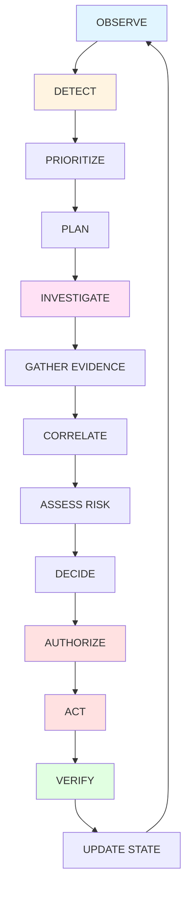
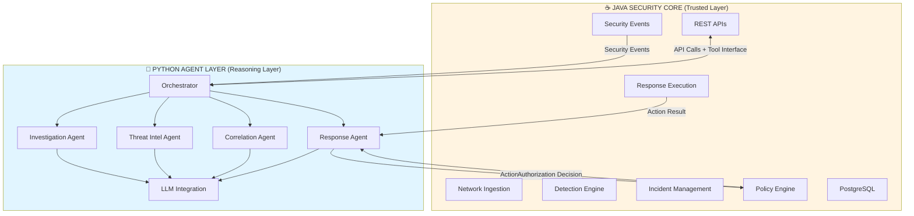
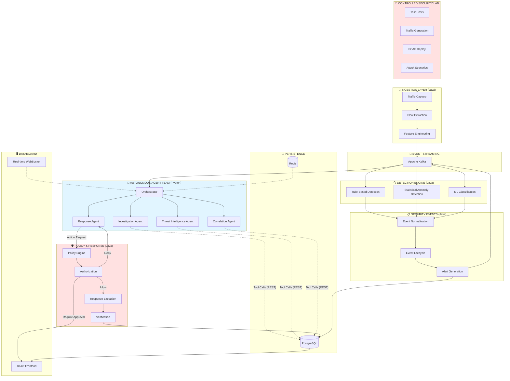
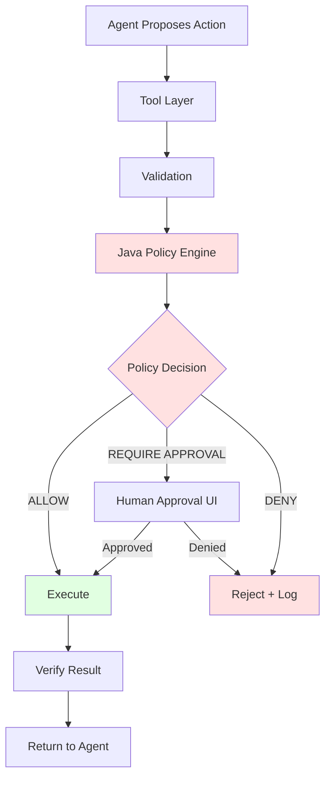
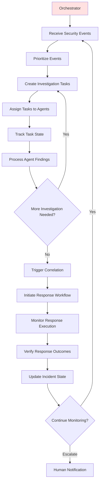
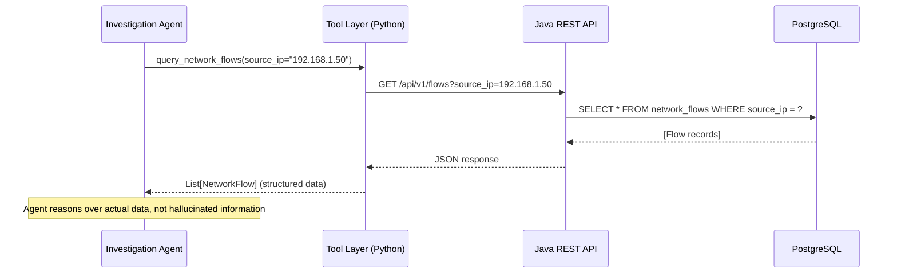
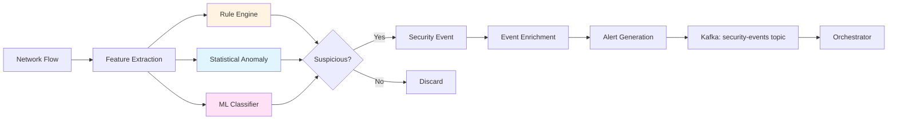
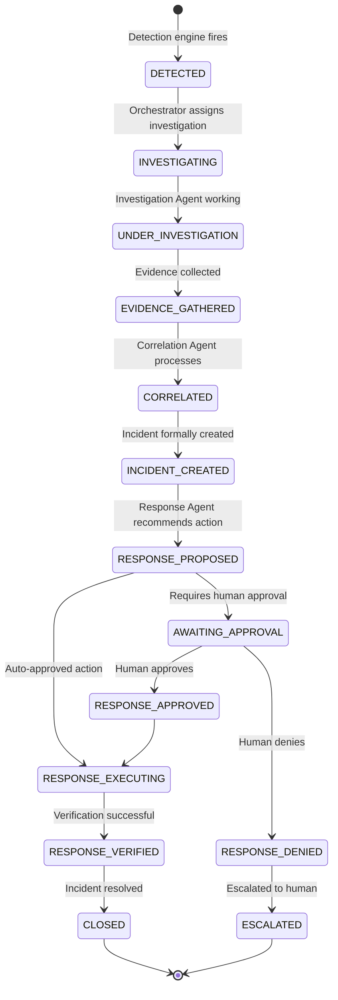
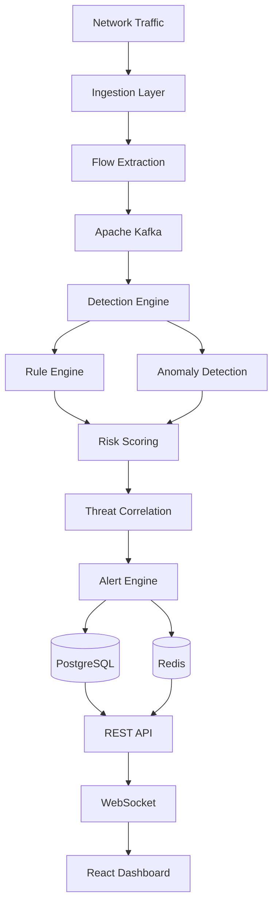
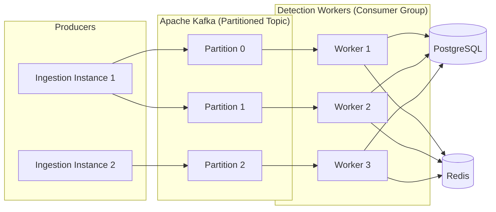

<div align="center">
  
  <h1>Intriqo</h1>
  <p><strong>Autonomous Multi-Agent Security Operations Center</strong></p>
  <p><em>Real-time threat detection, autonomous investigation, and controlled response</em></p>

  <p>
    <a href="https://github.com/AlliedEdge/intriqo/actions/workflows/ci.yml">
      
    </a>
    
    
    
    
    
    <a href="LICENSE">
      
    </a>
  </p>
</div>

---

## Vision

Intriqo is designed to become an **autonomous multi-agent Security Operations Center (SOC)** that operates continuously without requiring manual human intervention for every investigation step.

The central concept is **not** an AI chatbot attached to an intrusion detection system.

The intended behavior is closer to **a miniature autonomous SOC team operating inside a controlled cyber range**.

A human operator should be able to press:

```
[ START TEAM ]
```

and the autonomous security team begins operating — continuously detecting threats, investigating suspicious activity, gathering evidence, correlating incidents, assessing risk, proposing responses, and verifying outcomes.

The human becomes the **supervisor**, not the operator who manually drives every investigation.

### The Core Differentiator

**Weak architecture** (not our goal):

```
Alert → Human clicks "Analyze with AI" → LLM explains alert
```

**Intriqo's intended architecture**:

```
Security Event
      ↓
Autonomous Orchestrator
      ↓
Agent creates investigation task
      ↓
Specialized agents investigate
      ↓
Agents use real security tools
      ↓
Evidence returned
      ↓
Agents communicate findings
      ↓
Incident correlation
      ↓
Risk assessment
      ↓
Response decision
      ↓
Deterministic policy validation
      ↓
Controlled action
      ↓
Verification
      ↓
Follow-up investigation if necessary
      ↓
Autonomous loop continues
```

This is an **agentic autonomous security system**, not an AI-assisted dashboard.

> **Status: 🚧 Architecture Phase**
> 
> The Java 21 + Spring Boot security platform has been initialized. The autonomous agent architecture is currently being designed. **Agents are NOT yet implemented.** See the [Current Status](#current-status) and [Roadmap](#roadmap) for what exists versus what is planned.

---

## Table of Contents

- [Vision](#vision)
- [Autonomous Control Loop](#autonomous-control-loop)
- [Architecture](#architecture)
  - [Technology Split: Java vs Python](#technology-split-java-vs-python)
  - [System Architecture Diagram](#system-architecture-diagram)
  - [Security Boundary: AI Must Not Have Unrestricted Authority](#security-boundary-ai-must-not-have-unrestricted-authority)
- [The Autonomous Agent Team](#the-autonomous-agent-team)
  - [Agent 1: Investigation Agent](#agent-1-investigation-agent)
  - [Agent 2: Threat Intelligence Agent](#agent-2-threat-intelligence-agent)
  - [Agent 3: Correlation Agent](#agent-3-correlation-agent)
  - [Agent 4: Response Agent](#agent-4-response-agent)
  - [Agent 5: Orchestrator](#agent-5-orchestrator)
- [Agent Tools](#agent-tools)
- [Agent-to-Agent Communication](#agent-to-agent-communication)
- [Human Supervision Model](#human-supervision-model)
- [Autonomous Control Plane](#autonomous-control-plane)
- [Detection Engine](#detection-engine)
- [Controlled Security Laboratory](#controlled-security-laboratory)
- [Repository Structure](#repository-structure)
- [Data and State Management](#data-and-state-management)
- [Event-Driven Messaging](#event-driven-messaging)
- [Observability](#observability)
- [Dashboard Vision](#dashboard-vision)
- [Evaluation Methodology](#evaluation-methodology)
- [Research Direction](#research-direction)
- [Architectural Principles](#architectural-principles)
- [Roadmap](#roadmap)
- [Current Status](#current-status)
- [Quick Start](#quick-start)
- [Design Decisions](#design-decisions)
- [Documentation](#documentation)
- [Contributing](#contributing)
- [Security Reporting](#security-reporting)
- [License](#license)

---

## Autonomous Control Loop

Intriqo is designed around a persistent autonomous loop that operates continuously while the SOC team is running:



This loop is the core of the autonomous behavior:

1. **OBSERVE** — Monitor network activity and security event streams
2. **DETECT** — Apply detection rules, anomaly detection, and ML models
3. **PRIORITIZE** — Score and rank security events by urgency and risk
4. **PLAN** — Create investigation tasks and assign them to specialized agents
5. **INVESTIGATE** — Autonomous agents gather evidence using structured tools
6. **GATHER EVIDENCE** — Query network flows, historical alerts, host activity, DNS logs, authentication events
7. **CORRELATE** — Identify relationships between individual events, reconstruct attack sequences
8. **ASSESS RISK** — Calculate composite risk scores based on evidence and threat intelligence
9. **DECIDE** — Determine appropriate response action
10. **AUTHORIZE** — Validate proposed action against deterministic policy engine
11. **ACT** — Execute controlled response (only if authorized)
12. **VERIFY** — Confirm response outcome, collect additional evidence
13. **UPDATE STATE** — Update incident status, investigation findings, system knowledge
14. **Loop back to OBSERVE** — Continue monitoring

The system should be capable of continuing this loop **without requiring human intervention for every step**, while remaining under human supervision.

---

## Architecture

### Technology Split: Java vs Python

Intriqo intentionally uses **Java and Python for different architectural responsibilities**. This is a deliberate design choice, not a compromise.

#### Java = Security Platform / Deterministic Core

The Java 21 + Spring Boot backend owns the **trusted cybersecurity control layer**:

| Responsibility | Description |
|---|---|
| **Network Ingestion** | Traffic capture, flow extraction, packet parsing |
| **Feature Extraction** | Network flow feature engineering |
| **Detection Engine** | Rule-based detection, statistical anomaly detection |
| **Security Event Generation** | Creation and normalization of security events |
| **Event Lifecycle Management** | Event persistence, state transitions, audit trails |
| **Incident Management** | Incident creation, correlation primitives, status tracking |
| **Policy Engine** | Deterministic authorization of agent-requested actions |
| **Response Execution** | Controlled security actions (block IP, isolate host, terminate session) |
| **Persistence Layer** | PostgreSQL repositories, caching abstractions |
| **REST APIs** | HTTP endpoints for querying events, incidents, investigations |
| **WebSocket Delivery** | Real-time alert and investigation status delivery |
| **System Configuration** | Application configuration, infrastructure integration |
| **Audit Logging** | Complete audit trail of all system actions |

**Why Java for this layer?**

* Deterministic behavior is critical for security policy enforcement
* Strong type safety reduces surface area for runtime errors in security-critical code
* Excellent concurrency primitives (virtual threads via Project Loom)
* Mature security frameworks (Spring Security)
* Well-understood operational characteristics
* Strong integration with enterprise infrastructure

#### Python = Agentic AI Layer

Python is used for **agent orchestration, reasoning, and LLM integration**:

| Responsibility | Description |
|---|---|
| **Agent Orchestration** | Central control plane for autonomous agent team |
| **Specialized Agents** | Investigation, threat intelligence, correlation, response agents |
| **LLM Integration** | Structured reasoning with large language models |
| **Tool Calling** | Agents use structured tools to gather evidence from Java security layer |
| **Investigation Workflows** | Multi-step reasoning workflows for security investigations |
| **Threat Intelligence Reasoning** | External indicator lookup, reputation assessment |
| **Correlation Reasoning** | Complex event correlation requiring flexible reasoning |
| **ML Experimentation** | Model training, evaluation, preprocessing |
| **Agent Communication** | Inter-agent messaging and task coordination |

**Why Python for this layer?**

* Python dominates the LLM/agent/ML ecosystem
* Rich libraries for agent frameworks, LangChain, LlamaIndex, AutoGPT patterns
* Rapid experimentation and iteration for agent behaviors
* Strong ML ecosystem (scikit-learn, PyTorch, TensorFlow)
* JSON-based tool calling integrates naturally with REST APIs
* Not forced into Java merely because the main backend is Java

#### The Boundary



**Key principle:** The deterministic security layer (Java) decides what is **permitted**. The reasoning layer (Python) decides what is **appropriate**. Neither has absolute authority.

### System Architecture Diagram



### Security Boundary: AI Must Not Have Unrestricted Authority

This is **one of the most important architectural decisions** in Intriqo.

**Principle:** The LLM/agents must **NEVER** receive unrestricted shell access, arbitrary infrastructure control, or direct database write access.

#### The Action Authorization Flow



**Example:**

```
Response Agent: "I recommend blocking IP 192.168.1.100"
      ↓
Tool Layer: create_block_request(ip="192.168.1.100", duration="1h")
      ↓
Policy Engine: 
  - Is this IP in the controlled lab range? ✓
  - Does the agent have block_ip permission? ✓
  - Is this IP on the protected allowlist? ✗
  - Does the incident severity justify blocking? ✓
      ↓
Decision: ALLOW
      ↓
Response Execution: Block IP 192.168.1.100 for 1 hour
      ↓
Verification: Confirm block is active
      ↓
Result returned to Response Agent
```

#### What This Provides

| Benefit | Description |
|---|---|
| **Least Privilege** | Agents can only request predefined actions via structured tool calls |
| **Deterministic Authorization** | Java policy engine validates every action against explicit rules |
| **Auditability** | Complete audit trail: what was requested, why, what was decided, what happened |
| **Containment of LLM Mistakes** | Hallucinated or incorrect actions are rejected before execution |
| **Human Override** | Critical actions require explicit human approval |
| **Safer Autonomous Operation** | Autonomous agents can operate continuously without unrestricted system access |

**The agent can reason about what should happen. The deterministic security layer decides whether the requested action is actually permitted.**

---

## The Autonomous Agent Team

Intriqo starts with **five specialized agents** rather than dozens of generic agents.

### Agent 1: Investigation Agent

**Purpose:** Autonomously investigate suspicious security events

**Evidence Sources:**
- Network flow history
- Historical alerts for the same host/IP/user
- Host activity logs
- DNS query activity
- Authentication events (successful and failed)
- Related incidents
- Previous behavioral patterns
- Timeline reconstruction

**Example Investigation:**

```
INVESTIGATION: Suspicious SSH Activity from 192.168.1.50

EVIDENCE GATHERED:
- 127 failed SSH authentication attempts over 3 minutes
- 3 successful authentications after failure sequence
- Activity targeted 4 distinct hosts
- Source IP previously flagged in 2 earlier incidents
- No prior legitimate activity from this IP
- Authentication attempts used 45 distinct usernames

TIMELINE:
10:30:15 - First failed authentication attempt
10:30:17 - Brute force pattern detected (threshold exceeded)
10:33:42 - Successful authentication to host-prod-db-01
10:34:10 - Successful authentication to host-prod-app-02
10:34:55 - Successful authentication to host-prod-app-05

CONFIDENCE: HIGH
ASSESSMENT: Successful credential brute-force attack with lateral movement
RECOMMENDATION: Investigate successful access, check for privilege escalation indicators
```

The Investigation Agent **uses actual tools** to gather this evidence rather than hallucinating security facts.

### Agent 2: Threat Intelligence Agent

**Purpose:** Investigate indicators and provide threat intelligence context

**Capabilities:**
- IP reputation lookup
- Domain reputation lookup
- File hash lookup (if malware detection is added later)
- Known vulnerability intelligence (CVE lookup)
- Threat actor infrastructure correlation
- Geographic/ASN analysis
- Historical indicator tracking

**Example Output:**

```
THREAT INTELLIGENCE: 203.0.113.42

REPUTATION:
- Known malicious: YES
- Threat feeds: 4 feeds report this IP
- First seen: 2024-08-15
- Last seen: 2025-09-10 (active)

ASSOCIATIONS:
- Linked to APT-XXXXX infrastructure
- 15 domains hosted on this IP in the past 30 days
- 8 domains flagged as phishing

GEOLOCATION:
- Country: [REDACTED]
- ASN: AS12345 (Known bulletproof hosting)

CONFIDENCE: HIGH
SOURCE: AlienVault OTX, AbuseIPDB, Internal Threat Intel Database
```

### Agent 3: Correlation Agent

**Purpose:** Connect individual security events into cohesive incidents and attack sequences

Instead of presenting five unrelated alerts, the Correlation Agent reasons about whether they represent one coordinated incident.

**Example:**

**Individual Events:**
```
Event 1: Port scan detected from 192.168.1.50
Event 2: SSH brute force from 192.168.1.50
Event 3: Successful SSH authentication from 192.168.1.50
Event 4: Privilege escalation indicator on host-prod-db-01
Event 5: Large outbound transfer from host-prod-db-01
```

**Correlated Incident:**
```
INCIDENT #1042: Multi-Stage Attack - Reconnaissance to Exfiltration

ATTACK SEQUENCE:
1. Reconnaissance (10:25:00)
   - Port scan across 192.168.1.0/24 subnet

2. Credential Attack (10:30:15)
   - SSH brute force targeting multiple hosts
   
3. Initial Access (10:33:42)
   - Successful authentication to host-prod-db-01

4. Privilege Escalation (10:35:20)
   - Suspicious sudo activity detected
   - Root shell obtained

5. Possible Exfiltration (10:40:15)
   - 2.3 GB outbound transfer to 203.0.113.42
   - Transfer to known malicious IP

CONFIDENCE: HIGH
SEVERITY: CRITICAL
```

### Agent 4: Response Agent

**Purpose:** Decide which predefined defensive action is appropriate

**Important:** The Response Agent does **NOT** execute arbitrary commands. Every response goes through the Policy Engine.

**Controlled Actions:**

| Action | Description | Authorization Level |
|---|---|---|
| `block_ip` | Block an IP address at firewall/network level | Automatic (if in lab range) |
| `isolate_host` | Network isolation of a compromised host | Requires human approval |
| `terminate_session` | Kill an active suspicious session | Automatic (if criteria met) |
| `disable_account` | Disable a compromised user account | Requires human approval |
| `collect_logs` | Gather additional forensic logs | Automatic |
| `increase_monitoring` | Elevate monitoring level for an asset | Automatic |
| `create_incident` | Formally create an incident record | Automatic |
| `escalate_to_human` | Flag for immediate human investigation | Automatic |

**Example Response Decision:**

```
RESPONSE RECOMMENDATION

INCIDENT: #1042 (Multi-Stage Attack)
SEVERITY: CRITICAL

PROPOSED ACTIONS:
1. block_ip(ip="192.168.1.50", duration="24h")
   → Policy: ALLOW (IP in lab range, severity justifies blocking)
   
2. isolate_host(host="host-prod-db-01")
   → Policy: REQUIRE HUMAN APPROVAL (production host isolation)
   
3. collect_logs(host="host-prod-db-01", scope="full_forensic")
   → Policy: ALLOW (read-only operation)
   
4. escalate_to_human(reason="Possible data exfiltration detected")
   → Policy: ALLOW (notification action)

AWAITING: Human approval for host isolation
```

### Agent 5: Orchestrator

**Purpose:** Central autonomous control plane for the agent team

The Orchestrator is the **brain** of the autonomous loop. It does not investigate threats itself — it **coordinates** the team.

**Responsibilities:**



**Key Capabilities:**

1. **Event Prioritization** — Not all security events require immediate investigation. The Orchestrator scores and ranks events by urgency, severity, and available agent capacity.

2. **Task Creation** — For high-priority events, create structured investigation tasks:
   ```json
   {
     "task_id": "task-1042-investigate-ssh",
     "type": "INVESTIGATE",
     "assigned_to": "investigation_agent",
     "priority": "HIGH",
     "context": {
       "event_id": "evt-192847",
       "source_ip": "192.168.1.50",
       "target_host": "host-prod-db-01",
       "alert_type": "ssh_brute_force"
     }
   }
   ```

3. **Agent Coordination** — Track which agents are working on which tasks, handle task failures, reassign tasks if an agent becomes unavailable.

4. **Investigation State Management** — Maintain the state of ongoing investigations, evidence gathered, findings produced, decisions made.

5. **Follow-up Task Generation** — Based on investigation findings, create additional tasks:
   ```
   Investigation Result: "Successful brute force detected"
     ↓
   New Task: "Investigate what the attacker accessed after successful auth"
     ↓
   Assign to Investigation Agent
   ```

6. **Correlation Trigger** — Once sufficient evidence is gathered, trigger the Correlation Agent to reconstruct the incident.

7. **Response Workflow** — After correlation, invoke the Response Agent to determine appropriate actions.

8. **Verification** — After a response action is executed, verify the outcome and create follow-up tasks if necessary.

9. **Autonomous Loop Management** — Respect START / STOP / PAUSE state. When the team is running, continuously process eligible security events.

**The Orchestrator enables the system to continue working without requiring a human to manually initiate every step.**

---

## Agent Tools

Agents must **not hallucinate system information**. They use **structured tools** to gather evidence from the Java security layer.

### Proposed Tool Interface

```python
# Investigation tools
query_security_events(filters: dict) -> List[SecurityEvent]
query_network_flows(source_ip: str, time_range: tuple) -> List[NetworkFlow]
query_historical_alerts(entity: str, lookback_days: int) -> List[Alert]
query_host_activity(hostname: str, time_range: tuple) -> List[HostEvent]
query_dns_activity(domain: str, time_range: tuple) -> List[DNSQuery]
query_authentication_events(username: str, time_range: tuple) -> List[AuthEvent]

# Correlation tools
search_incidents(filters: dict) -> List[Incident]
find_related_events(event_id: str, correlation_window: int) -> List[SecurityEvent]

# Threat intelligence tools
lookup_ip_reputation(ip: str) -> ReputationResult
lookup_domain_reputation(domain: str) -> ReputationResult
lookup_cve(cve_id: str) -> CVEDetails

# Risk assessment tools
calculate_event_risk(event_id: str) -> RiskScore
calculate_incident_risk(incident_id: str) -> RiskScore

# Investigation management tools
create_investigation(event_id: str, reason: str) -> Investigation
update_investigation(investigation_id: str, findings: dict) -> Investigation
add_evidence(investigation_id: str, evidence: dict) -> Evidence

# Incident management tools
create_incident(events: List[str], severity: str) -> Incident
update_incident_status(incident_id: str, status: str) -> Incident

# Response tools
request_block_ip(ip: str, duration: str, justification: str) -> ActionRequest
request_isolate_host(hostname: str, justification: str) -> ActionRequest
request_terminate_session(session_id: str, justification: str) -> ActionRequest
request_collect_logs(hostname: str, scope: str) -> ActionRequest

# Verification tools
verify_response_action(action_id: str) -> ActionResult
check_block_status(ip: str) -> BlockStatus
```

**Important:** These tools are **proposed interfaces** for the agent architecture. They are **NOT implemented yet**. They represent the contract between the Python agent layer and the Java security platform.

### How Tools Work



**The LLM decides which tool to call based on investigation context. The tool returns actual structured data. The agent reasons over that data.**

---

## Agent-to-Agent Communication

Agents communicate using **structured messages and domain objects**, not uncontrolled natural-language conversations.

### Proposed Domain Objects

```python
@dataclass
class SecurityEvent:
    event_id: str
    timestamp: datetime
    event_type: str
    severity: str
    source_ip: str
    destination_ip: str
    raw_data: dict

@dataclass
class AgentTask:
    task_id: str
    task_type: str  # INVESTIGATE, CORRELATE, ASSESS_TI, DECIDE_RESPONSE
    assigned_to: str
    priority: str
    context: dict
    status: str
    created_at: datetime

@dataclass
class AgentResult:
    task_id: str
    agent_id: str
    findings: dict
    confidence: float
    evidence: List[Evidence]
    recommendations: List[str]
    completed_at: datetime

@dataclass
class Finding:
    finding_type: str
    description: str
    confidence: float
    severity: str
    supporting_evidence: List[str]

@dataclass
class Evidence:
    evidence_type: str
    source: str
    data: dict
    collected_at: datetime

@dataclass
class Investigation:
    investigation_id: str
    event_id: str
    status: str
    findings: List[Finding]
    evidence: List[Evidence]
    assigned_agent: str
    created_at: datetime
    updated_at: datetime

@dataclass
class Incident:
    incident_id: str
    title: str
    severity: str
    status: str
    events: List[str]
    investigations: List[str]
    timeline: List[dict]
    risk_score: float
    created_at: datetime

@dataclass
class ActionRequest:
    request_id: str
    action_type: str
    parameters: dict
    justification: str
    requested_by: str
    incident_id: str
    requested_at: datetime

@dataclass
class PolicyDecision:
    request_id: str
    decision: str  # ALLOW, DENY, REQUIRE_APPROVAL
    reason: str
    policy_rules_applied: List[str]
    decided_at: datetime

@dataclass
class ActionResult:
    request_id: str
    action_type: str
    status: str  # SUCCESS, FAILED, PENDING_APPROVAL
    outcome: dict
    verification: dict
    executed_at: datetime
```

### Communication Pattern Example

```
Investigation Agent
    ↓
AgentResult(
    findings=[Finding("Brute force detected", confidence=0.95)],
    evidence=[Evidence("127 failed auth attempts")],
    recommendations=["Check threat intelligence for source IP"]
)
    ↓
Orchestrator
    ↓
New AgentTask(
    task_type="ASSESS_TI",
    assigned_to="threat_intelligence_agent",
    context={"ip": "192.168.1.50"}
)
    ↓
Threat Intelligence Agent
    ↓
AgentResult(
    findings=[Finding("Known malicious IP", confidence=0.90)],
    evidence=[Evidence("Listed in 4 threat feeds")]
)
    ↓
Orchestrator
    ↓
Correlation Agent
```

**Structured communication provides:**
- Type safety
- Clear contracts between agents
- Serializable state for persistence
- Audit trail of agent reasoning
- Easier testing and validation

---

## Human Supervision Model

Intriqo does **not** pretend humans are unnecessary.

The intended model is:

```
       Human
         ↓
     Supervisor
         ↓
Autonomous SOC Team
```

### Human Capabilities

Humans should be able to:

| Capability | Description |
|---|---|
| **Start Autonomous Operation** | Press `START TEAM` to begin autonomous monitoring and investigation |
| **Stop Autonomous Operation** | Press `STOP TEAM` to safely halt autonomous activity |
| **Pause Operation** | Temporarily suspend autonomous actions while preserving state |
| **Inspect Investigations** | View active and completed investigations, evidence gathered, findings |
| **Inspect Agent Reasoning** | See what tools agents used, what evidence they collected, how they reached conclusions |
| **Inspect Proposed Actions** | Review actions proposed by the Response Agent before execution |
| **Approve/Deny Actions** | Explicitly approve or deny actions that require human authorization |
| **Override Decisions** | Override any automated decision or change incident severity |
| **Emergency Stop** | Immediately disable all autonomous response execution |
| **Inspect Audit History** | Complete audit trail of all agent activity, decisions, and actions |
| **Manual Investigation** | Launch manual investigations or assign tasks to agents |

### Control vs Supervision

**Supervised Autonomy** (Intriqo's model):
```
Human sets boundaries
    ↓
Agents operate autonomously within boundaries
    ↓
Human reviews outcomes and overrides when necessary
```

**Manual Control** (traditional SOC):
```
Human initiates every investigation step
    ↓
Human interprets every alert
    ↓
Human decides every response action
    ↓
Human executes every action
```

Intriqo demonstrates **controlled autonomy**, not blind autonomy.

---

## Autonomous Control Plane

The future dashboard should expose autonomous team controls.

### START TEAM

Starts autonomous operation. The system begins continuously processing security events according to the autonomous loop.

**Example Dashboard State:**

```
╔══════════════════════════════════════╗
║       AUTONOMOUS SOC CONTROL         ║
║                                      ║
║          ● TEAM RUNNING              ║
║                                      ║
║          [ STOP TEAM ]               ║
╠══════════════════════════════════════╣
║ Active Agents:          5            ║
║ Active Investigations:  3            ║
║ Open Incidents:         7            ║
║ Pending Actions:        1            ║
║ Actions Executed:       12           ║
╚══════════════════════════════════════╝
```

### STOP TEAM

Stops autonomous operation **safely**.

**STOP should:**
- Prevent creation of new autonomous investigation tasks
- Prevent new automated response actions
- Allow in-flight investigations to complete gracefully or be suspended
- Preserve all investigation state
- Preserve all incident state
- Preserve complete audit information
- Return control to the human operator

**STOP does NOT:**
- Delete investigation history
- Lose evidence
- Abandon incidents
- Corrupt system state

### PAUSE TEAM

**PAUSE** is a separate capability from STOP. It should:
- Stop creation of new autonomous actions
- Suspend active agent tasks
- Preserve exact system state
- Allow resumption from the same point later

Use case: Human wants to review system behavior before allowing it to continue.

### EMERGENCY STOP

**EMERGENCY STOP** is a high-priority safety capability.

It should:
- **Immediately** disable all autonomous response execution
- Freeze autonomous activity (no new investigations, no new actions)
- Preserve all evidence and state
- Log the emergency stop event with full context
- Require explicit human action to resume

**Trigger conditions:**
- Human operator presses emergency stop button
- System detects potentially dangerous behavior
- Unexpected failure mode detected
- Policy violation detected

---

## Detection Engine

The autonomous agents do **NOT** replace the detection engine. The detection engine generates the security events that the autonomous agents investigate.

The detection engine is designed to combine three complementary approaches:

### 1. Rule-Based Detection

Deterministic and auditable. Produces security events when predefined patterns are matched.

**Planned Detection Rules:**

| Rule | Description | Status |
|---|---|---|
| Port Scan Detection | Detect systematic connection attempts across multiple ports | Planned |
| SSH Brute Force | Detect repeated failed authentication attempts | Planned |
| SYN Flood Detection | Detect large volumes of half-open TCP connections | Planned |
| DNS Anomaly Detection | Detect suspicious DNS query patterns, large responses | Planned |
| Abnormal Traffic Volume | Detect unusual traffic volumes for a host or network segment | Planned |
| Suspicious Authentication Patterns | Detect authentication from unusual locations, times, or patterns | Planned |
| Lateral Movement Indicators | Detect suspicious internal connection patterns | Planned |

### 2. Statistical / Anomaly Detection

Identify deviations from established behavioral baselines.

**Planned Capabilities:**
- Baseline network flow characteristics per host
- Detect statistical outliers (volume, duration, protocol distribution)
- Time-series anomaly detection (unusual activity at unusual times)
- Behavioral profiling (deviation from normal host behavior)

### 3. Machine Learning

Use ML for more complex classification and anomaly detection where appropriate.

**Planned ML Components:**
- Supervised classification for known attack patterns
- Unsupervised anomaly detection for novel threats
- Feature engineering from network flows
- Model training in Python, inference integration in Java

**Python is used for:**
- Data exploration
- Preprocessing
- Model training
- Evaluation
- Hyperparameter tuning

**Java runtime integration:**
- Trained models exported (ONNX, PMML, or custom format)
- Inference integrated into detection pipeline
- Low-latency model serving

### Detection Engine Architecture



The agentic layer **consumes** the security events generated by these detection mechanisms and **investigates** them autonomously.

---

## Controlled Security Laboratory

Intriqo is designed to operate within a **controlled and reproducible cybersecurity laboratory**, not against arbitrary real-world infrastructure.

### Lab Environment

**Planned Components:**

| Component | Description |
|---|---|
| **Dockerized Test Hosts** | Multiple containerized hosts simulating production infrastructure |
| **Synthetic Traffic Generation** | Scripted generation of normal and malicious network traffic |
| **PCAP Replay** | Replay of pre-recorded network traffic for reproducibility |
| **Simulated Authentication** | Controlled SSH, RDP, HTTP authentication scenarios |
| **Attack Scenario Scripts** | Automated port scans, brute force, lateral movement, exfiltration simulations |
| **Network Isolation** | Lab network isolated from production infrastructure |

### Why a Controlled Lab?

1. **Safety** — Automated response actions operate only against test resources
2. **Reproducibility** — The same attack scenarios can be replayed for evaluation
3. **Ethical** — No risk of accidentally attacking real infrastructure
4. **Educational** — Suitable for an FYP/research environment
5. **Benchmarking** — Controlled conditions allow accurate performance measurement

### Example Attack Scenarios

```
Scenario 1: Port Scan → SSH Brute Force → Lateral Movement
    1. Attacker container performs port scan of subnet
    2. Detection engine generates "port_scan" event
    3. Orchestrator creates investigation task
    4. Attacker begins SSH brute force against discovered host
    5. Detection engine generates "ssh_brute_force" event
    6. Investigation Agent gathers evidence
    7. Attacker successfully authenticates
    8. Attacker moves laterally to second host
    9. Correlation Agent reconstructs attack sequence
    10. Response Agent proposes blocking attacker IP
    11. Policy Engine authorizes block
    12. Response executed and verified

Scenario 2: DNS Exfiltration
    1. Compromised host begins suspicious DNS queries
    2. Detection engine generates "dns_anomaly" event
    3. Investigation Agent investigates query patterns
    4. Threat Intelligence Agent checks domain reputation
    5. Correlation Agent identifies data exfiltration pattern
    6. Response Agent proposes isolating host
    7. Policy Engine requires human approval
    8. Human reviews evidence and approves
    9. Host isolated and verified
```

All automated response actions should initially operate **only against explicitly controlled test resources**.

---

## Repository Structure

### Proposed Organization

```
intriqo/
├── backend/                       # Java 21 + Spring Boot Security Platform
│   ├── src/
│   │   ├── main/java/com/intriqo/
│   │   │   ├── ingestion/         # Network traffic ingestion
│   │   │   ├── detection/         # Detection engine
│   │   │   ├── events/            # Security event lifecycle
│   │   │   ├── incidents/         # Incident management
│   │   │   ├── policy/            # Policy engine and authorization
│   │   │   ├── response/          # Response execution
│   │   │   ├── api/               # REST APIs and WebSocket
│   │   │   ├── persistence/       # PostgreSQL repositories
│   │   │   ├── infrastructure/    # Kafka, Redis integration
│   │   │   └── common/            # Shared utilities
│   │   └── main/resources/
│   ├── build.gradle
│   └── settings.gradle
│
├── agents/                        # Python Agent System
│   ├── orchestrator/              # Central orchestrator
│   ├── investigation_agent/       # Investigation agent
│   ├── threat_intel_agent/        # Threat intelligence agent
│   ├── correlation_agent/         # Correlation agent
│   ├── response_agent/            # Response agent
│   ├── tools/                     # Tool implementations (API clients)
│   ├── common/                    # Shared types, utilities
│   ├── tests/                     # Agent tests
│   └── requirements.txt
│
├── ml/                            # Machine Learning Experimentation
│   ├── notebooks/                 # Jupyter notebooks
│   ├── data/                      # Training datasets
│   ├── preprocessing/             # Feature engineering
│   ├── training/                  # Model training scripts
│   ├── evaluation/                # Model evaluation
│   ├── models/                    # Trained model artifacts
│   └── requirements.txt
│
├── frontend/                      # React + TypeScript Dashboard
│   └── intriqo-dashboard/
│       ├── src/
│       │   ├── components/
│       │   ├── features/
│       │   ├── services/
│       │   └── App.tsx
│       ├── package.json
│       └── vite.config.ts
│
├── infrastructure/                # Infrastructure as Code
│   ├── docker/                    # Dockerfiles
│   ├── kafka/                     # Kafka topic definitions
│   ├── postgres/                  # Database migrations
│   ├── redis/                     # Redis configuration
│   ├── monitoring/                # Prometheus, Grafana
│   └── docker-compose.yml
│
├── security-lab/                  # Controlled Test Environment
│   ├── attack-scenarios/          # Simulated attack scripts
│   ├── traffic-generation/        # Traffic generation scripts
│   ├── pcaps/                     # PCAP files for replay
│   └── lab-setup/                 # Lab infrastructure setup
│
├── docs/                          # Documentation
│   ├── architecture/
│   ├── security/
│   ├── research/                  # Research methodology, results
│   ├── adr/                       # Architecture Decision Records
│   └── api/                       # API specifications
│
├── scripts/                       # Utility scripts
├── tests/                         # Integration and E2E tests
├── .github/workflows/             # CI/CD pipelines
├── README.md
└── docker-compose.yml
```

**Note:** This structure represents the **intended final organization**. It does not reflect the current repository structure, which is still in the architecture phase.

---

## Data and State Management

### PostgreSQL (Persistent State)

**Proposed Tables:**

| Table | Purpose |
|---|---|
| `network_flows` | Raw network flow records |
| `security_events` | Security events generated by detection engine |
| `alerts` | Generated alerts (may be distinct from events) |
| `incidents` | Correlated incidents |
| `investigations` | Investigation records |
| `findings` | Investigation findings |
| `evidence` | Evidence collected during investigations |
| `agent_tasks` | Agent task definitions and state |
| `agent_results` | Agent results and findings |
| `action_requests` | Requested response actions |
| `action_results` | Response action outcomes |
| `policy_decisions` | Policy engine decisions |
| `audit_log` | Complete audit trail |

### Redis (Low-Latency State)

**Proposed Use Cases:**

| Use Case | Description |
|---|---|
| Active Agent State | Current agent status, active tasks, task queue |
| Investigation Context | Temporary investigation state (recent evidence, working memory) |
| Rate Limiting | Detection rule rate limits, action rate limits |
| Short-Lived Coordination | Agent-to-agent coordination state |
| Caching | Cached threat intelligence, flow lookups, frequently accessed data |
| Connection Tracking | Active connection state for stateful detection |

**Principle:** Do NOT use Redis as a replacement for PostgreSQL. Redis is used where sub-second access latency is genuinely required. Durable state belongs in PostgreSQL.

### State Diagram: Security Event Lifecycle



---

## Event-Driven Messaging

Apache Kafka may eventually be used for high-volume event and agent communication.

### Proposed Kafka Topics

| Topic | Purpose | Producer | Consumer |
|---|---|---|---|
| `network-flows` | Raw ingested network flows | Ingestion layer | Detection workers |
| `security-events` | Security events from detection engine | Detection workers | Orchestrator |
| `agent-tasks` | Tasks assigned to agents | Orchestrator | Agents |
| `agent-results` | Results returned by agents | Agents | Orchestrator |
| `incident-events` | Incident lifecycle events | Correlation Agent | Dashboard, audit log |
| `action-requests` | Response action requests | Response Agent | Policy Engine |
| `action-results` | Response action outcomes | Response Execution | Response Agent, Orchestrator |
| `audit-events` | System audit trail | All components | Audit system |

### When to Introduce Kafka

**Do NOT introduce Kafka merely because it sounds impressive.**

Kafka should be introduced when:
1. Event volume exceeds what synchronous processing can handle
2. Decoupling ingestion from detection provides measurable benefit
3. Partition-based parallelism is needed for detection workers
4. Event replay for debugging or retraining is required
5. Backpressure handling is needed

The initial implementation **may use simpler mechanisms** (e.g., in-memory queues, direct API calls) until workload characteristics justify Kafka.

**Document this principle:** Introduce distributed systems complexity when measurements justify it, not before.

---

## Observability

Autonomous systems **must be observable**. Humans need visibility into what the agents are doing and why.

### Planned Observability Components

| Component | Purpose |
|---|---|
| **Spring Boot Actuator** | Health endpoints, metrics, application info |
| **Prometheus** | Metrics collection and storage |
| **Grafana** | Dashboards for system metrics and agent activity |
| **Structured Logging** | JSON-formatted logs with correlation IDs |
| **Correlation IDs** | Track request flow across Java and Python layers |
| **Audit Trail** | Complete audit log of all agent actions and decisions |

### Metrics to Expose

#### Detection Metrics

- `intriqo.flows.ingested` — Total network flows ingested
- `intriqo.events.detected` — Security events generated
- `intriqo.detection.latency` — Time from flow arrival to event generation (p50, p95, p99)
- `intriqo.rules.evaluated` — Detection rule evaluations per second
- `intriqo.ml.inferences` — ML model inferences per second

#### Agent Metrics

- `intriqo.agents.active` — Number of active agents
- `intriqo.tasks.created` — Agent tasks created
- `intriqo.tasks.completed` — Agent tasks completed
- `intriqo.tasks.failed` — Agent tasks failed
- `intriqo.task.latency` — Time from task creation to completion
- `intriqo.investigations.active` — Active investigations
- `intriqo.tool_calls.total` — Tool calls by agents
- `intriqo.tool_calls.failed` — Failed tool calls

#### Response Metrics

- `intriqo.actions.requested` — Response actions requested
- `intriqo.actions.authorized` — Actions authorized by policy engine
- `intriqo.actions.denied` — Actions denied by policy engine
- `intriqo.actions.awaiting_approval` — Actions awaiting human approval
- `intriqo.actions.executed` — Actions successfully executed
- `intriqo.actions.failed` — Actions that failed execution

#### Incident Metrics

- `intriqo.incidents.created` — Incidents created
- `intriqo.incidents.open` — Open incidents
- `intriqo.incidents.closed` — Closed incidents
- `intriqo.incident.severity` — Distribution by severity

#### Performance Metrics

- `intriqo.kafka.consumer.lag` — Consumer group lag per partition
- `intriqo.db.query.latency` — Database query latency
- `intriqo.api.request.latency` — API request latency
- `intriqo.response.execution.latency` — Time to execute response actions

### Example Grafana Dashboard

**Autonomous SOC Overview:**
- Agent status (active, idle, failed)
- Active investigations
- Incidents created/closed over time
- Response actions executed
- System health

**Investigation Dashboard:**
- Investigation duration histogram
- Tool calls per investigation
- Evidence sources used
- Agent reasoning summaries

**Response Dashboard:**
- Action requests over time
- Authorization decisions (allow/deny/approval)
- Action success rate
- Time to respond (detection → action execution)

---

## Dashboard Vision

The eventual SOC dashboard should make autonomous behavior **explainable and observable**.

### Autonomous Control Panel

```
╔══════════════════════════════════════════════════════════╗
║              INTRIQO AUTONOMOUS SOC                      ║
╠══════════════════════════════════════════════════════════╣
║                                                          ║
║                   ● TEAM RUNNING                         ║
║                                                          ║
║              [ STOP TEAM ]  [ PAUSE TEAM ]               ║
║                                                          ║
╠══════════════════════════════════════════════════════════╣
║  Active Agents:             5                            ║
║  Active Investigations:     3                            ║
║  Open Incidents:            7                            ║
║  Pending Approvals:         1                            ║
║  Actions Executed Today:   23                            ║
╚══════════════════════════════════════════════════════════╝
```

### Live Agent Activity Feed

```
╔══════════════════════════════════════════════════════════╗
║                  LIVE AGENT ACTIVITY                     ║
╠══════════════════════════════════════════════════════════╣
║                                                          ║
║  🔎 Investigation Agent                                   ║
║     STATUS: Investigating                                ║
║     TASK: Suspicious SSH activity from 192.168.1.50      ║
║     EVIDENCE: 127 failed auth attempts detected          ║
║     PROGRESS: Gathering timeline...                      ║
║                                                          ║
║  🌐 Threat Intelligence Agent                            ║
║     STATUS: Working                                      ║
║     TASK: IP reputation lookup                           ║
║     TARGET: 192.168.1.50                                 ║
║     PROGRESS: Querying threat feeds...                   ║
║                                                          ║
║  🧠 Correlation Agent                                     ║
║     STATUS: Analyzing                                    ║
║     TASK: Correlate 5 security events                    ║
║     PROGRESS: Reconstructing attack sequence...          ║
║                                                          ║
║  🛡 Response Agent                                        ║
║     STATUS: Awaiting authorization                       ║
║     ACTION: Isolate host-prod-db-01                      ║
║     REASON: Suspected compromise                         ║
║                                                          ║
╚══════════════════════════════════════════════════════════╝
```

### Investigation Detail View

When a user clicks on an investigation:

```
╔══════════════════════════════════════════════════════════╗
║         INVESTIGATION #1042: SSH Brute Force             ║
╠══════════════════════════════════════════════════════════╣
║  Status: COMPLETED                                       ║
║  Agent: Investigation Agent                              ║
║  Duration: 2m 15s                                        ║
║  Confidence: HIGH                                        ║
╠══════════════════════════════════════════════════════════╣
║  TOOLS USED:                                             ║
║    ✓ query_authentication_events()                       ║
║    ✓ query_network_flows()                               ║
║    ✓ query_historical_alerts()                           ║
║    ✓ query_host_activity()                               ║
║                                                          ║
║  EVIDENCE COLLECTED:                                     ║
║    • 127 failed SSH authentication attempts              ║
║    • 3 successful authentications after brute force      ║
║    • Source IP previously flagged in 2 incidents         ║
║    • No prior legitimate activity from this IP           ║
║                                                          ║
║  FINDINGS:                                               ║
║    • Successful credential brute-force attack            ║
║    • Attacker gained access to 3 hosts                   ║
║    • Lateral movement detected                           ║
║                                                          ║
║  RECOMMENDATION:                                         ║
║    • Check for privilege escalation indicators           ║
║    • Check for data exfiltration indicators              ║
║                                                          ║
╚══════════════════════════════════════════════════════════╝
```

### Human Approval Interface

When a response action requires human approval:

```
╔══════════════════════════════════════════════════════════╗
║              ⚠️  ACTION REQUIRES APPROVAL                 ║
╠══════════════════════════════════════════════════════════╣
║  Incident: #1042 (Multi-Stage Attack)                    ║
║  Severity: CRITICAL                                      ║
║                                                          ║
║  Proposed Action:                                        ║
║  isolate_host(host="host-prod-db-01")                    ║
║                                                          ║
║  Justification:                                          ║
║  Host is suspected to be compromised. Evidence indicates ║
║  successful brute-force attack, privilege escalation,    ║
║  and possible data exfiltration. Network isolation       ║
║  recommended to contain threat.                          ║
║                                                          ║
║  Policy Requirement:                                     ║
║  Production host isolation requires human approval       ║
║                                                          ║
║  Evidence Summary:                                       ║
║  • 127 failed + 3 successful SSH attempts                ║
║  • Privilege escalation detected                         ║
║  • 2.3 GB outbound transfer to known malicious IP        ║
║                                                          ║
║          [ VIEW FULL INVESTIGATION ]                     ║
║                                                          ║
║          [ APPROVE ]     [ DENY ]                        ║
║                                                          ║
╚══════════════════════════════════════════════════════════╝
```

### Key Dashboard Principles

Users should be able to see:

✓ What the agent is doing **right now**
✓ Why it started an investigation
✓ What tools it used
✓ What evidence it found
✓ What findings it produced
✓ How incidents were correlated
✓ What action was requested
✓ What policy decision occurred
✓ Whether the action succeeded
✓ What happened afterward

The dashboard should demonstrate **explainable autonomy**, not black-box AI.

---

## Evaluation Methodology

Intriqo should be evaluated **scientifically and experimentally**, not just demonstrated.

### Proposed Metrics

#### Detection Performance

| Metric | Description | Target |
|---|---|---|
| Precision | True positives / (True positives + False positives) | > 0.85 |
| Recall | True positives / (True positives + False negatives) | > 0.90 |
| False Positive Rate | False positives / Total benign events | < 0.05 |
| False Negative Rate | False negatives / Total malicious events | < 0.10 |
| F1 Score | Harmonic mean of precision and recall | > 0.87 |

#### Autonomous Investigation Performance

| Metric | Description |
|---|---|
| Autonomous Investigation Rate | Percentage of events investigated without human initiation |
| Investigation Success Rate | Investigations that produced actionable findings |
| Mean Time to Investigate (MTTI) | Average time from event detection to investigation completion |
| Investigation Depth | Average number of evidence sources consulted |
| Tool Call Success Rate | Percentage of tool calls that succeeded |

#### Response Performance

| Metric | Description |
|---|---|
| Mean Time to Respond (MTTR) | Average time from event detection to response action execution |
| Response Success Rate | Percentage of response actions that executed successfully |
| Detection-to-Response Latency | End-to-end latency from detection to verified response |
| False Autonomous Action Rate | Percentage of autonomous actions that were incorrect/unnecessary |

#### Human Interaction

| Metric | Description |
|---|---|
| Human Intervention Rate | Percentage of incidents requiring human intervention |
| Autonomous Resolution Rate | Percentage of incidents resolved entirely autonomously |
| Approval Request Rate | Percentage of actions requiring human approval |
| Escalation Rate | Percentage of incidents escalated to human |

#### Agent Efficiency

| Metric | Description |
|---|---|
| Tool Calls per Investigation | Average tool calls per investigation |
| Failed Tool Call Rate | Percentage of tool calls that failed |
| Token/Compute Cost | Average LLM tokens consumed per investigation (if applicable) |
| Agent Task Latency | Time per agent task (by task type) |

#### System Performance

| Metric | Description |
|---|---|
| Event Throughput | Security events processed per second |
| Detection Latency | Time from flow ingestion to security event generation (p50, p95, p99) |
| Agent Task Latency | Time from task creation to completion (p50, p95, p99) |
| Database Query Latency | Database operation latency (p50, p95, p99) |
| Resource Utilization | CPU, memory, disk I/O under load |

### Evaluation Methodology

**Phase 1: Controlled Attack Scenarios**

1. Define 20+ reproducible attack scenarios
2. Execute scenarios in controlled lab
3. Measure detection accuracy (precision, recall, F1)
4. Measure autonomous investigation rate
5. Measure time to investigate
6. Measure time to respond
7. Verify correctness of response actions

**Phase 2: Comparison Against Manual Investigation**

1. Human analyst investigates same scenarios without agent assistance
2. Measure time to investigate (human vs autonomous)
3. Measure time to respond (human vs autonomous)
4. Compare evidence quality and depth
5. Compare correctness of conclusions

**Phase 3: Load Testing**

1. Generate high-volume network traffic
2. Measure event throughput under load
3. Measure detection latency under load
4. Measure agent task throughput
5. Identify bottlenecks
6. Measure horizontal scaling characteristics

**Phase 4: Longitudinal Study**

1. Run autonomous SOC continuously for extended period (days/weeks)
2. Measure investigation success rate over time
3. Measure false positive/negative rates
4. Measure human intervention frequency
5. Analyze failure modes

### Benchmark Reproducibility

All benchmarks should be:
- **Reproducible** — documented scenarios, scripts, PCAP files
- **Version-controlled** — benchmark scripts and data in repository
- **Automated** — CI pipeline runs performance regression tests
- **Documented** — results published in `docs/performance/`

**Do NOT make performance claims without supporting measurements.**

---

## Research Direction

Intriqo is positioned as a substantial final-year engineering/research project.

### Research Context

**Intriqo does NOT claim that the overall concept of autonomous cybersecurity agents is entirely novel.** Security automation, autonomous threat hunting, and AI-assisted SOCs are active research areas.

### Potential Contributions

| Contribution Area | Description |
|---|---|---|
| **Architecture for Controlled Autonomous SOC** | Design pattern for safe autonomous security operation with deterministic policy boundaries |
| **Multi-Agent Security Investigation Workflow** | Specialized agent coordination for security event investigation |
| **Deterministic Policy Boundary Around LLM Agents** | Design pattern for containing AI decision-making within explicit security policy |
| **Persistent Autonomous Investigation Loop** | Control loop design for continuous autonomous operation |
| **Explainable Agent Activity** | Dashboard and logging design for making autonomous behavior transparent |
| **Controlled Automated Response** | Framework for safe automated response actions with verification |
| **Evaluation of Autonomous vs Human-Assisted SOC Workflows** | Empirical comparison of investigation time, accuracy, depth |
| **Measurable Investigation/Response Performance** | Metrics framework for evaluating autonomous security agents |

### Research Question

> **Can a controlled multi-agent architecture autonomously investigate and respond to network security incidents while maintaining measurable safety, explainability, and operational effectiveness?**

### Evaluation Hypotheses

**H1:** Autonomous agents can investigate security incidents faster than manual human investigation while maintaining comparable accuracy.

**H2:** A deterministic policy engine can safely constrain AI-driven response actions, preventing inappropriate automated responses.

**H3:** Structured tool-based evidence gathering produces more reliable investigation findings than LLM reasoning alone.

**H4:** Multi-agent specialization (investigation, threat intelligence, correlation, response) produces better investigation outcomes than a single general-purpose agent.

**H5:** Continuous autonomous operation reduces mean time to investigate and mean time to respond compared to manual SOC workflows.

### Future Work

- Compare multiple agent frameworks (LangChain, AutoGPT, CrewAI, custom)
- Evaluate different LLMs for security reasoning tasks
- Investigate learning mechanisms (agents improve over time)
- Explore federated agent architectures for distributed SOCs
- Study human-agent collaboration patterns
- Investigate adversarial robustness (can attackers manipulate agents?)

**Do NOT claim publication or novelty guarantees.** Research is a future direction pending execution and evaluation.

---

## Architectural Principles

These principles guide all design decisions in Intriqo:

### 1. Autonomy Without Unrestricted Authority

Agents operate autonomously but within deterministic security boundaries. AI can reason about what should happen. Deterministic policy decides what is permitted.

### 2. Human Override

Humans can override any autonomous decision. Humans can stop autonomous operation at any time. Critical actions require explicit human approval.

### 3. Least Privilege

Agents can only request predefined actions via structured tools. Agents cannot execute arbitrary commands or access arbitrary systems.

### 4. Tool-Based Evidence Gathering

Agents use structured tools that return actual data from the security platform. Agents do not hallucinate security facts or system state.

### 5. Deterministic Security Boundaries Around AI

The Java security platform (detection, policy, response execution) is deterministic and auditable. The Python agent layer (reasoning, investigation) is AI-driven. Clear architectural boundary between the two.

### 6. Auditable Decisions

Every agent action, every investigation, every tool call, every policy decision, every response action is logged completely. Audit trail is immutable.

### 7. Structured Agent Communication

Agents communicate via typed domain objects, not unstructured natural language. Communication is serializable, testable, and auditable.

### 8. Persistent Investigation State

All investigation state is persisted. STOP does not lose evidence or abandon incidents. System can resume from any point.

### 9. Controlled Cybersecurity Laboratory

All automated response actions operate against explicitly controlled test resources, not production infrastructure. Safe for research/FYP environment.

### 10. Observable Autonomous Behavior

Autonomous agents must be observable. Dashboard exposes what agents are doing, why, what evidence they gathered, what they decided.

### 11. Use Deterministic Software Where Deterministic Software Is Better

Do not use an LLM for tasks that deterministic code handles better (parsing, validation, arithmetic, policy enforcement).

### 12. Do Not Use an LLM Merely for the Sake of Using an LLM

LLMs are used where flexible reasoning over unstructured evidence is genuinely beneficial (investigation planning, evidence interpretation, threat correlation).

### 13. Benchmark Before Introducing Distributed Complexity

Do not introduce Kafka, microservices, or distributed systems complexity until measurements justify the operational overhead.

### 14. Prefer Modularity Before Premature Microservices

Start as a well-structured modular monolith. Extract services only when workload characteristics (throughput, latency, scaling requirements) justify it.

### 15. Every Automated Action Must Be Explainable and Traceable

For every automated action: What happened? Why? What evidence justified it? What policy authorized it? What was the outcome?

---

## Roadmap

### Phase 0 — Architecture & Requirements *(CURRENT PHASE)*

- [x] Java 21 + Spring Boot backend initialized
- [x] Initial dependencies added
- [ ] Finalize system architecture
- [ ] Define domain model (SecurityEvent, Investigation, Incident, Finding, Evidence)
- [ ] Define agent contracts (AgentTask, AgentResult, ActionRequest, PolicyDecision)
- [ ] Define security boundaries
- [ ] Document tool interface specifications

### Phase 1 — Controlled Security Lab

- [ ] Dockerized test environment (attacker, victims, network)
- [ ] Synthetic traffic generation scripts
- [ ] PCAP replay capability
- [ ] Controlled attack scenarios (port scan, brute force, lateral movement)
- [ ] Lab network isolation

### Phase 2 — Network Ingestion (Java)

- [ ] Flow ingestion interface
- [ ] PCAP parsing
- [ ] Flow normalization
- [ ] Feature extraction
- [ ] Flow persistence

### Phase 3 — Detection Engine (Java)

- [ ] Rule engine interface and registry
- [ ] Port scan detection rule
- [ ] SSH brute force detection rule
- [ ] SYN flood detection rule
- [ ] Statistical anomaly detection foundation
- [ ] Security event generation
- [ ] Event persistence

### Phase 4 — Security Events & Incidents (Java)

- [ ] SecurityEvent domain model
- [ ] Event lifecycle management
- [ ] Alert generation
- [ ] Incident domain model
- [ ] Evidence model
- [ ] Investigation model
- [ ] PostgreSQL schema and repositories

### Phase 5 — Python Agent Framework

- [ ] Agent abstraction (base agent class)
- [ ] AgentTask and AgentResult domain objects
- [ ] Tool interface abstraction
- [ ] Tool implementations (API clients to Java backend)
- [ ] Agent-to-agent messaging foundation
- [ ] Agent state persistence

### Phase 6 — Agent Orchestrator (Python)

- [ ] Event subscription (from Java security platform)
- [ ] Task creation and prioritization
- [ ] Agent task assignment
- [ ] Task state tracking
- [ ] Agent coordination
- [ ] Investigation state management
- [ ] Autonomous loop foundation
- [ ] START / STOP / PAUSE control

### Phase 7 — Investigation Agent (Python)

- [ ] Investigation workflow implementation
- [ ] Tool calling (query_network_flows, query_authentication_events, etc.)
- [ ] Evidence collection
- [ ] Finding generation
- [ ] Investigation result reporting
- [ ] Confidence scoring

### Phase 8 — Threat Intelligence Agent (Python)

- [ ] IP reputation lookup
- [ ] Domain reputation lookup
- [ ] Threat feed integration
- [ ] Threat intelligence finding generation
- [ ] Confidence scoring

### Phase 9 — Correlation Agent (Python)

- [ ] Event correlation logic
- [ ] Attack sequence reconstruction
- [ ] Incident timeline generation
- [ ] Related event identification
- [ ] Incident confidence scoring

### Phase 10 — Policy Engine (Java)

- [ ] PolicyRule interface and registry
- [ ] Action authorization logic
- [ ] Allow/Deny/RequireApproval decision making
- [ ] Policy decision audit logging
- [ ] Policy configuration

### Phase 11 — Response Agent (Python)

- [ ] Response decision workflow
- [ ] Action request generation (block_ip, isolate_host, etc.)
- [ ] Response justification generation
- [ ] Response result verification
- [ ] Follow-up task generation

### Phase 12 — Response Execution (Java)

- [ ] Controlled action execution (block IP, isolate host, etc.)
- [ ] Integration with lab infrastructure
- [ ] Action verification
- [ ] Action result reporting
- [ ] Action audit logging

### Phase 13 — Autonomous Control Plane

- [ ] START TEAM implementation
- [ ] STOP TEAM implementation
- [ ] PAUSE TEAM implementation
- [ ] Emergency Stop implementation
- [ ] Control plane API
- [ ] State management for team control

### Phase 14 — REST APIs (Java)

- [ ] Query security events API
- [ ] Query incidents API
- [ ] Query investigations API
- [ ] Query evidence API
- [ ] Tool endpoints for Python agents
- [ ] Human approval API

### Phase 15 — Dashboard (React + TypeScript)

- [ ] Autonomous control panel UI
- [ ] Live agent activity feed
- [ ] Investigation detail view
- [ ] Incident timeline view
- [ ] Evidence viewer
- [ ] Human approval interface
- [ ] Audit trail viewer
- [ ] WebSocket integration for real-time updates

### Phase 16 — ML Enhancement

- [ ] Statistical anomaly detection implementation
- [ ] ML model training pipeline (Python)
- [ ] ML model export
- [ ] ML inference integration (Java)
- [ ] Feature engineering for ML

### Phase 17 — Event Streaming (Kafka)

- [ ] Kafka topic definitions
- [ ] Producer implementation (ingestion, detection)
- [ ] Consumer implementation (detection workers, orchestrator)
- [ ] Consumer group configuration
- [ ] Backpressure handling

### Phase 18 — Observability

- [ ] Spring Boot Actuator integration
- [ ] Prometheus metrics instrumentation
- [ ] Grafana dashboard creation
- [ ] Structured logging implementation
- [ ] Correlation ID propagation
- [ ] Complete audit trail

### Phase 19 — Evaluation & Benchmarking

- [ ] Define evaluation metrics precisely
- [ ] Implement benchmark suite
- [ ] Execute controlled attack scenarios
- [ ] Measure detection performance
- [ ] Measure investigation performance
- [ ] Measure response performance
- [ ] Compare autonomous vs manual workflows
- [ ] Load testing
- [ ] Document results in `docs/performance/`

### Phase 20 — Security Hardening

- [ ] Authentication implementation (JWT)
- [ ] Authorization implementation (RBAC)
- [ ] Input validation hardening
- [ ] Secret management
- [ ] Security testing
- [ ] Penetration testing
- [ ] Vulnerability remediation

---

## Current Status

**Be completely honest about what exists:**

### ✅ IMPLEMENTED

- Java 21 backend initialized
- Spring Boot project structure created
- Gradle build system configured
- Initial dependencies added (Spring Boot, PostgreSQL driver, etc.)
- CI/CD pipeline configured (GitHub Actions)
- Documentation structure established

### 📋 PLANNED (Documented but Not Implemented)

- System architecture
- Agent architecture
- Autonomous control loop
- Detection engine
- Python agent layer
- Agent orchestrator
- Investigation Agent
- Threat Intelligence Agent
- Correlation Agent
- Response Agent
- Policy engine
- Controlled security lab
- Dashboard
- Observability stack

### 🔮 PROPOSED (Future Work)

- ML detection integration
- Kafka event streaming (will be added when workload justifies it)
- Horizontal scaling (will be validated via benchmarks)
- Advanced correlation algorithms
- Federated agent architectures

### ⚠️ NOT CLAIMED

- Production readiness
- Autonomous agents are currently operational
- Detection engine is implemented
- Dashboard exists
- Any performance characteristics
- Any evaluation results

**Status Summary:** Intriqo is in the **architecture phase**. The Java security platform has been initialized. The autonomous agent architecture has been designed in this document but **NOT yet implemented**. Agents do not exist yet. The autonomous loop does not exist yet. The dashboard does not exist yet.

---

## Quick Start

### Prerequisites

- Java 21
- Python 3.11+
- Docker and Docker Compose
- Gradle (wrapper included, no separate installation required)

### Build Java Backend

```bash
cd backend
./gradlew build
```

### Start Infrastructure

```bash
docker compose up -d
```

This starts PostgreSQL, Redis, and (eventually) Kafka.

### Run Java Backend

```bash
./gradlew bootRun
```

### Install Python Agent Dependencies

```bash
cd agents
python -m venv venv
source venv/bin/activate  # On Windows: venv\Scripts\activate
pip install -r requirements.txt
```

### Run Python Agents

```bash
python orchestrator/main.py
```

> **Note:** Most components depend on phases not yet implemented. The above commands represent the **intended** quick start once implementation is complete. Review the [Roadmap](#roadmap) to understand what is currently functional.

---

## Design Decisions

Significant architectural choices are documented as Architecture Decision Records in [`docs/adr/`](docs/adr/).

### Key Decisions

**Why Java for the security platform?**

Java 21 brings virtual threads (Project Loom), records, sealed classes, and strong concurrency primitives. For a system designed around concurrent detection workers, event processing, and high-throughput I/O, Java provides deterministic behavior, strong type safety, and mature security frameworks — all critical for the trusted security layer.

**Why Python for the agent layer?**

Python dominates the LLM/agent/ML ecosystem. Using Python for agents is not a compromise; it's the right tool for the job. The agent layer benefits from rapid experimentation, rich agent frameworks (LangChain, LlamaIndex), and strong ML libraries. Do not force the agent layer into Java merely because the main backend is Java.

**Why separate Java and Python instead of a unified language?**

The deterministic security layer and the AI reasoning layer have fundamentally different requirements. Java excels at deterministic, high-performance, type-safe systems. Python excels at flexible AI/ML workflows. Using both languages for their strengths produces a better system than forcing everything into one language.

**Why start as a modular monolith?**

Microservices introduce distributed system complexity (network partitions, distributed tracing, service discovery, partial failures) before there is evidence those tradeoffs are justified. Starting as a modular monolith with clear domain boundaries allows the architecture to evolve based on measured characteristics rather than speculation.

**Why Kafka?**

Kafka decouples ingestion from detection, absorbs traffic bursts, enables replayability for debugging and model retraining, and supports partition-based parallelism for detection workers. These are concrete engineering requirements. However, Kafka will only be introduced when workload characteristics justify the operational overhead.

**Why a controlled security lab instead of real network monitoring?**

Safety, reproducibility, ethics, and suitability for an FYP/research environment. Automated response actions operating against real infrastructure carry significant risk. A controlled lab provides reproducible attack scenarios for evaluation while remaining safe.

**Why structured tools instead of allowing arbitrary code execution?**

Unrestricted code execution by AI is a security nightmare. Structured tools provide:
- Least privilege (agents can only call predefined functions)
- Auditability (every tool call is logged)
- Safety (tools are validated and sandboxed)
- Correctness (tools return actual data, not hallucinated facts)

**Why a deterministic policy engine?**

AI reasoning is probabilistic and can make mistakes. Security policy enforcement must be deterministic and auditable. The policy engine provides a safety boundary that prevents inappropriate autonomous actions regardless of what the AI decides.

---

## Documentation

| Document | Location |
|---|---|
| System Architecture | [`docs/architecture/system-architecture.md`](docs/architecture/system-architecture.md) |
| Component Diagram | [`docs/architecture/component-diagram.md`](docs/architecture/component-diagram.md) |
| Data Flow | [`docs/architecture/data-flow.md`](docs/architecture/data-flow.md) |
| Deployment Architecture | [`docs/architecture/deployment-architecture.md`](docs/architecture/deployment-architecture.md) |
| Scalability | [`docs/architecture/scalability.md`](docs/architecture/scalability.md) |
| Architecture Decision Records | [`docs/adr/`](docs/adr/) |
| Threat Model | [`docs/security/threat-model.md`](docs/security/threat-model.md) |
| Security Documentation | [`docs/security/`](docs/security/) |
| API Specification | [`docs/api/openapi.yaml`](docs/api/openapi.yaml) |
| Performance Benchmarks | [`docs/performance/benchmarks.md`](docs/performance/benchmarks.md) |
| Research Methodology | [`docs/research/methodology.md`](docs/research/methodology.md) |

---

## Contributing

Contributions are welcome. Please read [`CONTRIBUTING.md`](CONTRIBUTING.md) before opening a pull request.

---

## Security Reporting

Do not report security vulnerabilities through public GitHub issues. See [`SECURITY.md`](SECURITY.md) for the responsible disclosure process.

---

## License

See [`LICENSE`](LICENSE).

---

## Authors

- **Rayan Mohammed Rafeeq** — [GitHub](https://github.com/Rayan-Mohammed-Rafeeq)
- **Hemanth Kumar** — [GitHub](https://github.com/hemanth-kumar-n-1)
- **Sumit Patil** — [GitHub](https://github.com/sumitpatil93463-png)
- **Rakshith Y** — [GitHub](https://github.com/rakshithy3185)

**Project:** Intriqo — Autonomous Multi-Agent Security Operations Center

Intriqo is designed to demonstrate serious software engineering across the following domains:

| Domain | Capabilities |
|---|---|
| **Networking** | Network flow ingestion, PCAP replay, traffic generation |
| **Detection** | Rule-based detection, anomaly detection, feature extraction, threat classification |
| **Correlation** | Event correlation, risk scoring, alert deduplication and suppression |
| **Concurrency** | Concurrent detection workers, non-blocking I/O, thread pool management |
| **Distributed Systems** | Kafka event streaming, consumer groups, partition-based parallelism, backpressure |
| **Persistence** | PostgreSQL for durable state, Redis for low-latency cache and ephemeral state |
| **API** | REST APIs, real-time WebSocket alert delivery |
| **Observability** | Structured logging, Prometheus metrics, Grafana dashboards, latency tracking |
| **Security** | Authentication, authorization, input validation, secret management |
| **Scalability** | Horizontal scaling of detection workers, load balancing, throughput benchmarking |

---

## Architecture

### Processing Pipeline

The following diagram represents the intended end-to-end processing pipeline:



### Architectural Philosophy

Intriqo intentionally begins as a **modular monolith** — a single deployable unit composed of well-isolated, independently maintainable domain modules. This is a deliberate engineering choice, not a limitation.

The intended evolution path:

```
Modular Monolith
    │
    ▼
Event-Driven Architecture (Kafka)
    │
    ▼
Benchmarking & Profiling
    │
    ▼
Identify Real Bottlenecks
    │
    ▼
Extract Selectively Scalable Workloads
    │
    ▼
Horizontally Scalable Services
```

Service extraction is not driven by architectural aesthetics. Each extraction must be justified by measured workload characteristics: throughput saturation, latency percentiles, resource contention, or independent scaling requirements. Modules that do not exhibit those characteristics remain co-deployed.

### Scalability Model



Multiple detection workers consume partitioned Kafka topics within a consumer group. Each worker processes a disjoint partition subset, enabling linear horizontal scaling of detection throughput. Shared state is coordinated through PostgreSQL and Redis.

---

## Repository Structure

```
intriqo/
├── .github/
│   └── workflows/          # CI, build, and security scan pipelines
├── docs/
│   ├── architecture/       # System design documents and component diagrams
│   ├── adr/                # Architecture Decision Records
│   ├── security/           # Threat model and security documentation
│   ├── api/                # OpenAPI specification
│   └── performance/        # Benchmark results and latency analysis
├── infrastructure/
│   ├── docker/             # Per-service Dockerfiles
│   ├── kafka/              # Topic definitions and Kafka configuration
│   ├── postgres/           # Migrations and seed data
│   ├── redis/              # Redis configuration
│   └── monitoring/         # Prometheus and Grafana configuration
├── scripts/                # Dev setup, traffic generation, PCAP replay, benchmarking
├── datasets/               # Sample datasets for testing and experimentation
├── pcaps/                  # PCAP files for traffic replay
├── src/
│   ├── main/java/          # Application source code
│   └── main/resources/     # Configuration files
├── frontend/
│   └── intriqo-dashboard/  # React + TypeScript dashboard (Vite)
├── ml/                     # Python notebooks, preprocessing, training, and model evaluation
├── load-tests/             # Load testing scenarios and results
├── tests/
│   ├── integration/        # Kafka, PostgreSQL, Redis integration tests
│   ├── contract/           # API contract tests
│   ├── performance/        # Ingestion and detection throughput tests
│   └── security/           # Authentication, authorization, and injection tests
├── build.gradle
├── settings.gradle
└── docker-compose.yml
```

---

## Backend Domain Structure

The Java application is organized around domain packages with clearly scoped responsibilities:

```
com.intriqo/
├── ingestion/       # Network flow ingestion, traffic parsing, flow representation
├── detection/       # Detection engine, rule framework, anomaly detection, feature extraction
├── correlation/     # Threat correlation, event grouping, suppression, deduplication
├── threat/          # Threat classification, risk scoring, severity assessment
├── alert/           # Alert lifecycle, WebSocket delivery, notification routing
├── api/             # REST controllers, WebSocket endpoints, request/response models
├── persistence/     # Repositories, database access, caching abstractions
├── infrastructure/  # Kafka producers and consumers, external integrations
└── common/          # Shared types, domain events, utilities, error handling
```

Each domain module is designed to own its data, enforce its own invariants, and communicate with other modules through well-defined interfaces or domain events. Cross-domain direct coupling is avoided.

---

## Detection Engine

The detection engine is designed around an extensible rule interface. Each rule receives a normalized network flow and returns a structured detection result:

```java
public interface DetectionRule {
    DetectionResult evaluate(NetworkFlow flow);
}
```

Rules are registered in a pipeline and evaluated concurrently against incoming flows. The engine is designed to be extended without modification to core processing logic.

Planned detection patterns include:

- **Port scanning** — systematic connection attempts across a range of ports
- **Brute-force behavior** — repeated authentication failures against a target host
- **SYN flooding** — large volumes of half-open TCP connections
- **DNS anomalies** — unusually high DNS query rates, large responses, or suspicious domains
- **Suspicious traffic patterns** — abnormal flow volumes, durations, or protocol behaviors

> These detection patterns represent planned or in-progress work. Not all rules are currently implemented. Refer to the source under `com.intriqo.detection` for what is active.

The detection engine is designed to combine three complementary approaches:

| Layer | Mechanism |
|---|---|
| Rule-based | Explicit pattern matching against known signatures and behavioral thresholds |
| Statistical | Baseline modeling, deviation scoring, frequency analysis |
| ML | Trained classifiers for anomaly detection and threat categorization |

---

## Event-Driven Architecture

Apache Kafka sits between ingestion and detection, providing:

- **Decoupling** — ingestion and detection scale and fail independently
- **Buffering** — Kafka absorbs traffic bursts without dropping events
- **Parallelism** — partitioned topics map directly to parallel detection workers
- **Consumer groups** — multiple workers share load across topic partitions
- **Replayability** — retained events can be replayed for model retraining, debugging, or regression testing
- **Backpressure handling** — downstream slowness does not propagate upstream to ingestion
- **Horizontal scaling** — adding detection workers increases throughput proportionally, up to the partition count

> Kafka integration is planned for Phase 3. The current codebase is being structured to make event-driven integration straightforward when introduced.

---

## Scalability

Intriqo is designed with horizontal scalability as an architectural goal. The following components are intended to be stateless or independently scalable:

| Component | Scaling Approach |
|---|---|
| REST API | Stateless instances behind a load balancer |
| Detection Workers | Consumer group members, scale by adding workers up to partition count |
| Ingestion | Multiple producers writing to Kafka |
| PostgreSQL | Shared persistent state; connection pooling; read replicas for analytical queries |
| Redis | Shared low-latency state and caching layer |

Scaling decisions will be informed by measured throughput, latency percentiles, and resource utilization from the benchmark suite. Claims about throughput or scaling efficiency will only be made once supported by reproducible benchmark results.

---

## Observability

Planned observability stack:

- **Spring Boot Actuator** — health endpoints, environment info, live metrics
- **Prometheus** — metrics scraping and storage
- **Grafana** — dashboards for detection throughput, alert volume, latency, and system health
- **Structured logging** — JSON-formatted logs with correlation IDs, severity, and component context

Metrics of interest include:

| Metric | Description |
|---|---|
| `intriqo.flows.ingested` | Total network flows ingested |
| `intriqo.detection.latency` | Time from flow ingestion to detection result |
| `intriqo.alerts.generated` | Alerts produced by the detection engine |
| `kafka.consumer.lag` | Consumer group lag per partition |
| `intriqo.db.query.latency` | Database operation latency |
| `intriqo.rules.evaluated` | Detection rule evaluations per second |

> Observability infrastructure is planned for Phase 6. The table above reflects intended metrics, not currently emitted ones.

---

## Security Architecture

Intriqo's security design covers:

- **Authentication** — planned support for JWT-based authentication with stateless session handling
- **Authorization** — role-based access control on API endpoints
- **Input validation** — strict validation of all ingested data and API inputs
- **Secret management** — environment variable injection; no secrets in source or configuration files
- **Threat modeling** — documented in [`docs/security/threat-model.md`](docs/security/threat-model.md)
- **Dependency scanning** — automated vulnerability scanning in CI via the security scan workflow
- **Security tests** — dedicated test suite covering authentication, authorization, and injection attack vectors

See [`docs/security/`](docs/security/) for the full security documentation and [`SECURITY.md`](SECURITY.md) for vulnerability reporting.

---

## Machine Learning

ML is a supporting component of the detection architecture, not the primary one. Intriqo does not rely on ML as a substitute for sound engineering.

The intended detection model combines:

```
Rule-based detection          → deterministic, low-latency, auditable
Statistical anomaly detection → baseline deviation, unsupervised
ML classification             → trained models for complex pattern recognition
Threat correlation            → cross-event reasoning
Risk scoring                  → composite severity assessment
```

Python is used for data exploration, preprocessing, model training, and evaluation in the `ml/` directory. Trained models are intended to be exported and served from the Java backend. The production detection runtime remains in Java.

---

## Testing

The test strategy covers multiple verification layers:

| Layer | Tool | Status |
|---|---|---|
| Unit tests | JUnit 5, Mockito | Planned |
| Integration — Kafka | Testcontainers | Planned |
| Integration — PostgreSQL | Testcontainers | Planned |
| Integration — Redis | Testcontainers | Planned |
| API contract tests | OpenAPI + contract testing | Planned |
| Performance tests | Custom benchmark suite | Planned |
| Security tests | Dedicated test suite | Planned |

[Testcontainers](https://testcontainers.com/) is the preferred approach for integration tests that require real infrastructure instances. This avoids mocking infrastructure behavior and catches integration issues early.

---

## Performance

Performance will be evaluated using reproducible benchmarks rather than claimed figures. The benchmark suite is planned for Phase 7.

Metrics to be measured:

| Metric | Description |
|---|---|
| Ingestion throughput | Events/sec at the ingestion boundary |
| Detection latency | p50 / p95 / p99 (ms) from flow arrival to detection result |
| Kafka throughput | Messages/sec produced and consumed |
| Consumer lag | Sustained lag under load |
| Detection worker utilization | CPU and memory per worker under load |
| Database throughput | Reads and writes per second |
| Scaling efficiency | Throughput gain per additional detection worker |

**Benchmark results:** TBD — will be added as the benchmark suite is implemented.

---

## Quick Start

### Prerequisites

- Java 21
- Docker and Docker Compose
- The Gradle wrapper (`gradlew`) is included — no separate Gradle installation required

### Build

```bash
./gradlew build
```

### Run Tests

```bash
./gradlew test
```

### Start Infrastructure

```bash
docker compose up -d
```

This starts PostgreSQL, Redis, Kafka, Prometheus, and Grafana.

### Start Application

```bash
./gradlew bootRun
```

> **Note:** Some components depend on phases not yet implemented. Review the [Roadmap](#roadmap) to understand what is currently functional.

---

## Configuration

Intriqo is configured through environment variables. No secrets should be hardcoded or committed to source control.

| Variable | Description | Example |
|---|---|---|
| `DB_URL` | PostgreSQL JDBC URL | `jdbc:postgresql://localhost:5432/intriqo` |
| `DB_USERNAME` | Database username | `intriqo` |
| `DB_PASSWORD` | Database password | *(use a secret manager)* |
| `KAFKA_BOOTSTRAP_SERVERS` | Kafka broker addresses | `localhost:9092` |
| `REDIS_HOST` | Redis hostname | `localhost` |
| `REDIS_PORT` | Redis port | `6379` |

Environment-specific configuration files are located in `src/main/resources/`:

- `application.yml` — base configuration
- `application-dev.yml` — local development overrides
- `application-prod.yml` — production overrides (secrets via environment injection)

---

## Demo Walkthrough

The intended demo sequence, once all phases are complete:

1. Start the full infrastructure stack with `docker compose up -d`
2. Generate or replay network traffic using `scripts/generate-traffic.sh` or `scripts/replay-pcap.sh`
3. The ingestion layer parses and normalizes incoming flows
4. Normalized flow events are published to a Kafka topic
5. Detection workers consume the topic and evaluate flows against registered rules
6. Suspicious events are forwarded to the correlation engine
7. The correlation engine groups related events and scores aggregate risk
8. The alert engine generates a structured alert and persists it to PostgreSQL
9. The alert is also pushed to connected clients via WebSocket
10. The React dashboard displays the alert in real-time with flow context and severity

> This walkthrough describes the target behavior. Individual steps will become functional as corresponding phases are completed.

---

## Roadmap

### Phase 1 — Foundation
- [ ] Project structure and build configuration
- [ ] Core domain model: `NetworkFlow`, `FlowFeatures`, `DetectionResult`
- [ ] Basic ingestion interface and flow representation
- [ ] Application configuration and profiles

### Phase 2 — Detection Engine
- [ ] `DetectionRule` interface and rule registry
- [ ] Concurrent rule evaluation pipeline
- [ ] Initial detection rules (port scan, brute-force, SYN flood)
- [ ] Detection result model and severity classification

### Phase 3 — Kafka Integration
- [ ] Topic definitions and schema design
- [ ] Kafka producer in the ingestion layer
- [ ] Kafka consumer group in the detection layer
- [ ] Backpressure handling and consumer lag monitoring

### Phase 4 — Correlation and Alerting
- [ ] Threat correlation engine
- [ ] Risk scoring model
- [ ] Alert deduplication and suppression
- [ ] Alert lifecycle management

### Phase 5 — Persistence and APIs
- [ ] PostgreSQL schema and migrations
- [ ] Repositories for flows, alerts, and threats
- [ ] Redis caching layer
- [ ] REST API endpoints
- [ ] WebSocket alert delivery

### Phase 6 — Dashboard and Observability
- [ ] React + TypeScript dashboard (Vite)
- [ ] Real-time alert feed via WebSocket
- [ ] Spring Boot Actuator integration
- [ ] Prometheus metrics instrumentation
- [ ] Grafana dashboards

### Phase 7 — ML and Benchmarking
- [ ] Statistical anomaly detection
- [ ] ML model integration (Python training → Java inference)
- [ ] Benchmark suite design and implementation
- [ ] Load testing scenarios
- [ ] Performance baseline documentation

### Phase 8 — Hardening and Selective Scaling
- [ ] Security hardening and penetration test results
- [ ] Horizontal scaling validation under benchmark load
- [ ] Selective service extraction (where benchmarks justify it)
- [ ] Production deployment configuration

---

## Design Decisions

Significant architectural choices are documented as Architecture Decision Records in [`docs/adr/`](docs/adr/). The reasoning behind key technology choices is summarized here:

**Why Java?**
Java 21 brings virtual threads (Project Loom), records, sealed classes, and strong concurrency primitives. For a system designed around concurrent detection workers, event processing, and high-throughput I/O, Java is a technically justified choice — not a default one.

**Why Gradle?**
Gradle offers fine-grained build control, incremental compilation, and a Kotlin DSL that is more maintainable than Maven XML at this level of project complexity.

**Why start as a modular monolith?**
Microservices introduce distributed system complexity — network partitions, distributed tracing, service discovery, partial failures — before there is any evidence those tradeoffs are justified. Starting as a modular monolith with clear domain boundaries allows the architecture to evolve based on measured characteristics rather than speculation.

**Why Kafka?**
Kafka decouples ingestion from detection, absorbs traffic bursts, enables replayability for debugging and model retraining, and supports partition-based parallelism for detection workers. These are concrete engineering requirements, not architectural decoration.

**Why PostgreSQL?**
Relational integrity matters for alert correlation, event sequencing, and audit trails. PostgreSQL is operationally well-understood, has strong JSON support for flexible schemas where needed, and integrates well with the rest of the stack.

**Why Redis?**
Some detection patterns — rate limiting, connection tracking, sliding window counters — require sub-millisecond state access that relational queries cannot provide at scale. Redis is used where that access pattern is genuinely needed.

**Why React?**
The dashboard is primarily a real-time data display and alert management interface. React with TypeScript provides a well-typed, component-based foundation that fits this use case without unnecessary complexity.

**Why combine rule-based and ML detection?**
Rules provide deterministic, auditable detection with known false-positive characteristics. ML provides coverage for novel patterns that rules cannot anticipate. Neither approach alone is sufficient. The combination, with risk scoring, produces a more reliable detection system than either in isolation.

**Why benchmark before extracting microservices?**
Service extraction has a real cost: operational overhead, distributed system failure modes, and debugging complexity. That cost is only worth paying when a specific workload genuinely requires it. Benchmarks identify which components saturate first and whether distributed deployment would actually help.

---

## Documentation

| Document | Location |
|---|---|
| System Architecture | [`docs/architecture/system-architecture.md`](docs/architecture/system-architecture.md) |
| Component Diagram | [`docs/architecture/component-diagram.md`](docs/architecture/component-diagram.md) |
| Data Flow | [`docs/architecture/data-flow.md`](docs/architecture/data-flow.md) |
| Deployment Architecture | [`docs/architecture/deployment-architecture.md`](docs/architecture/deployment-architecture.md) |
| Architecture Decision Records | [`docs/adr/`](docs/adr/) |
| Threat Model | [`docs/security/threat-model.md`](docs/security/threat-model.md) |
| Security Documentation | [`docs/security/`](docs/security/) |
| API Specification | [`docs/api/openapi.yaml`](docs/api/openapi.yaml) |
| Performance Documentation | [`docs/performance/`](docs/performance/) |

---

## Contributing

Contributions are welcome. Please read [`CONTRIBUTING.md`](CONTRIBUTING.md) before opening a pull request. It covers the development workflow, code style expectations, commit conventions, and review process.

---

## Security Reporting

Do not report security vulnerabilities through public GitHub issues. See [`SECURITY.md`](SECURITY.md) for the responsible disclosure process.

---

## License

See [`LICENSE`](LICENSE).

---
## Authors

- **Rayan Mohammed Rafeeq** — [GitHub](https://github.com/Rayan-Mohammed-Rafeeq)
- **Hemanth Kumar** — [GitHub](https://github.com/hemanth-kumar-n-1)
- **Sumit Patil** — [GitHub](https://github.com/sumitpatil93463-png)
- **Rakshith Y** — [GitHub](https://github.com/rakshithy3185)

**Project:** Intriqo
