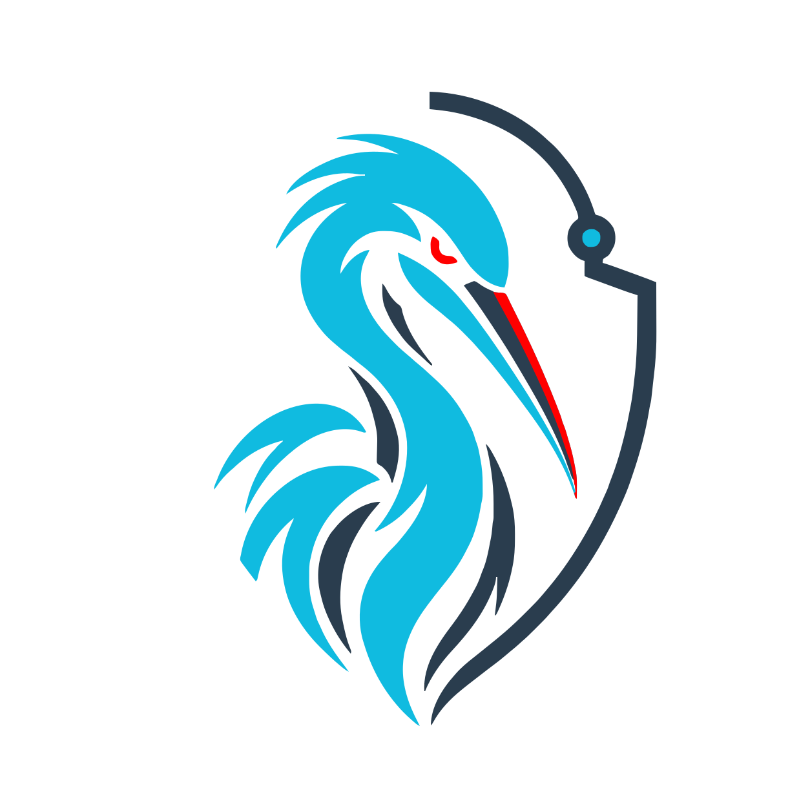
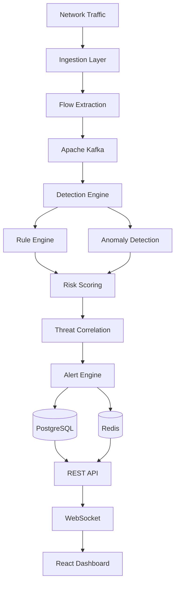
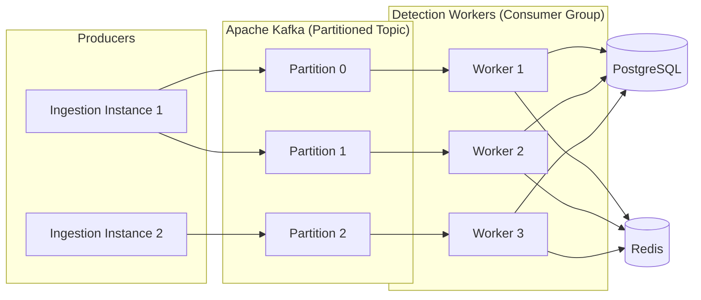

<div align="center">
  
  <h1>Intriqo</h1>
  <p><strong>Real-time Network Intrusion Detection &amp; Security Analytics Platform</strong></p>

  <p>
    <a href="https://github.com/AlliedEdge/intriqo/actions/workflows/ci.yml">
      
    </a>
    
    
    
    
    <a href="LICENSE">
      
    </a>
  </p>
</div>

---

Intriqo is a Java-based real-time network security platform designed to ingest network flows, detect suspicious behavior through rule-based and anomaly-based engines, correlate threat events, score risk, and deliver actionable security alerts. It is built around strong domain boundaries, event-driven processing, concurrency, observability, and measured scalability — starting as a well-structured modular monolith and evolving toward selectively distributed services only where workload evidence justifies it.

> **Status: 🚧 Active Development**
> Core domain modeling and architectural foundations are being established. See the [Roadmap](#roadmap) for the current phase of work. Do not assume any component is production-ready.

---

## Table of Contents

- [Engineering Goals](#engineering-goals)
- [Architecture](#architecture)
  - [Processing Pipeline](#processing-pipeline)
  - [Architectural Philosophy](#architectural-philosophy)
  - [Scalability Model](#scalability-model)
- [Repository Structure](#repository-structure)
- [Backend Domain Structure](#backend-domain-structure)
- [Detection Engine](#detection-engine)
- [Event-Driven Architecture](#event-driven-architecture)
- [Scalability](#scalability)
- [Observability](#observability)
- [Security Architecture](#security-architecture)
- [Machine Learning](#machine-learning)
- [Testing](#testing)
- [Performance](#performance)
- [Quick Start](#quick-start)
- [Configuration](#configuration)
- [Demo Walkthrough](#demo-walkthrough)
- [Roadmap](#roadmap)
- [Design Decisions](#design-decisions)
- [Documentation](#documentation)
- [Contributing](#contributing)
- [Security Reporting](#security-reporting)
- [License](#license)

---

## Engineering Goals

Intriqo is designed to demonstrate serious software engineering across the following domains:

| Domain | Capabilities |
|---|---|
| **Networking** | Network flow ingestion, PCAP replay, traffic generation |
| **Detection** | Rule-based detection, anomaly detection, feature extraction, threat classification |
| **Correlation** | Event correlation, risk scoring, alert deduplication and suppression |
| **Concurrency** | Concurrent detection workers, non-blocking I/O, thread pool management |
| **Distributed Systems** | Kafka event streaming, consumer groups, partition-based parallelism, backpressure |
| **Persistence** | PostgreSQL for durable state, Redis for low-latency cache and ephemeral state |
| **API** | REST APIs, real-time WebSocket alert delivery |
| **Observability** | Structured logging, Prometheus metrics, Grafana dashboards, latency tracking |
| **Security** | Authentication, authorization, input validation, secret management |
| **Scalability** | Horizontal scaling of detection workers, load balancing, throughput benchmarking |

---

## Architecture

### Processing Pipeline

The following diagram represents the intended end-to-end processing pipeline:



### Architectural Philosophy

Intriqo intentionally begins as a **modular monolith** — a single deployable unit composed of well-isolated, independently maintainable domain modules. This is a deliberate engineering choice, not a limitation.

The intended evolution path:

```
Modular Monolith
    │
    ▼
Event-Driven Architecture (Kafka)
    │
    ▼
Benchmarking & Profiling
    │
    ▼
Identify Real Bottlenecks
    │
    ▼
Extract Selectively Scalable Workloads
    │
    ▼
Horizontally Scalable Services
```

Service extraction is not driven by architectural aesthetics. Each extraction must be justified by measured workload characteristics: throughput saturation, latency percentiles, resource contention, or independent scaling requirements. Modules that do not exhibit those characteristics remain co-deployed.

### Scalability Model



Multiple detection workers consume partitioned Kafka topics within a consumer group. Each worker processes a disjoint partition subset, enabling linear horizontal scaling of detection throughput. Shared state is coordinated through PostgreSQL and Redis.

---

## Repository Structure

```
intriqo/
├── .github/
│   └── workflows/          # CI, build, and security scan pipelines
├── docs/
│   ├── architecture/       # System design documents and component diagrams
│   ├── adr/                # Architecture Decision Records
│   ├── security/           # Threat model and security documentation
│   ├── api/                # OpenAPI specification
│   └── performance/        # Benchmark results and latency analysis
├── infrastructure/
│   ├── docker/             # Per-service Dockerfiles
│   ├── kafka/              # Topic definitions and Kafka configuration
│   ├── postgres/           # Migrations and seed data
│   ├── redis/              # Redis configuration
│   └── monitoring/         # Prometheus and Grafana configuration
├── scripts/                # Dev setup, traffic generation, PCAP replay, benchmarking
├── datasets/               # Sample datasets for testing and experimentation
├── pcaps/                  # PCAP files for traffic replay
├── src/
│   ├── main/java/          # Application source code
│   └── main/resources/     # Configuration files
├── frontend/
│   └── intriqo-dashboard/  # React + TypeScript dashboard (Vite)
├── ml/                     # Python notebooks, preprocessing, training, and model evaluation
├── load-tests/             # Load testing scenarios and results
├── tests/
│   ├── integration/        # Kafka, PostgreSQL, Redis integration tests
│   ├── contract/           # API contract tests
│   ├── performance/        # Ingestion and detection throughput tests
│   └── security/           # Authentication, authorization, and injection tests
├── build.gradle
├── settings.gradle
└── docker-compose.yml
```

---

## Backend Domain Structure

The Java application is organized around domain packages with clearly scoped responsibilities:

```
com.intriqo/
├── ingestion/       # Network flow ingestion, traffic parsing, flow representation
├── detection/       # Detection engine, rule framework, anomaly detection, feature extraction
├── correlation/     # Threat correlation, event grouping, suppression, deduplication
├── threat/          # Threat classification, risk scoring, severity assessment
├── alert/           # Alert lifecycle, WebSocket delivery, notification routing
├── api/             # REST controllers, WebSocket endpoints, request/response models
├── persistence/     # Repositories, database access, caching abstractions
├── infrastructure/  # Kafka producers and consumers, external integrations
└── common/          # Shared types, domain events, utilities, error handling
```

Each domain module is designed to own its data, enforce its own invariants, and communicate with other modules through well-defined interfaces or domain events. Cross-domain direct coupling is avoided.

---

## Detection Engine

The detection engine is designed around an extensible rule interface. Each rule receives a normalized network flow and returns a structured detection result:

```java
public interface DetectionRule {
    DetectionResult evaluate(NetworkFlow flow);
}
```

Rules are registered in a pipeline and evaluated concurrently against incoming flows. The engine is designed to be extended without modification to core processing logic.

Planned detection patterns include:

- **Port scanning** — systematic connection attempts across a range of ports
- **Brute-force behavior** — repeated authentication failures against a target host
- **SYN flooding** — large volumes of half-open TCP connections
- **DNS anomalies** — unusually high DNS query rates, large responses, or suspicious domains
- **Suspicious traffic patterns** — abnormal flow volumes, durations, or protocol behaviors

> These detection patterns represent planned or in-progress work. Not all rules are currently implemented. Refer to the source under `com.intriqo.detection` for what is active.

The detection engine is designed to combine three complementary approaches:

| Layer | Mechanism |
|---|---|
| Rule-based | Explicit pattern matching against known signatures and behavioral thresholds |
| Statistical | Baseline modeling, deviation scoring, frequency analysis |
| ML | Trained classifiers for anomaly detection and threat categorization |

---

## Event-Driven Architecture

Apache Kafka sits between ingestion and detection, providing:

- **Decoupling** — ingestion and detection scale and fail independently
- **Buffering** — Kafka absorbs traffic bursts without dropping events
- **Parallelism** — partitioned topics map directly to parallel detection workers
- **Consumer groups** — multiple workers share load across topic partitions
- **Replayability** — retained events can be replayed for model retraining, debugging, or regression testing
- **Backpressure handling** — downstream slowness does not propagate upstream to ingestion
- **Horizontal scaling** — adding detection workers increases throughput proportionally, up to the partition count

> Kafka integration is planned for Phase 3. The current codebase is being structured to make event-driven integration straightforward when introduced.

---

## Scalability

Intriqo is designed with horizontal scalability as an architectural goal. The following components are intended to be stateless or independently scalable:

| Component | Scaling Approach |
|---|---|
| REST API | Stateless instances behind a load balancer |
| Detection Workers | Consumer group members, scale by adding workers up to partition count |
| Ingestion | Multiple producers writing to Kafka |
| PostgreSQL | Shared persistent state; connection pooling; read replicas for analytical queries |
| Redis | Shared low-latency state and caching layer |

Scaling decisions will be informed by measured throughput, latency percentiles, and resource utilization from the benchmark suite. Claims about throughput or scaling efficiency will only be made once supported by reproducible benchmark results.

---

## Observability

Planned observability stack:

- **Spring Boot Actuator** — health endpoints, environment info, live metrics
- **Prometheus** — metrics scraping and storage
- **Grafana** — dashboards for detection throughput, alert volume, latency, and system health
- **Structured logging** — JSON-formatted logs with correlation IDs, severity, and component context

Metrics of interest include:

| Metric | Description |
|---|---|
| `intriqo.flows.ingested` | Total network flows ingested |
| `intriqo.detection.latency` | Time from flow ingestion to detection result |
| `intriqo.alerts.generated` | Alerts produced by the detection engine |
| `kafka.consumer.lag` | Consumer group lag per partition |
| `intriqo.db.query.latency` | Database operation latency |
| `intriqo.rules.evaluated` | Detection rule evaluations per second |

> Observability infrastructure is planned for Phase 6. The table above reflects intended metrics, not currently emitted ones.

---

## Security Architecture

Intriqo's security design covers:

- **Authentication** — planned support for JWT-based authentication with stateless session handling
- **Authorization** — role-based access control on API endpoints
- **Input validation** — strict validation of all ingested data and API inputs
- **Secret management** — environment variable injection; no secrets in source or configuration files
- **Threat modeling** — documented in [`docs/security/threat-model.md`](docs/security/threat-model.md)
- **Dependency scanning** — automated vulnerability scanning in CI via the security scan workflow
- **Security tests** — dedicated test suite covering authentication, authorization, and injection attack vectors

See [`docs/security/`](docs/security/) for the full security documentation and [`SECURITY.md`](SECURITY.md) for vulnerability reporting.

---

## Machine Learning

ML is a supporting component of the detection architecture, not the primary one. Intriqo does not rely on ML as a substitute for sound engineering.

The intended detection model combines:

```
Rule-based detection          → deterministic, low-latency, auditable
Statistical anomaly detection → baseline deviation, unsupervised
ML classification             → trained models for complex pattern recognition
Threat correlation            → cross-event reasoning
Risk scoring                  → composite severity assessment
```

Python is used for data exploration, preprocessing, model training, and evaluation in the `ml/` directory. Trained models are intended to be exported and served from the Java backend. The production detection runtime remains in Java.

---

## Testing

The test strategy covers multiple verification layers:

| Layer | Tool | Status |
|---|---|---|
| Unit tests | JUnit 5, Mockito | Planned |
| Integration — Kafka | Testcontainers | Planned |
| Integration — PostgreSQL | Testcontainers | Planned |
| Integration — Redis | Testcontainers | Planned |
| API contract tests | OpenAPI + contract testing | Planned |
| Performance tests | Custom benchmark suite | Planned |
| Security tests | Dedicated test suite | Planned |

[Testcontainers](https://testcontainers.com/) is the preferred approach for integration tests that require real infrastructure instances. This avoids mocking infrastructure behavior and catches integration issues early.

---

## Performance

Performance will be evaluated using reproducible benchmarks rather than claimed figures. The benchmark suite is planned for Phase 7.

Metrics to be measured:

| Metric | Description |
|---|---|
| Ingestion throughput | Events/sec at the ingestion boundary |
| Detection latency | p50 / p95 / p99 (ms) from flow arrival to detection result |
| Kafka throughput | Messages/sec produced and consumed |
| Consumer lag | Sustained lag under load |
| Detection worker utilization | CPU and memory per worker under load |
| Database throughput | Reads and writes per second |
| Scaling efficiency | Throughput gain per additional detection worker |

**Benchmark results:** TBD — will be added as the benchmark suite is implemented.

---

## Quick Start

### Prerequisites

- Java 21
- Docker and Docker Compose
- The Gradle wrapper (`gradlew`) is included — no separate Gradle installation required

### Build

```bash
./gradlew build
```

### Run Tests

```bash
./gradlew test
```

### Start Infrastructure

```bash
docker compose up -d
```

This starts PostgreSQL, Redis, Kafka, Prometheus, and Grafana.

### Start Application

```bash
./gradlew bootRun
```

> **Note:** Some components depend on phases not yet implemented. Review the [Roadmap](#roadmap) to understand what is currently functional.

---

## Configuration

Intriqo is configured through environment variables. No secrets should be hardcoded or committed to source control.

| Variable | Description | Example |
|---|---|---|
| `DB_URL` | PostgreSQL JDBC URL | `jdbc:postgresql://localhost:5432/intriqo` |
| `DB_USERNAME` | Database username | `intriqo` |
| `DB_PASSWORD` | Database password | *(use a secret manager)* |
| `KAFKA_BOOTSTRAP_SERVERS` | Kafka broker addresses | `localhost:9092` |
| `REDIS_HOST` | Redis hostname | `localhost` |
| `REDIS_PORT` | Redis port | `6379` |

Environment-specific configuration files are located in `src/main/resources/`:

- `application.yml` — base configuration
- `application-dev.yml` — local development overrides
- `application-prod.yml` — production overrides (secrets via environment injection)

---

## Demo Walkthrough

The intended demo sequence, once all phases are complete:

1. Start the full infrastructure stack with `docker compose up -d`
2. Generate or replay network traffic using `scripts/generate-traffic.sh` or `scripts/replay-pcap.sh`
3. The ingestion layer parses and normalizes incoming flows
4. Normalized flow events are published to a Kafka topic
5. Detection workers consume the topic and evaluate flows against registered rules
6. Suspicious events are forwarded to the correlation engine
7. The correlation engine groups related events and scores aggregate risk
8. The alert engine generates a structured alert and persists it to PostgreSQL
9. The alert is also pushed to connected clients via WebSocket
10. The React dashboard displays the alert in real-time with flow context and severity

> This walkthrough describes the target behavior. Individual steps will become functional as corresponding phases are completed.

---

## Roadmap

### Phase 1 — Foundation
- [ ] Project structure and build configuration
- [ ] Core domain model: `NetworkFlow`, `FlowFeatures`, `DetectionResult`
- [ ] Basic ingestion interface and flow representation
- [ ] Application configuration and profiles

### Phase 2 — Detection Engine
- [ ] `DetectionRule` interface and rule registry
- [ ] Concurrent rule evaluation pipeline
- [ ] Initial detection rules (port scan, brute-force, SYN flood)
- [ ] Detection result model and severity classification

### Phase 3 — Kafka Integration
- [ ] Topic definitions and schema design
- [ ] Kafka producer in the ingestion layer
- [ ] Kafka consumer group in the detection layer
- [ ] Backpressure handling and consumer lag monitoring

### Phase 4 — Correlation and Alerting
- [ ] Threat correlation engine
- [ ] Risk scoring model
- [ ] Alert deduplication and suppression
- [ ] Alert lifecycle management

### Phase 5 — Persistence and APIs
- [ ] PostgreSQL schema and migrations
- [ ] Repositories for flows, alerts, and threats
- [ ] Redis caching layer
- [ ] REST API endpoints
- [ ] WebSocket alert delivery

### Phase 6 — Dashboard and Observability
- [ ] React + TypeScript dashboard (Vite)
- [ ] Real-time alert feed via WebSocket
- [ ] Spring Boot Actuator integration
- [ ] Prometheus metrics instrumentation
- [ ] Grafana dashboards

### Phase 7 — ML and Benchmarking
- [ ] Statistical anomaly detection
- [ ] ML model integration (Python training → Java inference)
- [ ] Benchmark suite design and implementation
- [ ] Load testing scenarios
- [ ] Performance baseline documentation

### Phase 8 — Hardening and Selective Scaling
- [ ] Security hardening and penetration test results
- [ ] Horizontal scaling validation under benchmark load
- [ ] Selective service extraction (where benchmarks justify it)
- [ ] Production deployment configuration

---

## Design Decisions

Significant architectural choices are documented as Architecture Decision Records in [`docs/adr/`](docs/adr/). The reasoning behind key technology choices is summarized here:

**Why Java?**
Java 21 brings virtual threads (Project Loom), records, sealed classes, and strong concurrency primitives. For a system designed around concurrent detection workers, event processing, and high-throughput I/O, Java is a technically justified choice — not a default one.

**Why Gradle?**
Gradle offers fine-grained build control, incremental compilation, and a Kotlin DSL that is more maintainable than Maven XML at this level of project complexity.

**Why start as a modular monolith?**
Microservices introduce distributed system complexity — network partitions, distributed tracing, service discovery, partial failures — before there is any evidence those tradeoffs are justified. Starting as a modular monolith with clear domain boundaries allows the architecture to evolve based on measured characteristics rather than speculation.

**Why Kafka?**
Kafka decouples ingestion from detection, absorbs traffic bursts, enables replayability for debugging and model retraining, and supports partition-based parallelism for detection workers. These are concrete engineering requirements, not architectural decoration.

**Why PostgreSQL?**
Relational integrity matters for alert correlation, event sequencing, and audit trails. PostgreSQL is operationally well-understood, has strong JSON support for flexible schemas where needed, and integrates well with the rest of the stack.

**Why Redis?**
Some detection patterns — rate limiting, connection tracking, sliding window counters — require sub-millisecond state access that relational queries cannot provide at scale. Redis is used where that access pattern is genuinely needed.

**Why React?**
The dashboard is primarily a real-time data display and alert management interface. React with TypeScript provides a well-typed, component-based foundation that fits this use case without unnecessary complexity.

**Why combine rule-based and ML detection?**
Rules provide deterministic, auditable detection with known false-positive characteristics. ML provides coverage for novel patterns that rules cannot anticipate. Neither approach alone is sufficient. The combination, with risk scoring, produces a more reliable detection system than either in isolation.

**Why benchmark before extracting microservices?**
Service extraction has a real cost: operational overhead, distributed system failure modes, and debugging complexity. That cost is only worth paying when a specific workload genuinely requires it. Benchmarks identify which components saturate first and whether distributed deployment would actually help.

---

## Documentation

| Document | Location |
|---|---|
| System Architecture | [`docs/architecture/system-architecture.md`](docs/architecture/system-architecture.md) |
| Component Diagram | [`docs/architecture/component-diagram.md`](docs/architecture/component-diagram.md) |
| Data Flow | [`docs/architecture/data-flow.md`](docs/architecture/data-flow.md) |
| Deployment Architecture | [`docs/architecture/deployment-architecture.md`](docs/architecture/deployment-architecture.md) |
| Architecture Decision Records | [`docs/adr/`](docs/adr/) |
| Threat Model | [`docs/security/threat-model.md`](docs/security/threat-model.md) |
| Security Documentation | [`docs/security/`](docs/security/) |
| API Specification | [`docs/api/openapi.yaml`](docs/api/openapi.yaml) |
| Performance Documentation | [`docs/performance/`](docs/performance/) |

---

## Contributing

Contributions are welcome. Please read [`CONTRIBUTING.md`](CONTRIBUTING.md) before opening a pull request. It covers the development workflow, code style expectations, commit conventions, and review process.

---

## Security Reporting

Do not report security vulnerabilities through public GitHub issues. See [`SECURITY.md`](SECURITY.md) for the responsible disclosure process.

---

## License

See [`LICENSE`](LICENSE).

---
## Authors

- **Rayan Mohammed Rafeeq** — [GitHub](https://github.com/Rayan-Mohammed-Rafeeq)
- **Hemanth Kumar** — [GitHub](https://github.com/hemanth-kumar-n-1)
- **Sumit Patil** — [GitHub](https://github.com/sumitpatil93463-png)
- **Rakshith Y** — [GitHub](https://github.com/rakshithy3185)

**Project:** Intriqo
