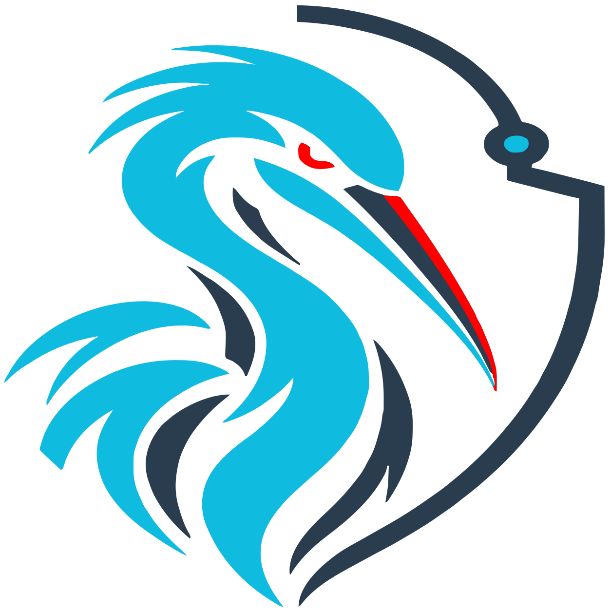

<div align="center">

  

  <h1>Intriqo</h1>

  <p><strong>Reproducible local network security monitoring workflow</strong></p>

  <p><em>Deterministic detection · Optional isolated ML · Analyst-auditable SOC flow</em></p>

  <p>
    <a href="https://github.com/AlliedEdge/intriqo/actions/workflows/ci.yml">
      
    </a>
    
    
    
    
    
    
    <a href="LICENSE">
      
    </a>
  </p>

</div>

---

## What is Intriqo?

Intriqo is an open-source network security monitoring project under development.
Core v1 currently validates deterministic `PORT_SCAN`, `UDP_SCAN`, and `SYN_FLOOD` detection,
an optional locked-model `ML_ANOMALY` path, and the local
Detection → Event → Incident → Investigation → Finding → Audit workflow.
The C++ engine observes authorized Linux traffic or offline/synthetic fixtures;
the FastAPI Control Plane persists authenticated events in PostgreSQL; agents
poll investigation tasks; and the React dashboard reads the same REST APIs.

The implemented Core v1 flow is:

```
Authorized traffic or controlled replay
      ↓
C++ IDS Engine          ← parsing, flows, PORT_SCAN/UDP_SCAN/SYN_FLOOD detection
      ↓  authenticated SecurityEvent JSON
FastAPI Control Plane   ← PostgreSQL, correlation, lifecycle, RBAC, audit
      ↓  persisted AgentTask
Investigation Agent     ← structured evidence and idempotent Finding
      ↓
React SOC Dashboard     ← authenticated REST views and explicit refresh
```

> **Status:** Core v1 release-candidate validation is documented, but this is
> not a production deployment or production-readiness claim. Live full-stack
> capture was not exercised in the current host because libpcap is unavailable.
> See [Current Status](#current-status), [Local Development](docs/local-development.md),
> and [runtime recovery](docs/runtime-recovery.md).

---

## Documentation

The full documentation is split into focused pages. Click any section to go straight to the detail.

**New developer quick path:** [Local Development](docs/local-development.md)
contains the prerequisites, one-command startup, health/status, logs, smoke
test, ML enablement, recovery, and security boundaries.

The analyst lifecycle is documented in [SOC Workflow](docs/soc-workflow.md),
including correlation, state transitions, evidence, deduplication, RBAC, and
dashboard navigation.

### 🏗 Architecture

| Page | Description |
|---|---|
| [System Architecture](docs/architecture/system-architecture.md) | Full system diagram, layer responsibilities, data flow |
| [Component Diagram](docs/architecture/component-diagram.md) | Per-subsystem breakdown of all four layers |
| [Data Flow](docs/architecture/data-flow.md) | Detection → investigation → response → dashboard path |
| [Deployment Architecture](docs/architecture/deployment-architecture.md) | Local dev topology, target production layout |

### 🤖 Autonomous Agents

| Page | Description |
|---|---|
| [Agent Overview & Autonomous Loop](docs/agents/overview.md) | The control loop, agent team design, and coordination model |
| [Investigation Agent](docs/agents/investigation-agent.md) | Evidence gathering, tool invocation, finding generation |
| [Threat Intelligence Agent](docs/agents/threat-intelligence-agent.md) | IP/domain reputation, threat feed enrichment |
| [Correlation Agent](docs/agents/correlation-agent.md) | Multi-event incident reconstruction, attack sequence building |
| [Response Agent](docs/agents/response-agent.md) | Action proposal, policy submission, verification |
| [Orchestrator](docs/agents/orchestrator.md) | Task routing, state management, autonomous loop control |
| [Tool Layer](docs/agents/tools.md) | Tool abstraction, input schema, mock and real tools |
| [Agent Communication](docs/agents/communication.md) | Typed domain contracts between agents |

### ⚙️ IDS Engine

| Page | Description |
|---|---|
| [C++ IDS Engine](docs/engine/ids-engine.md) | Subsystems, pipeline, detection approach, why C++ |
| [Capture Hardening Validation](docs/engine/capture-hardening-validation.md) | State policies, five-minute soaks, actual losses and versioned comparisons |
| [FlowFeatureRecord v1](docs/engine/flow-feature-contract.md) | Versioned flow measurements, bounded JSONL sink, strict Python consumer; no ML model |
| [Feature Boundary Validation](docs/engine/flow-feature-validation.md) | Actual regression, end-to-end, performance and memory results |
| [Optional Isolation Forest v2 inference](docs/ml-inference-integration.md) | Locked, disabled-by-default Python ML worker and Control Plane event integration |

### 🛡 Security

| Page | Description |
|---|---|
| [Policy Boundary](docs/security/policy-boundary.md) | How agents are constrained — ALLOW / DENY / HUMAN_APPROVAL flow |
| [Human Supervision Model](docs/security/human-supervision.md) | START / STOP / PAUSE / EMERGENCY STOP, operator capabilities |

### 🧪 Security Lab

| Page | Description |
|---|---|
| [Controlled Security Lab](docs/lab/security-lab.md) | Lab environment, attack scenarios, PCAP tooling |
| [INTRIQO Demo Lab](docs/demo-lab.md) | Persistent isolated namespaces, TAP mirror, live sensor path |
| [Demo Runbook](docs/demo-runbook.md) | 10–15 minute analyst demonstration |

### 📐 Architecture Decisions

| ADR | Decision |
|---|---|
| [ADR 001](docs/adr/001-modular-monorepo.md) | Modular monorepo structure |
| [ADR 002](docs/adr/002-cpp-ids-engine.md) | C++ for the IDS engine (replaces Java detection core) |
| [ADR 003](docs/adr/003-python-control-plane.md) | Python + FastAPI for the control plane |
| [ADR 004](docs/adr/004-python-agent-platform.md) | Python for the autonomous agent platform |
| [ADR 005](docs/adr/005-explicit-contracts.md) | Explicit cross-boundary JSON Schema contracts |
| [ADR 006](docs/adr/006-deferred-distributed-infrastructure.md) | Defer distributed infrastructure until benchmarks justify it |

### 🔬 Research & Performance

| Page | Description |
|---|---|
| [Research Methodology](docs/research/methodology.md) | Research questions, hypotheses, evaluation plan |
| [Benchmarks & Metrics](docs/performance/benchmarks.md) | Detection, investigation, response, and engine metrics |

---

## Repository Layout

```
intriqo/
├── engine/           C++ IDS engine        (CMake, C++20, GoogleTest)
├── control-plane/    Python control plane  (FastAPI, SQLAlchemy, Pydantic)
├── agents/           Python agent platform (intriqo_agents, 79 tests)
├── frontend/         React SOC dashboard   (Vite, TypeScript)
├── contracts/        JSON Schema contracts (5 cross-boundary schemas)
├── ml/               Anomaly models        (training, evaluation, experiments)
├── security-lab/     Attack scenarios      (Docker, PCAP tooling, fixtures)
├── infrastructure/   PostgreSQL and reserved future service directories
├── tests/            Cross-system tests    (e2e, integration, performance, security)
├── benchmarks/       Performance suite     (engine, detection, agents, end-to-end)
├── scripts/          Developer helpers     (dev, build, lab, benchmark)
└── docs/             All documentation     (architecture, ADRs, agents, engine, …)
    └── archive/      Preserved history     (Java-era architecture)
```

---

## Quick Start

**Prerequisites:** CMake ≥ 3.24, Python ≥ 3.10, Node.js ≥ 20, Docker + Compose.
The reproducible local runtime uses PostgreSQL plus the existing host-process
Control Plane, agent poller, optional ML worker, C++ engine, and Vite dashboard.
It does not start Redis, Kafka, or any other broker.

```bash
python3 -m venv control-plane/.venv
control-plane/.venv/bin/pip install -e 'control-plane[dev]' -e 'agents[dev]' -e 'ml[dev]'
(cd frontend/dashboard && npm ci)
cmake -S . -B build/intriqo-runtime-release -DCMAKE_BUILD_TYPE=Release -DINTRIQO_BUILD_TESTS=ON
cmake --build build/intriqo-runtime-release --parallel
cp .env.example .env
./scripts/start-intriqo.sh
./scripts/status-intriqo.sh
./scripts/smoke-intriqo.sh
```

See [Local Development](docs/local-development.md) for ML enablement, logs,
recovery, isolated lab traffic, and the complete check matrix. The focused live
demonstration is documented in [Demo Lab](docs/demo-lab.md) and the
[Demo Runbook](docs/demo-runbook.md).

## FYP Demo After Reboot

From the repository root, start the isolated attacker/victim lab and Intriqo
runtime. Select `control-plane/.env` so the Control Plane receives the email
settings configured there:

```bash
cd /run/media/rayan/Workspace/01_Projects/intriqo
export INTRIQO_ENV_FILE=control-plane/.env
sudo -v
./scripts/lab/up.sh
./scripts/lab/status.sh --verify
./scripts/start-demo.sh
./scripts/status-intriqo.sh
curl -fsS http://169.254.77.1:8000/ready
```

Open `http://127.0.0.1:5173/` and sign in with your analyst account. To
generate the bounded lab detections, run:

```bash
./scripts/lab/port-scan.sh
./scripts/lab/udp-port-scan.sh
./scripts/lab/syn-flood.sh
```

Refresh the dashboard, open each event and its incident, create an
investigation task, then review the completed finding and audit trail. For
live logs, use `./scripts/logs-intriqo.sh --follow engine` and
`./scripts/logs-intriqo.sh --follow control-plane` in separate terminals. To
stop the runtime and lab when finished:

```bash
./scripts/stop-intriqo.sh --keep-postgres
./scripts/lab/down.sh
```

---

## Current Status

### Run the IDS

Requires C++20 and CMake ≥ 3.24; live capture additionally needs Linux, libpcap
development headers (`libpcap-dev` on Debian/Ubuntu), and authorized capture
privileges. Offline modes require neither libpcap nor a physical interface.

```bash
cmake -S . -B build/intriqo-runtime-release -DCMAKE_BUILD_TYPE=Release -DINTRIQO_BUILD_TESTS=ON
cmake --build build/intriqo-runtime-release --parallel
ctest --test-dir build/intriqo-runtime-release --output-on-failure

build/intriqo-runtime-release/engine/intriqo-engine --help
build/intriqo-runtime-release/engine/intriqo-engine --synthetic --output events.jsonl
build/intriqo-runtime-release/engine/intriqo-engine --pcap authorized-input.pcap --output events.jsonl
# Run only with approved privileges and an interface you are authorized to observe:
build/intriqo-runtime-release/engine/intriqo-engine --interface eth0 --filter "tcp" --no-promiscuous

# Token comes from the existing authentication/service-identity API; never a CLI argument.
export INTRIQO_CONTROL_PLANE_URL=http://127.0.0.1:8000
export INTRIQO_CONTROL_PLANE_TOKEN="$IDS_ENGINE_JWT"
build/intriqo-runtime-release/engine/intriqo-engine --interface eth0 --filter "tcp" --sink http

# Reproducible Release benchmark (full raw-packet runtime, not pre-parsed input):
python3 scripts/benchmark/runtime_benchmark.py --build build/intriqo-runtime-release
```

`--sink file|http`, `--output`, `--snaplen`, `--no-promiscuous`,
`--portscan-window`, `--portscan-unique-port-threshold`,
`--portscan-minimum-attempts`, and `--log-level error|info|debug` configure the
runtime. `INTRIQO_CONTROL_PLANE_ENDPOINT` defaults to `/api/v1/events`.
The existing HTTP sink is plain HTTP only: use it on a trusted local/isolated
network, not across an untrusted network with bearer credentials.

Startup reports the mode/source/registry/sink/configuration and capture
readiness; SIGINT/SIGTERM stop capture, flush flows/sink, and print measured
packet/flow/detection/delivery/failure/duration counters. Failed capture or
delivery returns nonzero; no per-packet logs or credentials are printed.

**Visibility is local to the configured traffic source.** Network-wide
monitoring requires an authorized SPAN/mirror port, TAP, or equivalent network
configuration. Promiscuous mode alone does not supply network-wide visibility.
See [limitations and configuration](docs/engine/ids-engine.md) and
[actual verification/benchmark results](docs/engine/runtime-validation.md).

### Capture Reliability and State Management

The existing IDS now bounds active flows (default **100000**, idle timeout
**60 seconds**) and port-scan state (**4096 source windows / 100000 flow IDs**).
Idle maintenance and deterministic oldest-flow eviction are counted. Capture
defaults to buffered libpcap dispatch with a **16 MiB request / 100 ms timeout**;
raw kernel/interface drops, parser rejections and completed processing remain
separate. The original observed **867 captured / 265 drops** is preserved.

`--flow-idle-timeout`, `--max-active-flows`, `--max-tracked-sources`,
`--max-tracked-observations`, `--capture-timeout-ms` and `--capture-immediate`
make the policies explicit. Optional `--event-queue-capacity 256` wraps the
existing sink in a bounded in-process delivery queue; **0 is the synchronous
default**. Overflow/failure stops capture, counts failed events and drains
admitted work. This is not a durable queue or a zero-loss guarantee.

Final five-minute loopback/file-sink soak: **3000010 captured/processed**, zero
reported capture/interface drops or parser rejects, one known event acknowledged,
peak 11 flows, final active state zero. The separate high-cardinality state
fixture processed **3 million packets** under 256/64/128 limits; RSS was
**4628 / 5028 / 5028 KiB** initial/peak/final. 30/60-minute procedures exist but
were not run. Synchronous HTTP acknowledgment stalls still caused measured
capture loss; the optional queue relieved the tested bounded stall only.

```bash
# Short deterministic state/expiry/correctness exercise; no capture privileges:
build/intriqo-runtime-release/engine/intriqo-state-soak --duration-seconds 3 \
  --rate 10000 --max-active-flows 256 --max-tracked-sources 64 \
  --max-tracked-observations 128 --flow-idle-timeout 2
```

See the [16-part measured report](docs/engine/capture-hardening-validation.md)
for three-repeat synthetic/PCAP results, overload boundaries, counter semantics,
all changed files and 300/1800/3600-second local-only release procedures.

| Layer | Status | Details |
|---|---|---|
| **C++ Engine** | 🟢 Validated | Deterministic `PORT_SCAN`/`UDP_SCAN`/`SYN_FLOOD`, synthetic/classic-PCAP paths, bounded state and event sink; live capture remains environment-dependent |
| **Optional ML** | 🟡 Experimental | Locked native-v2 Isolation Forest worker, disabled by default, hash-checked, analyst-promoted to incidents; not a production accuracy claim |
| **Control Plane** | 🟢 Core v1 workflow | FastAPI, PostgreSQL persistence, JWT/RBAC, correlation, incident lifecycle, tasks, findings, and audit logs |
| **Agents** | 🟢 Core v1 investigation | Polling agent with idempotent retries and structured detector-specific evidence |
| **Frontend** | 🟢 Core v1 navigation | Authenticated REST dashboard for events, incidents, tasks, findings, evidence, timeline, provenance, and audit |
| **Documentation/tooling** | 🟢 Local reproducibility | Documented startup/status/smoke/recovery commands and controlled validation procedures |

**Not supported or proven:** IPS/prevention, automated remediation or blocking,
external ML generalization, production deployment, large-scale throughput,
network-wide visibility without authorized sensor placement, or a live full-stack
runtime test on a host without libpcap. Kafka, Redis, Kubernetes, streaming UI,
and additional detectors remain deferred.

---

## Security Model

Agents **propose**. The policy engine **decides**. The execution layer **acts**.

No agent has unrestricted shell access, raw SQL, arbitrary network access, or direct filesystem write access. Every side-effect goes through an explicit `Tool` → `PolicyEngine` → `AuditLog` chain.

→ Full detail: [Policy Boundary](docs/security/policy-boundary.md)

---

## Contributing

See [CONTRIBUTING.md](CONTRIBUTING.md) before opening a pull request.

## Security Reporting

Do not use public issues. See [SECURITY.md](SECURITY.md) for the responsible disclosure process.

## License

See [LICENSE](LICENSE).

---

## Authors

- **Rayan Mohammed Rafeeq** — [GitHub](https://github.com/Rayan-Mohammed-Rafeeq)
- **Hemanth Kumar** — [GitHub](https://github.com/hemanth-kumar-n-1)
- **Sumit Patil** — [GitHub](https://github.com/sumitpatil93463-png)
- **Rakshith Y** — [GitHub](https://github.com/rakshithy3185)
