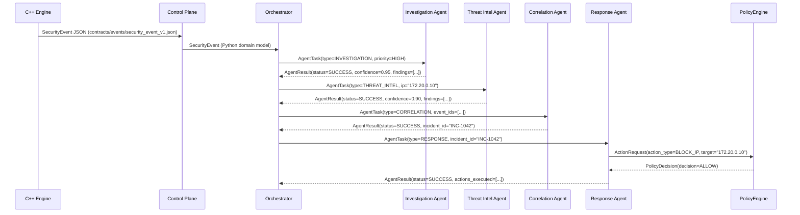

# Agent-to-Agent Communication

← [Back to Agent Overview](overview.md) · [Back to README](../../README.md)

---

## Design Principle

Agents communicate through **typed domain objects**, not uncontrolled natural-language messages. Every message between agents is a structured Python dataclass — serializable, testable, and auditable.

This gives:

- **Type safety** — mismatched contracts fail at construction time
- **Auditability** — every message can be persisted and inspected
- **Testability** — agent interactions are reproducible without live infrastructure
- **Observability** — every agent communication appears in the audit log

---

## Communication Flow



---

## Domain Objects

### SecurityEvent (inbound boundary)

Produced by the C++ engine, validated by the adapter, consumed by agents.

```python
@dataclass(frozen=True)
class SecurityEvent:
    id:         str
    timestamp:  datetime
    event_type: str          # "PORT_SCAN_DETECTED" | "BRUTE_FORCE_DETECTED" | …
    severity:   str          # "LOW" | "MEDIUM" | "HIGH" | "CRITICAL"
    source:     str          # source IP
    target:     str          # destination IP
    metadata:   dict[str, Any]
```

### AgentTask (orchestrator → agent)

```python
@dataclass(frozen=True)
class AgentTask:
    task_id:        str
    task_type:      str   # "INVESTIGATION" | "THREAT_INTEL" | "CORRELATION" | "RESPONSE"
    description:    str
    security_event: SecurityEvent
    priority:       str   # "LOW" | "MEDIUM" | "HIGH" | "URGENT"
    context:        dict[str, Any]
    created_at:     datetime
```

### AgentResult (agent → orchestrator)

```python
@dataclass(frozen=True)
class AgentResult:
    task_id:    str
    agent_name: str
    status:     str           # "SUCCESS" | "INCONCLUSIVE" | "FAILED"
    findings:   tuple[str, ...]
    evidence:   tuple[dict, ...]
    confidence: float          # 0.0 – 1.0
    summary:    str | None
    error:      dict | None    # populated only on FAILED
    metadata:   dict[str, Any]
    created_at: datetime
```

### ActionRequest (response agent → policy engine)

```python
@dataclass(frozen=True)
class ActionRequest:
    action_type:      str    # "BLOCK_IP" | "ISOLATE_HOST" | "COLLECT_LOGS" | …
    target:           str
    parameters:       dict[str, Any]
    requesting_agent: str
    justification:    str    # must reference specific evidence
    confidence:       float
    task_id:          str
```

### PolicyDecision (policy engine → response agent)

```python
@dataclass(frozen=True)
class PolicyDecision:
    decision:               str   # "ALLOW" | "DENY" | "HUMAN_APPROVAL"
    reason:                 str
    conditions:             dict[str, Any]
    requires_approval_from: str | None  # e.g. "soc_analyst"
```

---

## Communication Pattern Example

```
Investigation Agent
    ↓
AgentResult(
    status     = "SUCCESS",
    findings   = ["Port scan confirmed: 10 ports on 172.20.0.20"],
    evidence   = [{"type": "port_distribution", "ports": [...]}],
    confidence = 0.95
)
    ↓
Orchestrator — merges findings, creates new task
    ↓
AgentTask(task_type="THREAT_INTEL", context={"ip": "172.20.0.10"})
    ↓
Threat Intelligence Agent
    ↓
AgentResult(
    findings   = ["172.20.0.10 listed in 4 threat feeds"],
    confidence = 0.90
)
    ↓
Orchestrator — enough evidence for correlation
    ↓
AgentTask(task_type="CORRELATION", event_ids=["evt-001", "evt-002"])
    ↓
Correlation Agent
    ↓
AgentResult(
    findings = ["Multi-stage attack reconstructed: recon → brute force → access"],
    evidence = [{"type": "correlated_incident", "severity": "CRITICAL"}]
)
    ↓
Orchestrator → Response Agent
    ↓
ActionRequest(action_type="BLOCK_IP", target="172.20.0.10", justification="…")
    ↓
PolicyEngine → PolicyDecision(decision="ALLOW")
    ↓
Action executed and verified
```

---

## Cross-Boundary JSON Contracts

When communication crosses a layer boundary (engine → control plane, control plane → agents), the Python dataclasses are serialised to JSON schemas defined in `contracts/`:

| Direction | Schema |
|---|---|
| Engine → Control Plane | [`contracts/events/security_event_v1.json`](../../contracts/events/security_event_v1.json) |
| Control Plane → Agents | [`contracts/agents/agent_task_v1.json`](../../contracts/agents/agent_task_v1.json) |
| Agents → Control Plane | [`contracts/agents/agent_result_v1.json`](../../contracts/agents/agent_result_v1.json) |
| Agents → PolicyEngine | [`contracts/actions/action_request_v1.json`](../../contracts/actions/action_request_v1.json) |
| PolicyEngine → Agents | [`contracts/actions/policy_decision_v1.json`](../../contracts/actions/policy_decision_v1.json) |

Within a single Python process (e.g. within the agent platform), agents pass typed dataclasses directly — no serialisation overhead.

---

→ Back to: [Agent Overview](overview.md)
