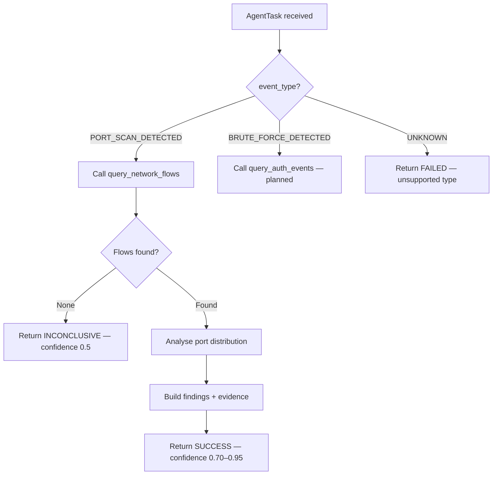

# Investigation Agent

← [Back to Agent Overview](overview.md) · [Back to README](../../README.md)

---

## Purpose

The Investigation Agent is the primary evidence-gathering specialist. When the Orchestrator receives a SecurityEvent and creates an investigation task, the Investigation Agent takes over — it queries real data sources through structured tools, analyses what it finds, and produces a typed `AgentResult` with structured findings and evidence.

**It never guesses.** Every finding is backed by data returned from a tool call.

---

## Implementation

**File:** `agents/src/intriqo_agents/investigation/agent.py`  
**Status:** ✅ Fully implemented and tested (7 unit tests passing)

```python
class InvestigationAgent(Agent):
    @property
    def name(self) -> str:
        return "investigation_agent"

    @property
    def capabilities(self) -> frozenset[str]:
        return frozenset({"investigation", "network_investigation"})

    def execute(self, task: AgentTask) -> AgentResult:
        # Routes by event_type → specialized investigation method
        if task.security_event.event_type == "PORT_SCAN_DETECTED":
            return self._investigate_port_scan(task)
        # Future: BRUTE_FORCE_DETECTED, SYN_FLOOD_DETECTED, …
```

---

## Investigation Flow



---

## Port Scan Investigation

The fully implemented investigation path for `PORT_SCAN_DETECTED`:

**Step 1 — Tool call**
```python
tool_result = query_network_flows(
    source_ip=event.source,
    target_ip=event.target,
    limit=100
)
```

**Step 2 — Evidence analysis**
```python
ports         = sorted(set(f["dst_port"] for f in flows))
total_packets = sum(f.get("packet_count", 0) for f in flows)
total_bytes   = sum(f.get("byte_count",   0) for f in flows)
confidence    = 0.95 if len(ports) >= 5 else 0.70
```

**Step 3 — Structured result**
```python
AgentResult.success(
    task_id    = task.task_id,
    agent_name = "investigation_agent",
    findings   = [
        f"Observed {len(flows)} suspicious connection attempts from {source} to {target}.",
        f"Attacker probed {len(ports)} distinct destination ports: {ports[:10]}…",
    ],
    evidence = [
        {"type": "port_distribution",       "distinct_port_count": len(ports), "ports": ports},
        {"type": "flow_telemetry_aggregate", "total_flows": len(flows), "total_packets": …},
    ],
    confidence = confidence,
    summary    = f"Port scan confirmed: source {source} scanned {len(ports)} ports on {target}.",
)
```

---

## Example Output

```
INVESTIGATION: PORT_SCAN_DETECTED
Source: 172.20.0.10 → Target: 172.20.0.20

TOOLS USED:
  ✓ query_network_flows(source_ip="172.20.0.10", target_ip="172.20.0.20", limit=100)
    → 10 flows returned

EVIDENCE:
  port_distribution:
    distinct_port_count: 10
    ports: [21, 22, 23, 80, 443, 3306, 5432, 8080, 8443, 27017]

  flow_telemetry_aggregate:
    total_flows:   10
    total_packets: 10
    total_bytes:   640
    sample_flow_ids: [flow-001, flow-002, flow-003, flow-004, flow-005]

FINDINGS:
  1. Observed 10 suspicious connection attempts from 172.20.0.10 to 172.20.0.20.
  2. Attacker probed 10 distinct destination ports: [21, 22, 23, 80, 443, …]

CONFIDENCE: 0.95
STATUS:     SUCCESS
SUMMARY:    Port scan confirmed: source 172.20.0.10 scanned 10 ports on 172.20.0.20.
```

---

## Planned Investigation Types

| Event Type | Investigation Path | Status |
|---|---|---|
| `PORT_SCAN_DETECTED` | Network flow analysis, port distribution | ✅ Implemented |
| `BRUTE_FORCE_DETECTED` | Auth event analysis, failure/success ratio, timeline | 📋 Planned |
| `SYN_FLOOD_DETECTED` | Flow volume analysis, SYN/ACK ratio | 📋 Planned |
| `DNS_ANOMALY_DETECTED` | DNS query pattern analysis, domain reputation | 📋 Planned |
| `LATERAL_MOVEMENT` | Internal connection graph, auth across multiple hosts | 📋 Planned |

---

## Result States

| Status | Meaning | Confidence |
|---|---|---|
| `SUCCESS` | Investigation produced actionable findings | 0.70 – 1.0 |
| `INCONCLUSIVE` | No evidence found to support or refute the event | 0.5 |
| `FAILED` | Tool failure, missing tool, or unsupported event type | 0.0 |

---

→ Next: [Threat Intelligence Agent](threat-intelligence-agent.md)
