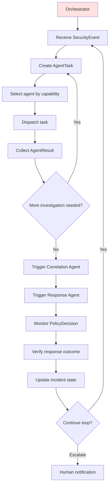

# Orchestrator

← [Back to Agent Overview](overview.md) · [Back to README](../../README.md)

---

## Purpose

The Orchestrator is the central nervous system of the autonomous agent team. It does not investigate threats, gather evidence, or propose responses itself — it **coordinates** every other agent and drives the autonomous loop.

**File:** `agents/src/intriqo_agents/orchestrator/orchestrator.py`  
**Status:** ✅ Fully implemented and tested

---

## Responsibilities



| Responsibility | Description |
|---|---|
| **Event intake** | Receives `SecurityEvent` from the control plane |
| **Task creation** | Maps event severity → task priority; builds `AgentTask` |
| **Agent selection** | Queries `AgentRegistry` for an agent matching the required capability |
| **Task dispatch** | Calls `agent.execute(task)` and collects the `AgentResult` |
| **Failure handling** | Catches agent crashes and wraps them in a `FAILED` result |
| **Follow-up routing** | Based on findings, creates new tasks for correlation or response |
| **State management** | Tracks in-flight tasks and investigation state |
| **Loop control** | Respects START / STOP / PAUSE signals |

---

## Implementation

### Task creation

```python
def create_task(self, event: SecurityEvent, task_id: str | None = None) -> AgentTask:
    priority_map = {
        "CRITICAL": "URGENT",
        "HIGH":     "HIGH",
        "MEDIUM":   "MEDIUM",
        "LOW":      "LOW",
    }
    return AgentTask(
        task_id        = task_id or f"task-{uuid.uuid4().hex[:8]}",
        task_type      = "INVESTIGATION",
        description    = f"Investigate {event.event_type} from {event.source} → {event.target}",
        security_event = event,
        priority       = priority_map.get(event.severity, "MEDIUM"),
        context        = {"event_metadata": event.metadata},
    )
```

### Agent selection

```python
def select_agent(self, task: AgentTask) -> Agent | None:
    if task.task_type == "INVESTIGATION":
        return self.registry.find_agent_by_capability("investigation")
    if task.task_type == "CORRELATION":
        return self.registry.find_agent_by_capability("correlation")
    if task.task_type == "RESPONSE":
        return self.registry.find_agent_by_capability("response")
    return None
```

### End-to-end processing

```python
def process_event(self, event: SecurityEvent) -> AgentResult:
    task  = self.create_task(event)
    agent = self.select_agent(task)

    if agent is None:
        return AgentResult.failure(task_id=task.task_id,
                                   agent_name="orchestrator",
                                   error_message=f"No agent for task_type='{task.task_type}'")
    try:
        return agent.execute(task)
    except Exception as exc:
        return AgentResult.failure(task_id=task.task_id,
                                   agent_name=agent.name,
                                   error_message=f"Agent crashed: {exc}")
```

---

## AgentRegistry

The `AgentRegistry` holds all registered agents and provides capability-based lookup.

```python
registry = AgentRegistry()
registry.register(InvestigationAgent())
# future:
# registry.register(CorrelationAgent())
# registry.register(ThreatIntelAgent())
# registry.register(ResponseAgent())

agent = registry.find_agent_by_capability("investigation")
# → InvestigationAgent instance
```

Agents advertise capabilities via `agent.capabilities: frozenset[str]`. The registry matches on any intersection.

---

## Autonomous Loop Control

The full loop (not yet wired end-to-end) will respond to control signals from the SOC dashboard:

| Signal | Effect |
|---|---|
| `START` | Begin processing incoming SecurityEvents autonomously |
| `STOP` | Finish in-flight tasks, persist state, halt new task creation |
| `PAUSE` | Suspend all agent tasks at current state; resume later |
| `EMERGENCY_STOP` | Immediately halt all response execution; freeze loop; require operator action to resume |

→ Full detail: [Human Supervision Model](../security/human-supervision.md)

---

## Demo Entrypoint

A standalone demo that wires the full agent stack together:

```bash
make agents-demo
# or directly:
cd agents && python -m intriqo_agents.orchestrator.main
```

Output:
```
[*] Processing SecurityEvent: evt-demo-001 (PORT_SCAN_DETECTED)
    Source: 10.0.0.10 → Target: 10.0.0.20
    Severity: HIGH

--------------------------------------------------------
  AGENT RESULT
--------------------------------------------------------
{
  "task_id":    "task-a1b2c3d4",
  "agent_name": "investigation_agent",
  "status":     "SUCCESS",
  "confidence": 0.95,
  "summary":    "Port scan confirmed: source 10.0.0.10 scanned 10 ports on 10.0.0.20.",
  ...
}
```

---

→ Next: [Tool Layer](tools.md)
