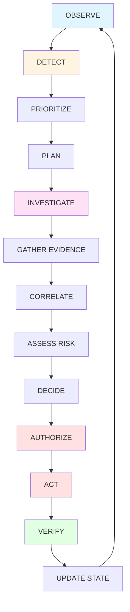
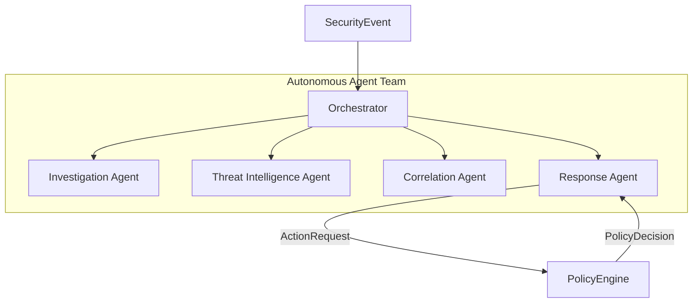

# Autonomous Agents — Overview

← [Back to README](../../README.md)

---

## The Autonomous Control Loop

Intriqo is built around a persistent loop that runs continuously while the SOC team is active. No human needs to manually trigger each step.



| Step | Description |
|---|---|
| **OBSERVE** | C++ engine monitors network traffic via live capture or PCAP replay |
| **DETECT** | Rule-based detectors and statistical anomaly detectors evaluate network flows |
| **PRIORITIZE** | Orchestrator scores and ranks SecurityEvents by urgency and severity |
| **PLAN** | Orchestrator creates AgentTasks and assigns them to specialist agents |
| **INVESTIGATE** | Investigation Agent gathers structured evidence using tools |
| **GATHER EVIDENCE** | Network flows, historical alerts, host telemetry, auth events, DNS logs |
| **CORRELATE** | Correlation Agent reconstructs multi-event attack sequences |
| **ASSESS RISK** | Composite risk score calculated from evidence and threat intelligence |
| **DECIDE** | Response Agent determines the appropriate defensive action |
| **AUTHORIZE** | PolicyEngine evaluates the action: ALLOW / DENY / HUMAN_APPROVAL |
| **ACT** | Authorized action is executed by the control plane |
| **VERIFY** | Outcome is confirmed; additional tasks are created if needed |
| **UPDATE STATE** | Incident and investigation records are updated |

The loop continues **without requiring human intervention for every step**.

---

## The Agent Team

Intriqo uses five specialized agents rather than one monolithic agent. Specialization produces more reliable and auditable results than general-purpose reasoning.



| Agent | Role | Status |
|---|---|---|
| [Orchestrator](orchestrator.md) | Routes events, dispatches tasks, manages the autonomous loop | ✅ Implemented |
| [Investigation Agent](investigation-agent.md) | Gathers evidence using structured tools | ✅ Implemented |
| [Threat Intelligence Agent](threat-intelligence-agent.md) | Enriches indicators with reputation and context | 📋 Planned |
| [Correlation Agent](correlation-agent.md) | Connects events into coherent incident timelines | 📋 Planned |
| [Response Agent](response-agent.md) | Proposes controlled defensive actions | 📋 Planned |

---

## Why Specialized Agents?

| Approach | Problem |
|---|---|
| **Single general agent** | One agent tries to do everything — investigation, correlation, response, threat intel — in one reasoning pass. Errors in one area corrupt the entire result. Hard to test and audit. |
| **Specialized agents (Intriqo)** | Each agent has a single, well-defined responsibility. Failures are isolated. Each agent can be tested independently. Outputs are typed and auditable. New agent types can be added without changing existing ones. |

---

## Agent Security Boundaries

Agents operate within strict constraints enforced at the architecture level — not by policy alone.

```
Agent
  ↓
Tool (strictly scoped, typed input schema)
  ↓
Input validation (ToolResult.validate_input)
  ↓
Control Plane API call (HTTP, not direct DB)
  ↓
PolicyEngine (ALLOW / DENY / HUMAN_APPROVAL)
  ↓
Execution
  ↓
AuditLog
```

**Agents never have:**
- Shell access
- Raw SQL access
- Unrestricted network access
- Direct filesystem write access
- Direct engine access

→ Full detail: [Policy Boundary](../security/policy-boundary.md)

---

## Agent Packages

All agent code lives in `agents/src/intriqo_agents/`:

```
intriqo_agents/
├── core/           Agent abstract base class
├── orchestrator/   AgentOrchestrator, AgentRegistry
├── investigation/  InvestigationAgent
├── contracts/      SecurityEvent (inbound boundary model)
├── state/          AgentTask, AgentResult
├── tools/          Tool, ToolResult, mock tools, engine_event_adapter
├── correlation/    (planned)
├── threat_intelligence/ (planned)
├── response/       (planned)
├── workflows/      (planned)
├── policies/       (planned)
├── memory/         (planned)
└── llm/            (planned)
```

→ See also: [Tool Layer](tools.md) · [Agent Communication](communication.md)
