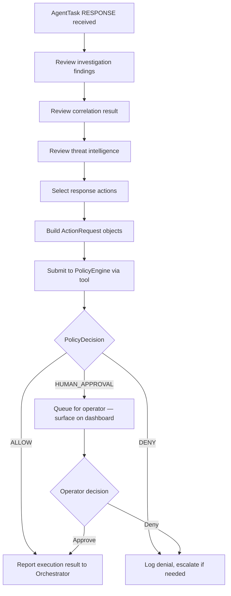

# Response Agent

← [Back to Agent Overview](overview.md) · [Back to README](../../README.md)

---

## Purpose

The Response Agent determines the appropriate defensive action for a confirmed incident. It reviews investigation findings, correlation results, and threat intelligence, then proposes one or more `ActionRequest` objects — each of which **must pass through the PolicyEngine before anything is executed**.

The Response Agent **never executes actions directly**. Its entire job is to reason about what should happen and submit well-justified requests.

**Status:** 📋 Planned — module stub exists at `agents/src/intriqo_agents/response/`

---

## Response Flow



---

## Controlled Action Catalogue

Every action in this table is the **only way** an agent can effect a change in infrastructure. There is no other path.

| Action | Description | Policy Level |
|---|---|---|
| `block_ip` | Block a source IP at the network/firewall level | Auto-approved (lab range + severity met) |
| `isolate_host` | Network-isolate a suspected compromised host | **Requires human approval** |
| `terminate_session` | Kill an active suspicious session | Auto-approved (criteria met) |
| `disable_account` | Disable a compromised user account | **Requires human approval** |
| `collect_logs` | Gather forensic logs from a host (read-only) | Auto-approved |
| `increase_monitoring` | Elevate monitoring level for an asset | Auto-approved |
| `create_incident` | Formally create an incident record | Auto-approved |
| `escalate_to_human` | Flag for immediate operator review | Auto-approved |

---

## Example Response Recommendation

```
RESPONSE RECOMMENDATION — INCIDENT #1042 (CRITICAL)

Evidence summary:
  • 127 failed + 3 successful SSH attempts from 172.20.0.10
  • Root shell obtained on srv-prod-db-01
  • 2.3 GB transferred to known-malicious 203.0.113.42
  • Threat intel: 172.20.0.10 listed in 4 feeds

Proposed actions:

  1. block_ip(ip="172.20.0.10", duration="24h",
              justification="Port scan source confirmed as malicious by 4 threat feeds")
     → Policy: ALLOW

  2. isolate_host(host="srv-prod-db-01",
                  justification="Root compromise confirmed; exfiltration likely")
     → Policy: REQUIRE HUMAN APPROVAL (production host)

  3. collect_logs(host="srv-prod-db-01", scope="full_forensic")
     → Policy: ALLOW (read-only)

  4. escalate_to_human(reason="Possible data exfiltration of 2.3 GB detected")
     → Policy: ALLOW

AWAITING: Human approval for host isolation
```

---

## Response Verification

After each authorized action executes, the Response Agent receives a result and verifies it:

```python
result = verify_response_action(action_id="action-001")

if result.status == "SUCCESS":
    # Update AgentResult with verified outcome
    # Orchestrator marks action as confirmed
elif result.status == "FAILED":
    # Create follow-up task to retry or escalate
```

---

## ActionRequest Contract

```python
@dataclass(frozen=True)
class ActionRequest:
    action_type:       str    # "BLOCK_IP" | "ISOLATE_HOST" | …
    target:            str    # IP, hostname, session ID, account name
    parameters:        dict   # action-specific parameters
    requesting_agent:  str    # "response_agent"
    justification:     str    # evidence-backed explanation
    confidence:        float  # 0.0 – 1.0
    task_id:           str    # links back to the originating AgentTask
```

The `justification` field is required and must reference specific evidence — not a generic string. The PolicyEngine uses it for audit logging.

---

→ See also: [Policy Boundary](../security/policy-boundary.md)  
→ Next: [Orchestrator](orchestrator.md)
