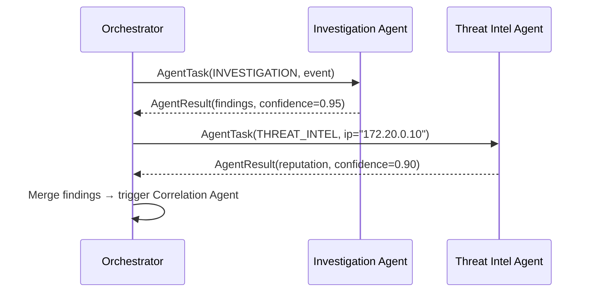

# Threat Intelligence Agent

← [Back to Agent Overview](overview.md) · [Back to README](../../README.md)

---

## Purpose

The Threat Intelligence Agent enriches security indicators with external and internal threat context. After the Investigation Agent produces findings, the Orchestrator dispatches a threat intelligence task to determine whether the source IP, domains, or hashes involved are known-malicious, associated with specific threat actors, or previously observed in other incidents.

**Status:** 📋 Planned — module stub exists at `agents/src/intriqo_agents/threat_intelligence/`

---

## Responsibilities

| Capability | Description |
|---|---|
| IP reputation lookup | Query internal + external feeds for IP classification |
| Domain reputation lookup | Check domain age, category, and threat feed presence |
| ASN / geolocation analysis | Identify hosting providers associated with malicious infrastructure |
| Threat actor correlation | Match indicators against known actor TTPs and infrastructure |
| Historical indicator tracking | Check if the indicator has appeared in previous incidents |
| Confidence scoring | Aggregate scores across multiple sources into a single confidence value |

---

## Planned Tool Interface

```python
# Threat intelligence tools (planned)
lookup_ip_reputation(ip: str) -> ReputationResult
lookup_domain_reputation(domain: str) -> ReputationResult
lookup_cve(cve_id: str) -> CVEDetails
get_threat_actor_profile(indicator: str) -> ThreatActorProfile
```

---

## Planned Intelligence Sources

| Source | Type | Use |
|---|---|---|
| AbuseIPDB | External API | IP abuse reports and confidence score |
| AlienVault OTX | External API | IP / domain / hash threat feeds |
| Internal feed | Local DB | Lab-registered IPs and their known roles |
| VirusTotal | External API | File hashes, domains, IPs |
| Shodan | External API | Host exposure profile |

All external sources are accessed through the tool layer — the agent never makes raw HTTP calls directly.

---

## Example Output (planned)

```
THREAT INTELLIGENCE: 203.0.113.42

REPUTATION:
  abuseipdb_confidence:    87 / 100
  alienvault_pulse_count:  4 feeds
  first_seen:              2024-08-15
  last_seen:               2026-09-10 (active)
  known_malicious:         YES

ASSOCIATIONS:
  threat_actor:     APT-infrastructure cluster (unattributed)
  hosted_domains:   15 in last 30 days
  flagged_domains:  8 as phishing / C2

GEOLOCATION:
  country:  [REDACTED]
  asn:      AS12345 — Known bulletproof hosting provider

CONFIDENCE: 0.90
STATUS:     SUCCESS
SUMMARY:    203.0.113.42 is actively listed in 4 threat feeds. Likely malicious.
```

---

## Integration with Investigation Flow



---

→ Next: [Correlation Agent](correlation-agent.md)
