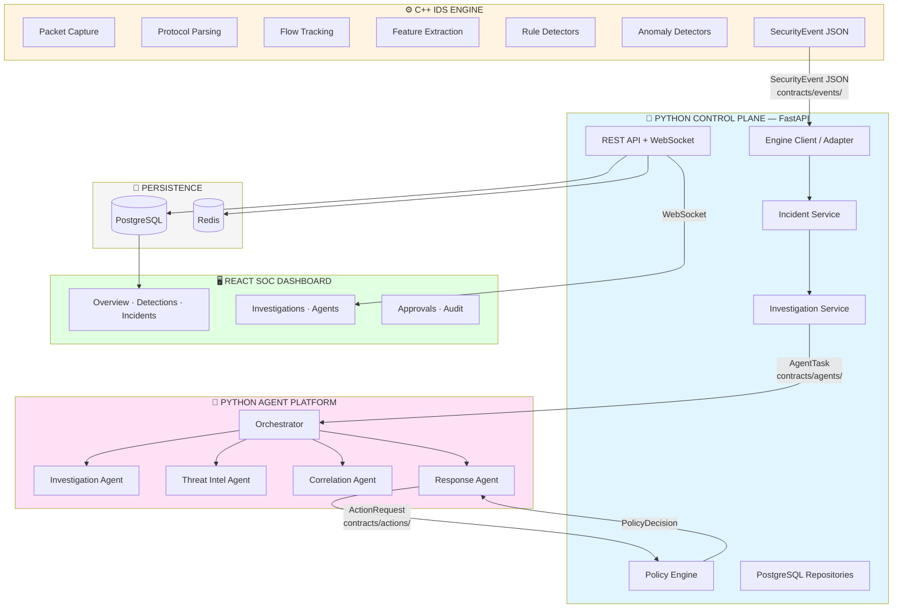
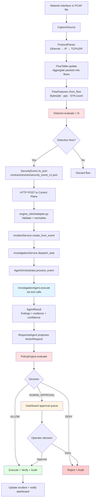
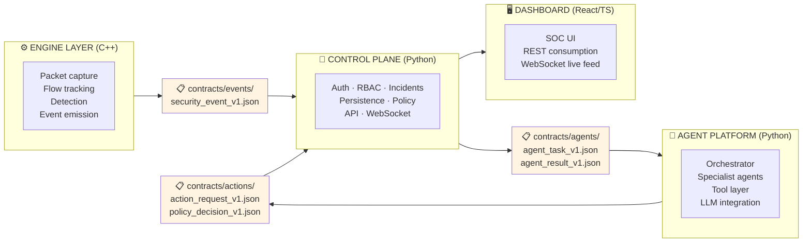
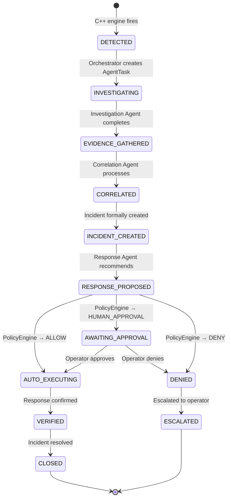
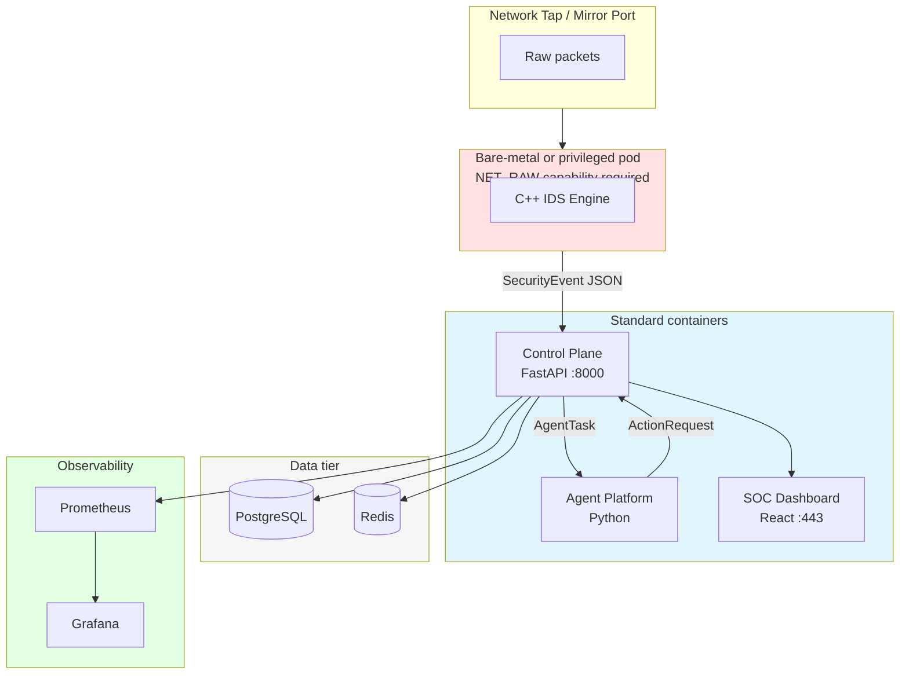

# System Architecture

← [Back to README](../../README.md)

---

## Overview

Intriqo is built around four distinct technical layers, each with a clearly scoped responsibility. No layer reaches into another layer's domain.



---

## Technology Split

| Layer | Language / Framework | Why |
|---|---|---|
| IDS Engine | C++20 / CMake | Line-rate packet processing — no GC pauses, zero-copy buffers |
| Control Plane | Python 3.10+ / FastAPI | Async I/O, Pydantic validation, clean layered architecture |
| Agent Platform | Python 3.10+ | LLM/agent/ML ecosystem dominance |
| SOC Dashboard | React 18 / TypeScript / Vite | Typed, component-based, real-time WebSocket |

---

## End-to-End Data Flow



---

## Architectural Boundaries



**Rule:** No layer imports another layer's internal types. All cross-boundary communication uses the versioned JSON Schema contracts in `contracts/`.

---

## Security Event Lifecycle



---

## Deployment Topology

### Local Development (current)

```
docker compose up
  ├── postgres:5432
  ├── redis:6379
  └── (optional profile) prometheus:9090, grafana:3000

Host processes:
  ├── uvicorn intriqo.api.app:app --reload --port 8000
  ├── python -m intriqo_agents.orchestrator.main  (demo)
  └── cd frontend/dashboard && npm run dev  (:5173)

Engine:
  make engine-build && ./engine/build/intriqo_engine  (when implemented)
```

### Target Production Topology



---

→ Related: [Component Diagram](component-diagram.md) · [Data Flow](data-flow.md) · [Deployment](deployment-architecture.md)
