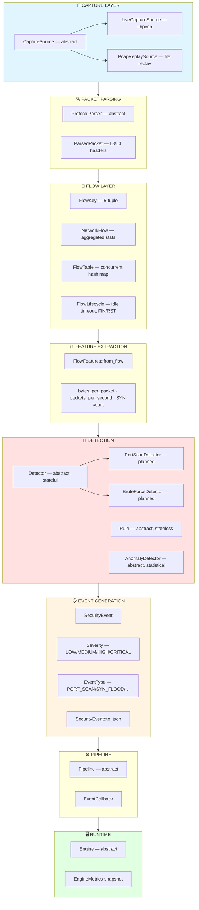
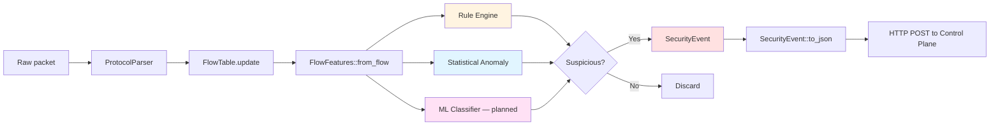
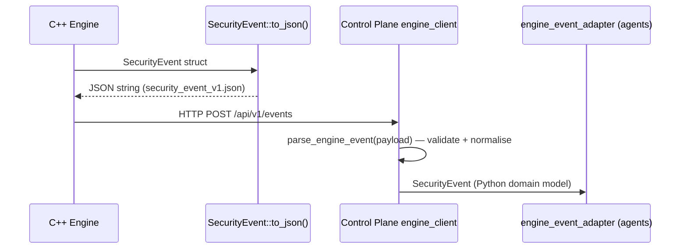

# C++ IDS Engine

← [Back to README](../../README.md)

---

## Overview

The C++ IDS engine is the high-performance detection core of Intriqo. It handles everything that must operate at or near network line rate — from raw packet capture through flow construction, feature extraction, and detection — producing structured `SecurityEvent` JSON that the Python control plane consumes.

> **Status:** Subsystem header interfaces complete. Implementations in progress.

---

## Why C++?

| Requirement | Why C++ delivers |
|---|---|
| Sub-millisecond per-packet latency | No GC pauses, deterministic allocation |
| Zero-copy packet access | Direct libpcap / AF_PACKET buffer access |
| Line-rate flow tracking | SIMD feature extraction, cache-friendly data structures |
| Future DPDK / XDP integration | Native C++ ecosystem, no JNI/FFI boundary |
| ONNX ML inference | ONNX Runtime C++ API — first-class, not a wrapper |
| Deterministic detection rules | No runtime surprises from garbage collection |

The previous architecture used Java (Spring Boot) for detection. Java GC pauses, JVM startup overhead, and indirect access to raw packet buffers are fundamental incompatibilities with line-rate packet processing.

---

## Subsystem Architecture



---

## Subsystem Reference

### capture/

```cpp
class CaptureSource {
    virtual void set_callback(PacketCallback cb) = 0;
    virtual void start() = 0;   // blocks until stop()
    virtual void stop() noexcept = 0;
};

struct LiveCaptureConfig {
    std::string interface_name;  // "eth0"
    int         snaplen{65535};
    bool        promiscuous{true};
    std::string bpf_filter;      // optional BPF expression
};

struct PcapReplayConfig {
    std::string file_path;
    bool        realtime{false}; // honour inter-packet timestamps
};
```

### packet/

```cpp
struct PacketView {
    TimePoint              timestamp;
    std::span<const std::byte> raw_bytes;
    std::size_t            link_layer_type;
};

struct ParsedPacket {
    TimePoint   timestamp;
    IPv4Address src_ip, dst_ip;
    Port        src_port{0}, dst_port{0};
    Protocol    protocol{Protocol::OTHER};
    PacketSize  total_length{0};
    std::uint8_t tcp_flags{0};

    bool is_tcp()  const noexcept;
    bool is_udp()  const noexcept;
    bool is_syn()  const noexcept;  // TCP && (flags & 0x02)
};
```

### flow/

```cpp
struct FlowKey {
    IPv4Address src_ip, dst_ip;
    Port        src_port{0}, dst_port{0};
    Protocol    protocol{Protocol::OTHER};
    bool operator==(const FlowKey&) const noexcept = default;
};

struct NetworkFlow {
    FlowId    flow_id{0};
    FlowKey   key;
    TimePoint first_seen, last_seen;
    uint64_t  packet_count{0};
    ByteCount byte_count{0};

    double duration_seconds() const noexcept;
    double bytes_per_packet() const noexcept;
    double packets_per_second() const noexcept;
};
```

### features/

```cpp
struct FlowFeatures {
    uint64_t packet_count{0};
    ByteCount byte_count{0};
    double   duration_seconds{0.0};
    double   bytes_per_packet{0.0};
    double   packets_per_second{0.0};
    double   bytes_per_second{0.0};
    uint32_t syn_count{0};
    uint32_t fin_count{0};
    uint32_t rst_count{0};

    static FlowFeatures from_flow(const NetworkFlow& f) noexcept;
};
```

### detection/

```cpp
class Detector {
    // Thread-safe — pipeline may call concurrently
    virtual std::vector<SecurityEvent>
    evaluate(const NetworkFlow& flow,
             const FlowFeatures& features) noexcept = 0;

    virtual void reset() noexcept = 0;
};
```

### events/

```cpp
enum class Severity : uint8_t { LOW=0, MEDIUM=1, HIGH=2, CRITICAL=3 };
enum class EventType : uint16_t { PORT_SCAN=1, SYN_FLOOD=2, BRUTE_FORCE=3, … };

struct SecurityEvent {
    std::string   event_id;       // UUID
    TimePoint     timestamp;
    EventType     event_type;
    Severity      severity;
    IPv4Address   source_address;
    IPv4Address   destination_address;
    std::string   description;
    std::unordered_map<std::string, MetadataValue> details;

    std::string to_json() const;  // → contracts/events/security_event_v1.json
};
```

### pipeline/

```cpp
using EventCallback = std::function<void(SecurityEvent)>;

class Pipeline {
    virtual void ingest(const ParsedPacket& pkt) = 0;
    virtual void on_event(EventCallback cb) = 0;
    virtual void flush() = 0;
    virtual std::size_t active_flow_count() const noexcept = 0;
};
```

### metrics/

```cpp
struct EngineMetrics {
    uint64_t packets_received{0};
    uint64_t packets_dropped{0};
    uint64_t flows_created{0};
    uint64_t flows_active{0};
    uint64_t events_emitted{0};
    double   pps{0.0};          // packets per second

    double drop_rate() const noexcept;
};
```

---

## Detection Pipeline



---

## Detection Approach

| Layer | Mechanism | Status |
|---|---|---|
| **Rule-based** | Explicit pattern matching — deterministic, auditable | Interfaces complete, implementations planned |
| **Statistical** | Sliding window counters, baseline deviation, frequency analysis | Interfaces complete |
| **ML inference** | ONNX Runtime C++ — trained classifiers for novel patterns | Planned |

### Planned Detectors

| Detector | Detection Method | Trigger |
|---|---|---|
| `PortScanDetector` | Count distinct dst_ports per src_ip within time window | ≥ N ports in T seconds |
| `BruteForceDetector` | Count failed auth flows per src_ip → target | ≥ N failures in T seconds |
| `SynFloodDetector` | Count SYN-only flows (no established state) | SYN/ACK ratio below threshold |
| `DnsAnomalyDetector` | Query rate, response size, entropy of queried names | Statistical deviation from baseline |
| `LateralMovementDetector` | Internal-to-internal connection graph analysis | Unusual cross-host connection pattern |

---

## Engine → Control Plane Boundary



The engine has **no knowledge** of Python, agents, or business logic. It emits JSON and the boundary adapter owns translation.

---

## Build System

```bash
# Configure (Release + tests)
cmake -S . -B engine/build \
      -DCMAKE_BUILD_TYPE=Release \
      -DINTRIQO_BUILD_TESTS=ON

# Build
cmake --build engine/build --parallel

# Run tests
./engine/build/engine/tests/unit/test_common
./engine/build/engine/tests/unit/test_packet
./engine/build/engine/tests/unit/test_flow
./engine/build/engine/tests/unit/test_features
./engine/build/engine/tests/unit/test_events

# Or via Makefile
make engine-build
make engine-test
```

### CMake Options

| Option | Default | Description |
|---|---|---|
| `INTRIQO_BUILD_TESTS` | `ON` | Build GoogleTest unit tests |
| `INTRIQO_BUILD_BENCHMARKS` | `OFF` | Build benchmark binaries |
| `INTRIQO_ENABLE_ASAN` | `OFF` | AddressSanitizer + UBSan |
| `INTRIQO_ENABLE_TSAN` | `OFF` | ThreadSanitizer |

---

→ See also: [System Architecture](../architecture/system-architecture.md) · [Data Flow](../architecture/data-flow.md)
