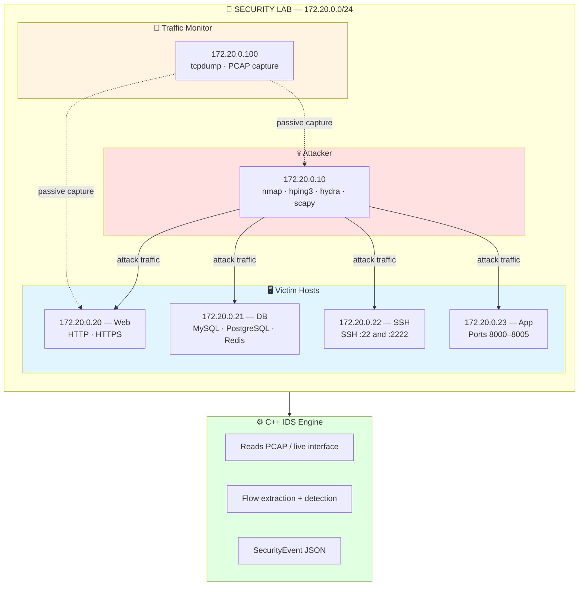
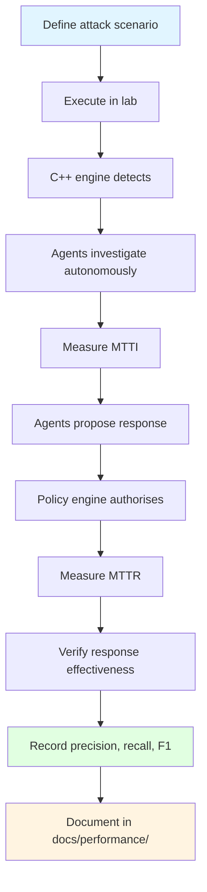

# Controlled Security Laboratory

> For the persistent namespace/TAP live demonstration, use
> [INTRIQO Demo Lab](../demo-lab.md) and [Demo Runbook](../demo-runbook.md).

← [Back to README](../../README.md)

---

## Why a Controlled Lab?

Intriqo is designed to operate inside a **controlled and reproducible cybersecurity laboratory** — not against arbitrary real-world infrastructure.

| Reason | Description |
|---|---|
| **Safety** | Automated response actions (block IP, isolate host) operate only against test resources — never production |
| **Reproducibility** | The same attack scenarios replay deterministically for evaluation |
| **Ethics** | No risk of accidentally attacking real infrastructure |
| **Research validity** | Controlled conditions enable accurate performance measurement |
| **FYP suitability** | Safe for an academic/research environment |

---

## Lab Architecture



---

## What Is Already Implemented

| Component | Location | Status |
|---|---|---|
| Attack scenario scripts | `security-lab/scenarios/` | ✅ Implemented |
| Port scan scenario | `security-lab/scenarios/port-scan.sh` | ✅ Implemented |
| Multi-target scan | `security-lab/scenarios/port-scan-multi-target.sh` | ✅ Implemented |
| Normal traffic baseline | `security-lab/scenarios/normal-traffic.sh` | ✅ Implemented |
| PCAP parser tool | `security-lab/tools/pcap_parser.py` | ✅ Implemented |
| Port scan fixture | `security-lab/traffic/port-scan-flows.json` | ✅ Implemented |
| Normal traffic fixture | `security-lab/traffic/normal-traffic-flows.json` | ✅ Implemented |
| Traffic generator script | `scripts/lab/generate-traffic.sh` | ✅ Implemented |
| PCAP replay script | `scripts/lab/replay-pcap.sh` | ✅ Implemented |
| Full Docker lab env | `security-lab/docker/` | 📋 Planned |

---

## Attack Scenarios

### Scenario 1: Port Scan → SSH Brute Force → Lateral Movement

```
Step 1.  Attacker (172.20.0.10) performs port scan of 172.20.0.0/24
         → C++ engine detects PORT_SCAN → SecurityEvent emitted

Step 2.  Orchestrator creates InvestigationTask for Investigation Agent
         → Investigation Agent queries network flows → 10 ports confirmed
         → AgentResult(confidence=0.95, status=SUCCESS)

Step 3.  Attacker begins SSH brute force on 172.20.0.20 (127 attempts)
         → C++ engine detects BRUTE_FORCE → SecurityEvent emitted

Step 4.  Attacker successfully authenticates after brute force
         → Investigation Agent gathers auth events + host telemetry

Step 5.  Attacker moves laterally to 172.20.0.21
         → Correlation Agent identifies attack sequence

Step 6.  Response Agent proposes:
           block_ip("172.20.0.10")    → Policy: ALLOW
           isolate_host("172.20.0.20") → Policy: HUMAN_APPROVAL

Step 7.  Operator reviews evidence on dashboard → approves isolation
         → Host isolated and verified
```

### Scenario 2: DNS Exfiltration

```
Step 1.  Compromised host (172.20.0.20) begins high-frequency DNS queries
         to newly-registered domains with high entropy names

Step 2.  C++ engine detects DNS_ANOMALY → SecurityEvent emitted

Step 3.  Investigation Agent queries DNS activity logs

Step 4.  Threat Intelligence Agent checks domain reputation:
           → 8 domains flagged as C2 infrastructure

Step 5.  Correlation Agent identifies data exfiltration pattern

Step 6.  Response Agent proposes:
           isolate_host("172.20.0.20") → Policy: HUMAN_APPROVAL

Step 7.  Evidence presented to operator on approval interface
         → Operator approves
         → Host isolated + verified
```

### Scenario 3: Normal Traffic Baseline (No Detection)

```
Step 1.  Normal HTTP/HTTPS browsing traffic generated

Step 2.  Normal SSH logins (1-2 successful, zero failures)

Step 3.  C++ engine processes all flows → no thresholds exceeded

Step 4.  No SecurityEvents emitted

Step 5.  No investigations triggered

Step 6.  System operates silently — confirms zero false positives
         on benign traffic
```

---

## PCAP Parser

**File:** `security-lab/tools/pcap_parser.py`

Converts raw PCAP files into the NetworkFlow JSON format expected by the detection engine.

```bash
# Parse a PCAP and output flows to JSON
python3 security-lab/tools/pcap_parser.py capture.pcap flows.json

# Show flow statistics only (no output file)
python3 security-lab/tools/pcap_parser.py capture.pcap
```

**Output format** (compatible with `security_event_v1.json` contract):

```json
{
  "flows": [
    {
      "timestamp": "2026-09-12T10:00:00Z",
      "src_ip":    "172.20.0.10",
      "dst_ip":    "172.20.0.20",
      "src_port":  49152,
      "dst_port":  22,
      "protocol":  "TCP",
      "flags":     "SYN",
      "packet_count": 1,
      "byte_count":   64,
      "duration_ms":  0
    }
  ]
}
```

---

## Traffic Fixtures

Pre-generated JSON fixtures for deterministic testing — no live lab required for unit or integration tests.

| File | Description | Flows | Expected Detections |
|---|---|---|---|
| `security-lab/traffic/port-scan-flows.json` | Port scan from 172.20.0.10 to 172.20.0.20 | 10 | 1× PORT_SCAN |
| `security-lab/traffic/normal-traffic-flows.json` | Legitimate HTTP + SSH traffic | ~20 | 0 |

These fixtures are used by:
- Python agent unit tests (via `mock_tools.py`)
- Future engine integration tests (PCAP replay → detection pipeline)

---

## Running Attack Scenarios

```bash
# Start the full lab environment (when Docker lab is implemented)
cd security-lab && ./setup.sh

# Run port scan (triggers detection)
docker exec intriqo-attacker bash /scenarios/port-scan.sh

# Run multi-target scan
docker exec intriqo-attacker bash /scenarios/port-scan-multi-target.sh

# Run normal traffic (should NOT trigger detection)
docker exec intriqo-attacker bash /scenarios/normal-traffic.sh

# Capture and parse traffic
docker exec intriqo-monitor /scripts/monitor.sh
python3 security-lab/tools/pcap_parser.py security-lab/pcaps/capture.pcap flows.json

# Stop the lab
cd security-lab && docker-compose down
```

---

## Evaluation with the Lab

The lab provides the controlled environment for all evaluation phases:



→ See also: [Benchmarks & Metrics](../performance/benchmarks.md)
