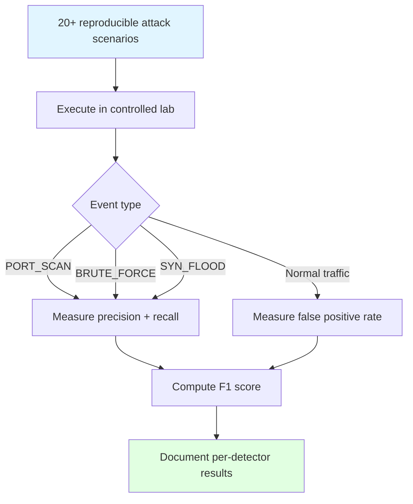
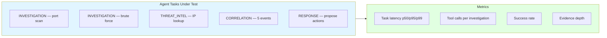
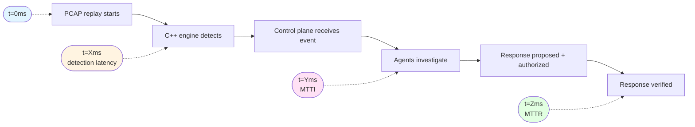

# Benchmarks & Metrics

← [Back to README](../../README.md)

---

## Principle

> Performance claims are only made once supported by reproducible benchmark results.

All targets in this document are **goals**, not measured values. Measured results will be added as each evaluation phase completes.

---

## Benchmark Suite Layout

```
benchmarks/
├── engine/         C++ packet processing throughput + detection latency
├── detection/      Per-detector throughput (port scan, brute force, SYN flood)
├── agents/         Agent task latency + tool call latency
└── end-to-end/     Full pipeline: packet → SecurityEvent → investigation → response
```

---

## Engine Benchmarks

```mermaid
flowchart LR
    subgraph Input["Input"]
        I1[PCAP replay\nvariable packet rate]
        I2[Synthetic flows\ninjected directly]
    end

    subgraph Engine["C++ Engine Under Test"]
        E1[Packet parsing]
        E2[Flow table update]
        E3[Feature extraction]
        E4[Detector evaluation]
        E5[Event emission]
    end

    subgraph Metrics["Metrics Captured"]
        M1[Packets/sec throughput]
        M2[Detection latency\np50 · p95 · p99]
        M3[Flow table size]
        M4[Drop rate]
        M5[CPU + memory utilisation]
    end

    Input --> Engine --> Metrics

    style Input   fill:#e1f5ff
    style Engine  fill:#fff4e1
    style Metrics fill:#e1ffe1
```



| Metric | Description | Target | Measured |
|---|---|---|---|
| Packet throughput | Packets/sec sustained without drops | TBD | — |
| Detection latency p50 | Packet arrival → SecurityEvent p50 | < 1ms | — |
| Detection latency p95 | Packet arrival → SecurityEvent p95 | < 5ms | — |
| Detection latency p99 | Packet arrival → SecurityEvent p99 | < 10ms | — |
| Flow table capacity | Max concurrent active flows | TBD | — |
| Drop rate at 100k pps | Packet loss at sustained 100,000 pps | < 0.1% | — |

---

## Detection Accuracy Benchmarks



| Detector | Precision Target | Recall Target | F1 Target | Measured |
|---|---|---|---|---|
| PortScanDetector | > 0.90 | > 0.95 | > 0.92 | — |
| BruteForceDetector | > 0.88 | > 0.92 | > 0.90 | — |
| SynFloodDetector | > 0.85 | > 0.90 | > 0.87 | — |
| DnsAnomalyDetector | > 0.80 | > 0.85 | > 0.82 | — |
| **Combined (all detectors)** | **> 0.85** | **> 0.90** | **> 0.87** | **—** |

---

## Agent Performance Benchmarks



| Task Type | Latency Target | Success Rate Target | Measured |
|---|---|---|---|
| INVESTIGATION (mock tools) | < 500ms | > 99% | — |
| INVESTIGATION (real tools) | < 2s | > 95% | — |
| THREAT_INTEL | < 3s | > 90% | — |
| CORRELATION (5 events) | < 1s | > 90% | — |
| RESPONSE (policy eval) | < 200ms | > 99% | — |

**Current baseline (mock tools, no network I/O):**

| Test suite | Tests | Time |
|---|---|---|
| agents/tests/unit | 79 tests | 0.09s |

---

## Investigation Performance Benchmarks

| Metric | Target | Measured |
|---|---|---|
| Mean Time to Investigate (MTTI) | < 30s (automated) | — |
| Autonomous Investigation Rate | > 90% of events | — |
| Investigation Success Rate | > 85% | — |
| Tool Call Success Rate | > 99% | — |
| Evidence Depth (avg sources) | ≥ 3 per investigation | — |

---

## Response Performance Benchmarks

| Metric | Target | Measured |
|---|---|---|
| Mean Time to Respond (MTTR) | Baseline TBD | — |
| PolicyEngine evaluation latency | < 50ms | — |
| False Autonomous Action Rate | < 1% | — |
| Policy bypass rate | 0% | — |

---

## Human vs Autonomous Comparison

This benchmark is run during Phase 2 evaluation. A human SOC analyst and the autonomous system investigate the same set of scenarios independently.

| Metric | Human Analyst | Autonomous System | Delta |
|---|---|---|---|
| MTTI (simple port scan) | TBD | TBD | TBD |
| MTTI (multi-stage attack) | TBD | TBD | TBD |
| MTTR | TBD | TBD | TBD |
| Evidence sources consulted | TBD | TBD | TBD |
| Correct conclusions | TBD | TBD | TBD |
| False positives | TBD | TBD | TBD |

---

## End-to-End Pipeline Benchmark



| Stage | Metric | Target | Measured |
|---|---|---|---|
| Packet → SecurityEvent | Detection latency p95 | < 5ms | — |
| SecurityEvent → InvestigationComplete | MTTI | < 30s | — |
| InvestigationComplete → PolicyDecision | Policy eval | < 50ms | — |
| PolicyDecision → Verified response | MTTR | TBD | — |
| **Packet → Verified response (E2E)** | **End-to-end** | **TBD** | **—** |

---

## Benchmark Reproducibility

All benchmarks are:

- **Version-controlled** — scripts live in `benchmarks/` alongside the code they test
- **Reproducible** — attack scenario PCAPs and parameters documented
- **Automated** — CI runs performance regression tests on every push to `main`
- **Documented** — measured results added here after each evaluation run

```bash
# Run engine benchmarks
make engine-bench

# Run agent benchmarks
make agents-test  # includes timing

# Run full end-to-end benchmark
scripts/benchmark/benchmark.sh
```

---

→ See also: [Research Methodology](../research/methodology.md) · [Security Lab](../lab/security-lab.md)
