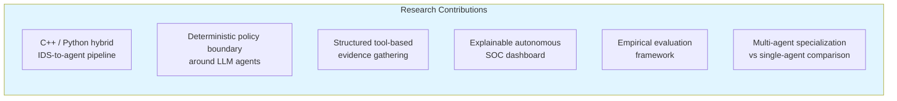
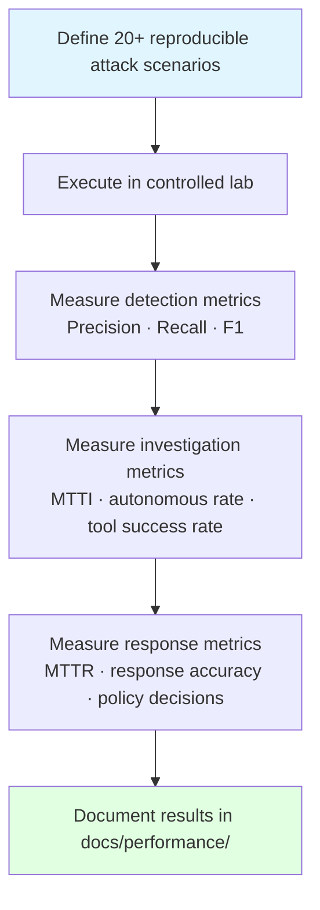
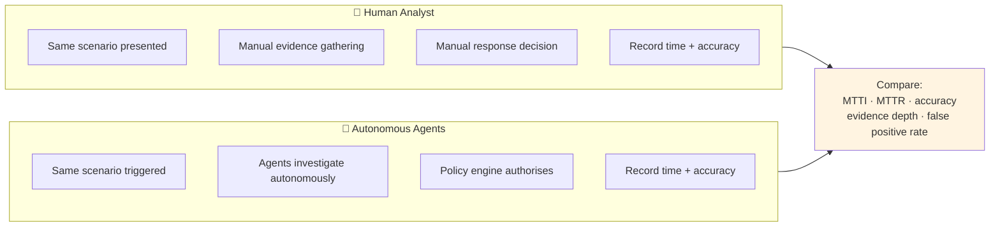

# Research Methodology

← [Back to README](../../README.md)

---

## Research Context

Intriqo is positioned as a substantial final-year engineering and research project.

**Intriqo does NOT claim that the overall concept of autonomous cybersecurity agents is entirely novel.** Security automation, autonomous threat hunting, and AI-assisted SOCs are active research areas. The contribution is in the specific architecture, the deterministic policy boundary around LLM agents, and the empirical evaluation framework.

---

## Research Question

> **Can a controlled multi-agent architecture autonomously investigate and respond to network security incidents while maintaining measurable safety, explainability, and operational effectiveness?**

---

## Evaluation Hypotheses

| # | Hypothesis |
|---|---|
| **H1** | Autonomous agents can investigate security incidents faster than manual human investigation while maintaining comparable accuracy. |
| **H2** | A deterministic policy engine can safely constrain AI-driven response actions, preventing inappropriate automated responses. |
| **H3** | Structured tool-based evidence gathering produces more reliable investigation findings than LLM reasoning alone (without tools). |
| **H4** | Multi-agent specialization (investigation + threat intel + correlation + response) produces better investigation outcomes than a single general-purpose agent. |
| **H5** | Continuous autonomous operation reduces Mean Time to Investigate (MTTI) and Mean Time to Respond (MTTR) compared to manual SOC workflows. |

---

## Potential Contributions

| Contribution | Description |
|---|---|
| **C++ / Python hybrid IDS-to-agent pipeline** | Architecture for connecting line-rate packet detection to autonomous reasoning agents |
| **Deterministic policy boundary around LLM agents** | Design pattern for containing AI decisions within explicit security policy — prevents hallucinated actions from executing |
| **Structured tool-based evidence gathering** | Framework that prevents agents from hallucinating system facts by requiring all evidence to come from real data sources |
| **Explainable autonomous SOC dashboard** | Dashboard design making agent reasoning, tool calls, findings, and decisions fully transparent and auditable |
| **Measurable autonomous investigation metrics** | Empirical framework (MTTI, MTTR, precision, recall) for evaluating autonomous security agents |
| **Multi-agent vs single-agent comparison** | Empirical comparison of specialized multi-agent team vs general-purpose single agent |

---

## Evaluation Plan

### Phase 1 — Controlled Attack Scenarios

**Scenarios to cover:**
1. Port scan → no response (detection only)
2. Port scan → SSH brute force (multi-event correlation)
3. Port scan → brute force → lateral movement (kill chain)
4. SSH brute force → successful auth → privilege escalation
5. Data exfiltration via DNS tunnelling
6. SYN flood (volumetric attack)
7. Normal traffic baseline (zero false positives required)

### Phase 2 — Human vs Autonomous Comparison

### Phase 3 — Load Testing

1. Generate high-volume network traffic (increasing packet rate)
2. Measure C++ engine throughput (packets/sec) and detection latency (p50, p95, p99)
3. Measure agent task throughput under parallel investigations
4. Identify bottlenecks before introducing distributed complexity
5. Validate ADR 006 — Kafka deferred until benchmarks justify it

### Phase 4 — Policy Boundary Validation

1. Construct deliberately incorrect/dangerous agent recommendations
2. Confirm PolicyEngine rejects them (DENY)
3. Construct borderline cases requiring human approval
4. Confirm they surface correctly on the dashboard
5. Measure zero bypass — no action executes without policy evaluation

---

## Metrics Framework

### Detection Performance

| Metric | Formula | Target |
|---|---|---|
| Precision | TP / (TP + FP) | > 0.85 |
| Recall | TP / (TP + FN) | > 0.90 |
| F1 Score | 2 × (P × R) / (P + R) | > 0.87 |
| False Positive Rate | FP / (FP + TN) | < 0.05 |

### Investigation Performance

| Metric | Description | Target |
|---|---|---|
| Mean Time to Investigate (MTTI) | Detection → investigation complete | < 30s (automated) |
| Autonomous Investigation Rate | % events investigated without human initiation | > 90% |
| Investigation Success Rate | % investigations producing actionable findings | > 85% |
| Tool Call Success Rate | % tool invocations returning valid data | > 99% |
| Evidence Depth | Avg. evidence sources per investigation | ≥ 3 |

### Response Performance

| Metric | Description | Target |
|---|---|---|
| Mean Time to Respond (MTTR) | Detection → verified response execution | Measurable (baseline TBD) |
| Autonomous Resolution Rate | % incidents resolved without human intervention | Measurable |
| False Autonomous Action Rate | % automated actions that were incorrect | < 0.01 |
| Human Approval Rate | % actions requiring human review | Measurable |

### Agent Efficiency

| Metric | Description |
|---|---|
| Tool calls per investigation | Avg. tool invocations per complete investigation |
| Agent task latency p50/p95/p99 | Distribution by task type |
| LLM tokens per investigation | Cost tracking when LLM integration is added |

### Engine Performance

| Metric | Description |
|---|---|
| Packets per second | Throughput at capture layer |
| Detection latency p50/p95/p99 | Packet arrival to SecurityEvent emission |
| Flow table size | Concurrent active flows under load |
| Drop rate | Packet loss under sustained high traffic |

---

## Benchmark Reproducibility Requirements

All benchmarks must be:

- **Reproducible** — documented scenarios, scripts, and PCAP fixtures in version control
- **Automated** — CI pipeline runs performance regression tests
- **Version-controlled** — `benchmarks/` scripts alongside the code that produces them
- **Documented** — results published in `docs/performance/` after each evaluation phase

> **Do NOT make performance claims without supporting measurements.**
> All metrics targets in this document are goals, not claims. They will be updated with actual measured values as evaluation phases complete.

---

## Future Research Directions

| Direction | Description |
|---|---|
| Agent framework comparison | Benchmark LangChain vs CrewAI vs custom orchestration for security investigation tasks |
| LLM comparison | Evaluate GPT-4o vs Claude 3.5 vs Llama 3 for security reasoning quality |
| Agent learning | Investigate whether agents improve over time with episodic memory |
| Adversarial robustness | Can attackers craft traffic to manipulate agent reasoning or exhaust investigation capacity? |
| Federated agent architectures | Distributed SOC across multiple sites with shared threat intelligence |
| Human-agent collaboration patterns | Study how operators interact with and correct autonomous agent decisions |

---

→ See also: [Benchmarks & Metrics](../performance/benchmarks.md) · [Security Lab](../lab/security-lab.md)
