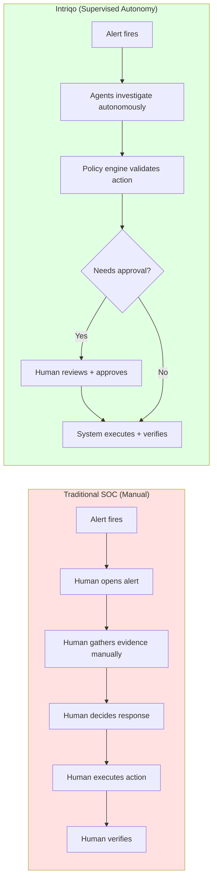
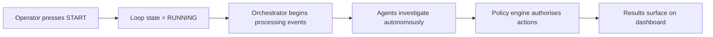
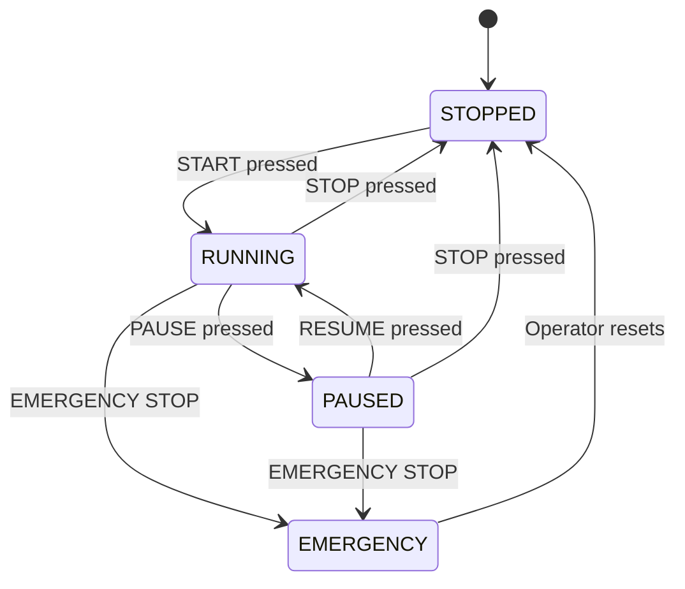

# Human Supervision Model

← [Back to README](../../README.md)

---

## Philosophy

Intriqo does **not** pretend humans are unnecessary. The intended model is supervised autonomy — the autonomous team operates continuously within boundaries set by human operators, and operators retain full override authority at all times.

```
       Human Operator
             ↓
         Supervisor
             ↓
    Autonomous SOC Team
```

The human becomes the **supervisor**, not the operator who manually drives every investigation step.

---

## Supervised Autonomy vs Manual Control



In the manual model, a human is in every loop iteration. In Intriqo's model, a human is in the loop **when it matters** — for approvals, overrides, and supervision — but not for every evidence-gathering step.

---

## Operator Control Panel

The SOC dashboard exposes direct autonomous team controls:

```
╔══════════════════════════════════════════════════════════╗
║              INTRIQO AUTONOMOUS SOC                      ║
╠══════════════════════════════════════════════════════════╣
║                                                          ║
║                   ● TEAM RUNNING                         ║
║                                                          ║
║         [ STOP TEAM ]     [ PAUSE TEAM ]                 ║
║         [ ⚠  EMERGENCY STOP ]                            ║
║                                                          ║
╠══════════════════════════════════════════════════════════╣
║  Active Agents:             5                            ║
║  Active Investigations:     3                            ║
║  Open Incidents:            7                            ║
║  Pending Approvals:         1                            ║
║  Actions Executed Today:   23                            ║
╚══════════════════════════════════════════════════════════╝
```

---

## Control Signals

### START

Begins autonomous operation. The system starts continuously processing SecurityEvents from the C++ engine, creating investigation tasks, and running the full autonomous loop.



### STOP

Stops autonomous operation **safely** — preserves all state.

**STOP does:**
- Prevent creation of new autonomous investigation tasks
- Prevent new automated response actions
- Allow in-flight investigations to complete gracefully
- Preserve all investigation state, evidence, and incident records
- Return control to the operator

**STOP does NOT:**
- Delete investigation history
- Lose collected evidence
- Abandon open incidents
- Corrupt system state



### PAUSE

Suspends agent tasks at their current state for later resumption.

**PAUSE is distinct from STOP:**

| | PAUSE | STOP |
|---|---|---|
| In-flight tasks | Suspended (resume later) | Complete then halt |
| Investigation state | Fully preserved | Fully preserved |
| New task creation | Halted immediately | Halted after in-flight complete |
| Resume behaviour | Continues from exact point | Starts fresh |

**Use case:** Operator wants to review agent behaviour before allowing it to continue — e.g. after an unexpected finding or an unusual action proposal.

### EMERGENCY STOP

High-priority safety mechanism. Takes effect immediately — no waiting for in-flight tasks to complete.

**EMERGENCY STOP:**
- Immediately halts **all** autonomous response execution
- Freezes the entire autonomous loop — no new investigations, no new actions
- Preserves all evidence and state
- Logs the emergency stop event with full context (who, when, system state)
- Requires **explicit operator action** to resume — does not auto-reset

**Trigger conditions:**
- Operator presses the emergency stop button on the dashboard
- System detects a policy violation or unexpected behaviour pattern
- Operator observes an agent acting incorrectly

---

## Operator Capabilities

| Capability | Description |
|---|---|
| **Start autonomous operation** | Press START to begin continuous monitoring and investigation |
| **Stop autonomous operation** | Press STOP to safely halt the autonomous team |
| **Pause operation** | Suspend all agent tasks while preserving state |
| **Emergency stop** | Immediately halt all response execution |
| **Inspect live agent activity** | View what each agent is doing right now, which tools it is calling |
| **Inspect investigations** | View active and completed investigations with full evidence timelines |
| **Inspect agent reasoning** | See which tools were called, what data was returned, how findings were reached |
| **Inspect proposed actions** | Review actions pending human approval before they execute |
| **Approve / Deny actions** | Explicitly authorise or reject actions requiring human approval |
| **Override decisions** | Override any automated decision or change incident severity |
| **View audit history** | Complete immutable audit trail of all agent activity and decisions |
| **Launch manual investigation** | Trigger an investigation manually for any event |

---

## Live Agent Activity Feed

Operators can see exactly what the autonomous team is doing at any moment:

```
╔══════════════════════════════════════════════════════════╗
║                  LIVE AGENT ACTIVITY                     ║
╠══════════════════════════════════════════════════════════╣
║                                                          ║
║  🔎 Investigation Agent                                   ║
║     STATUS: Investigating                                ║
║     TASK:   PORT_SCAN_DETECTED from 172.20.0.10          ║
║     TOOL:   query_network_flows() → 10 flows returned    ║
║     CONFIDENCE: 0.95                                     ║
║                                                          ║
║  🌐 Threat Intelligence Agent                             ║
║     STATUS: Working                                      ║
║     TASK:   IP reputation — 172.20.0.10                  ║
║     PROGRESS: Querying threat feeds…                     ║
║                                                          ║
║  🧠 Correlation Agent                                     ║
║     STATUS: Analyzing                                    ║
║     TASK:   Correlate 5 events → possible incident       ║
║     PROGRESS: Reconstructing attack sequence…            ║
║                                                          ║
║  🛡 Response Agent                                        ║
║     STATUS: Awaiting human approval                      ║
║     ACTION: isolate_host("srv-prod-db-01")               ║
║     POLICY: HUMAN_APPROVAL required                      ║
║                                                          ║
╚══════════════════════════════════════════════════════════╝
```

---

## Investigation Detail View

Clicking any investigation shows complete evidence and reasoning:

```
╔══════════════════════════════════════════════════════════╗
║       INVESTIGATION #1042: Port Scan                     ║
╠══════════════════════════════════════════════════════════╣
║  Status: SUCCESS    Confidence: 0.95    Duration: 0.14s  ║
╠══════════════════════════════════════════════════════════╣
║  TOOLS USED:                                             ║
║    ✓ query_network_flows()    → 10 flows                 ║
║    ✓ query_historical_alerts() → 1 prior alert           ║
║    ✓ query_host_activity()    → host found               ║
║                                                          ║
║  EVIDENCE:                                               ║
║    • 10 distinct ports probed                            ║
║      [21, 22, 23, 80, 443, 3306, 5432, 8080, 8443, 27017]║
║    • All flows SYN-only (no established connections)     ║
║    • Source IP flagged in 1 prior incident               ║
║                                                          ║
║  FINDINGS:                                               ║
║    • Port scan confirmed: 10 ports on 172.20.0.20        ║
║    • Attacker has prior history on this network          ║
║                                                          ║
╚══════════════════════════════════════════════════════════╝
```

---

## Explainability Principle

For every automated action, the operator can always answer:

| Question | Where to find it |
|---|---|
| What happened? | Incident timeline |
| Why did an agent start investigating? | Task creation log |
| What tools did it use? | Investigation detail — tools used |
| What evidence did it find? | Investigation detail — evidence section |
| What did it conclude? | Investigation detail — findings section |
| What action did it propose? | Action request record |
| What did the policy engine decide? | Policy decision log |
| Did the action succeed? | Action result record |
| What happened next? | Follow-up task log |

The dashboard demonstrates **explainable autonomy**, not a black-box AI.

---

→ See also: [Policy Boundary](policy-boundary.md) · [Orchestrator](../agents/orchestrator.md)
