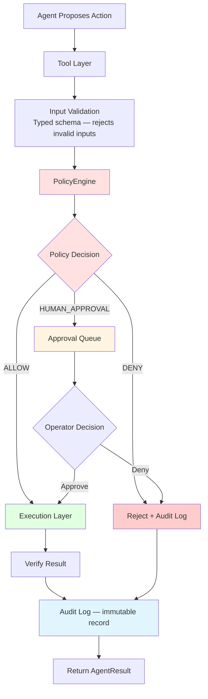
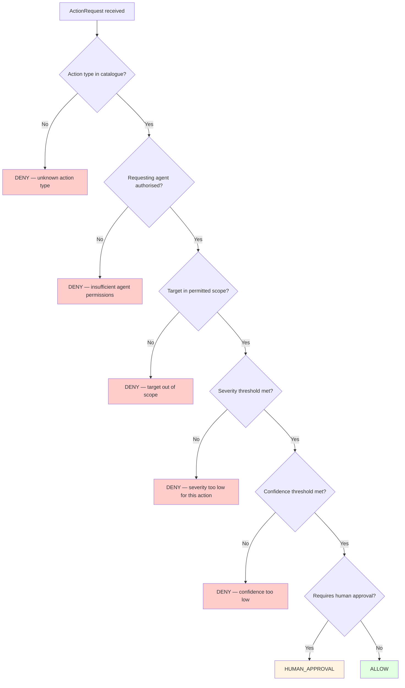
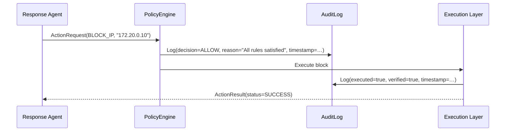

# Policy Boundary

← [Back to README](../../README.md)

---

## The Core Principle

This is **one of the most important architectural decisions** in Intriqo.

Agents must **NEVER** receive unrestricted shell access, arbitrary infrastructure control, or direct database write access. Every action an agent proposes must pass through a deterministic, auditable policy boundary before anything is executed.

```
The agent reasons about what SHOULD happen.
The deterministic security layer decides what IS PERMITTED.
Neither has absolute authority alone.
```

---

## The Authorization Flow



---

## PolicyEngine

**File:** `control-plane/src/intriqo/policy/policy_engine.py`

The PolicyEngine is deterministic — given the same `ActionRequest` and context, it always produces the same `PolicyDecision`. There is no AI, no probabilistic reasoning, and no LLM inside the policy engine.

```python
class PolicyEngine:
    def evaluate(self, request: ActionRequest) -> PolicyDecision:
        # Rules are evaluated in priority order
        # First matching rule wins
```

### Decision types

| Decision | Meaning | Outcome |
|---|---|---|
| `ALLOW` | Action is within policy — execute immediately | Execution layer runs the action |
| `DENY` | Action violates policy — reject | Rejection is logged; agent is notified |
| `HUMAN_APPROVAL` | Action requires operator review | Queued on dashboard approval panel |

---

## Worked Example

```
Response Agent: "I recommend blocking IP 172.20.0.10"

      ↓

Tool: request_block_ip(
    ip            = "172.20.0.10",
    duration      = "24h",
    justification = "Port scan source: 10 distinct ports, 4 threat feeds confirm malicious"
)

      ↓

PolicyEngine evaluates:
  ✓ action_type "BLOCK_IP" is in the approved catalogue
  ✓ IP is within the controlled lab range (172.20.0.0/24)
  ✓ Incident severity is HIGH — threshold for auto-approval met
  ✓ Requesting agent has block_ip capability
  ✓ IP is not on the protected allowlist
  ✓ Confidence >= 0.80 required: agent confidence = 0.95 ✓

      ↓

PolicyDecision(decision="ALLOW", reason="All policy rules satisfied")

      ↓

Execution: Block 172.20.0.10 for 24 hours

      ↓

Verification: Confirm block is active

      ↓

AuditLog entry:
  {
    "action_type":   "BLOCK_IP",
    "target":        "172.20.0.10",
    "requested_by":  "response_agent",
    "justification": "Port scan source: …",
    "decision":      "ALLOW",
    "executed_at":   "2026-09-12T10:45:00Z",
    "verified":      true
  }
```

---

## Action Catalogue

Only explicitly registered action types can be requested. Anything not in this table is automatically `DENY`.

| Action Type | Description | Default Policy Level |
|---|---|---|
| `BLOCK_IP` | Block a source IP at the network boundary | Auto-approved (lab range + severity threshold) |
| `ISOLATE_HOST` | Network-isolate a suspected compromised host | **Always requires human approval** |
| `TERMINATE_SESSION` | Kill an active suspicious session | Auto-approved (criteria met) |
| `DISABLE_ACCOUNT` | Disable a compromised user account | **Always requires human approval** |
| `COLLECT_LOGS` | Gather forensic logs (read-only) | Auto-approved |
| `INCREASE_MONITORING` | Elevate monitoring level for an asset | Auto-approved |
| `CREATE_TICKET` | Create a formal incident record | Auto-approved |
| `NOTIFY_ANALYST` | Send notification to on-call analyst | Auto-approved |
| `ESCALATE_TO_HUMAN` | Flag for immediate operator review | Auto-approved |

---

## What the Policy Engine Checks



---

## Human Approval Interface

When a decision is `HUMAN_APPROVAL`, it surfaces on the SOC dashboard:

```
╔══════════════════════════════════════════════════════════╗
║              ⚠️  ACTION REQUIRES APPROVAL                 ║
╠══════════════════════════════════════════════════════════╣
║  Incident: #1042 — Multi-Stage Attack                    ║
║  Severity: CRITICAL                                      ║
║                                                          ║
║  Proposed Action:                                        ║
║  isolate_host(host="srv-prod-db-01")                     ║
║                                                          ║
║  Justification:                                          ║
║  Host suspected to be compromised. Evidence includes     ║
║  successful brute-force, privilege escalation, and       ║
║  possible data exfiltration to 203.0.113.42.             ║
║                                                          ║
║  Policy Requirement:                                     ║
║  Production host isolation requires human approval.      ║
║                                                          ║
║  Evidence Summary:                                       ║
║  • 127 failed + 3 successful SSH attempts                ║
║  • Privilege escalation detected                         ║
║  • 2.3 GB outbound transfer to known-malicious IP        ║
║                                                          ║
║       [ VIEW FULL INVESTIGATION ]                        ║
║                                                          ║
║       [ ✅ APPROVE ]        [ ❌ DENY ]                   ║
╚══════════════════════════════════════════════════════════╝
```

---

## Audit Trail

Every policy decision — ALLOW, DENY, or HUMAN_APPROVAL — is written to the immutable audit log **before** any action executes.



The audit log entry exists whether the action succeeds, fails, or is denied. There is no path to execution that bypasses the audit log.

---

## What This Prevents

| Scenario | Without Policy Boundary | With Policy Boundary |
|---|---|---|
| LLM hallucinates a dangerous action | Executes immediately | Rejected at DENY — never reaches execution |
| Agent recommends isolating a critical host | Executes automatically | Requires human approval — operator reviews evidence first |
| Agent requests an unsupported action type | May be attempted | Automatically DENY — not in catalogue |
| Agent acts with low confidence | May execute incorrectly | DENY — confidence threshold not met |
| Operator wants to review before acting | No mechanism | PAUSE or EMERGENCY_STOP immediately halts execution |

---

→ See also: [Human Supervision Model](human-supervision.md) · [Response Agent](../agents/response-agent.md)
